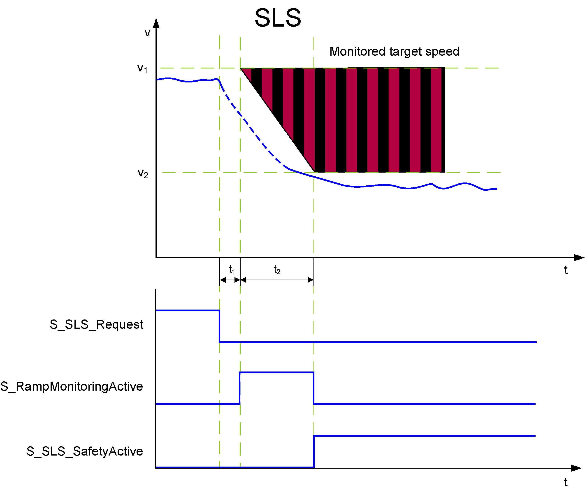

# SLS1 to SLS4 - Four Safely Limited Speed Functions

## General Function Description

A Safely Limited Speed function causes the controlled deceleration of a motor to a defined target speed. The drive is decelerated until a defined final limited speed has been achieved which is then monitored. SLS therefore prevents the motor to exceed the defined limited speed.

The function block provides **four separate** SLS monitoring functions: **SLS1** to **SLS4**. They work identically but can be parameterized and requested independent of each other, thus enabling four different speeds to be monitored.

NOTE: If several SLS functions are requested at the same time, SLS1 has the highest and SLS4 the lowest priority.

When requesting several SLS functions, you must parameterize the slowest target speed v2 for the SLS with the highest priority:

v2(SLS**1**) < v2(SLS**2**) < v2(SLS**3**) < v2(SLS**4**)

**Exception**: a v2 value = 0 is ignored and does not result in an error.

Other configurations are considered a configuration error and the module does not attain operational state.

**Example**: the following configuration is valid:

v2(SLS1) = 600, v2(SLS2) = 600, v2(SLS3) = 800 v2(SLS4) = 0

## Monitoring by the Safety-Related FB/Safety Logic

The monitoring behavior by the function block depends on the parameterization of the Safety Logic:

* If ramp monitoring is **deactivated**, monitoring is passive until the t2 time interval has elapsed (see figure and description below).
* If ramp monitoring is **activated**, the Safety Logic monitors the motor deceleration rate specified by the deceleration ramp.

In both cases, the SLS function monitors the deceleration of the motor (controlled by the standard (non-safety-related) controller). It then monitors the defined target speed (SLS\*\_Speed[v2]), thus helping to prevent overspeed.

The request of the safety-related function occurs at the beginning of the t1 time interval (S\_SLS\*\_Request signal in the diagram on the left). t1 is set with the device parameter SLS\*\_StartDelayTime[t1].

Within the t1 time interval, the standard (non-safety-related) controller receives the request from the connected process and initiates the motion control function according to the logic and drive parameterization defined in the standard (non-safety-related) application.

After t1 has elapsed, the deceleration of the drive is executed. The maximum allowed duration t2 of this ramp-down phase is defined by the device parameter SLS\*\_RampMonitoringTime[t2].

At the end of t2, the defined limited target speed SLS\*\_Speed[v2] must be achieved. Speed V2 is then monitored as long as SLS remains active.

During t2, the deceleration can be monitored by setting the device parameter SLS\*\_RampMonitoring = Activated.

If ramp monitoring is **deactivated**, the deceleration curve is not monitored. Even acceleration is allowed during the t2 interval. The target speed must be achieved before the elapse of t2. Otherwise, SS1 is activated as the defined fallback function.

If ramp monitoring is **activated**, the deceleration curve is monitored and must follow the parameterized ramp (as shown in the figure). Otherwise, SS1 is activated as the defined fallback function.

If the SLS targeted speed is successfully achieved, the function block switches S\_SLS\*\_SafetyActive = SAFETRUE (see diagram).

If the SS1 fallback function has been activated due to an error detected as described above, this is indicated by S\_SS1\_SafetyActive = SAFETRUE.

## Fallback Function

If the parameterized SLS\*\_RampMonitoringTime[t2] value is exceeded, or (in case of activated ramp monitoring) if the parameterized deceleration ramp is not respected as defined, or if target speed v2 is exceeded after t2 has elapsed, the [SS1 function](D-SE-0062421.html#D-SE-0062421) is executed as the fallback function.

## Application

The SLS function is used when personnel have to access the zone of operation. With the help of the SLS function, the speed is first reduced and then safety-related speed monitoring is activated in order to help prevent accidental exceeding of the parameterized speed limit.

By providing four separate SLS functions, the safety-related function could be, for example, extended in a way that several approaching zones could be defined: The closer a person comes to the zone of operation, the more the speed is reduced.

NOTE: The range of speed tolerance for SLS depends on the application (for example encoder type, mechanical system) and is in the range of a few tens of revolutions per minute. For each application, verify that the chosen range of speed tolerance is within the acceptable limits for the particular machine and axis configuration at hand.

EIO0000002337.01