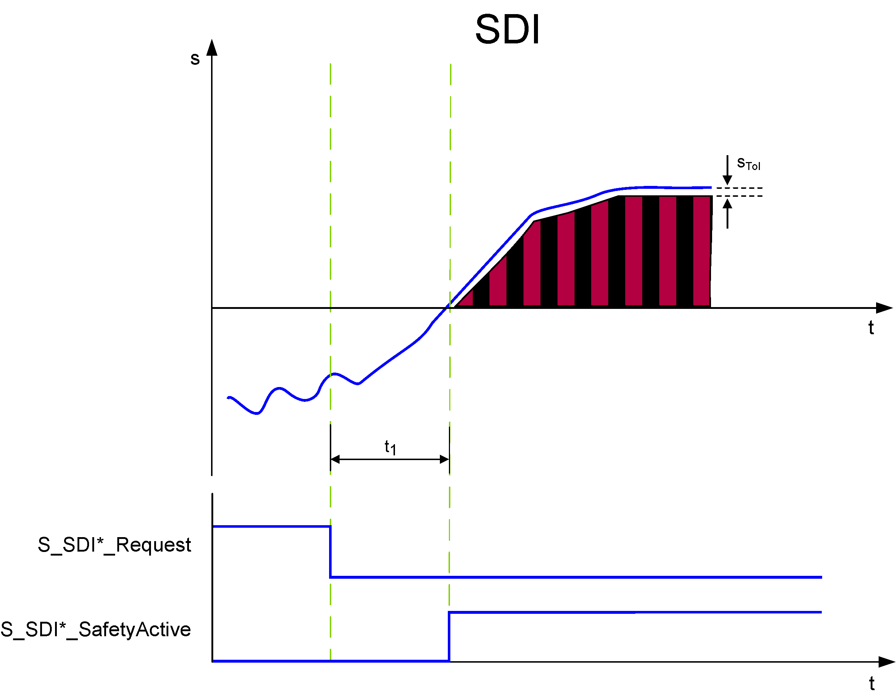

# SDIneg and SDIpos - Safe Direction Negative/Positive Function

## General Function Description

The Safe DIrection (SDI) safety-related function ensures that rotation/movement is only possible in the permitted (parameterized) direction.

The function block distinguishes two rotation/movement directions by providing separate inputs for requesting the SDI Negative or SDI Positive monitoring function: **SDIneg** and **SDIpos**. Both SDI monitoring functions are configured using the same parameters but can be requested independently.

NOTE: In which physical rotation/movement direction SDIpos or SDIneg actually results, depends on your application.

NOTE: If SDIpos and SDIneg are requested at the same time, the [SS1 function](D-SE-0062421.html#D-SE-0062421) is automatically executed as the defined fallback function.

The SDIneg/SDIpos function helps prevent the motor from rotating more than a defined amount into the incorrect direction (device parameter SDI\_PositionTolerance[sTol], see below).

## Monitoring by the Safety-Related FB/Safety Logic

The request of the safety-related function occurs at the beginning of the t1 time interval (S\_SDI\*\_Request signal in the diagram on the left). t1 is set with the device parameter SDI\_StartDelayTime[t1].

Within the t1 time interval, the standard (non-safety-related) controller also receives the request from the connected process and initiates the motion control function according to the logic and drive parameterization defined in the standard (non-safety-related) application.

After t1 has elapsed, the direction is monitored by capturing the position. Moving/rotating a certain distance against the allowed direction is permitted if it does not exceed the defined position tolerance STol.

If the SDI function is executed successfully, the function block switches S\_SDI\*\_SafetyActive = SAFETRUE (see diagram).

If the SS1 fallback function has been activated due to an error detected of the position tolerance as described below, this is indicated by S\_SS1\_SafetyActive = SAFETRUE.

## Fallback Function

If the absolute value of the position exceeds the position tolerance (parameter SDI\_PositionTolerance[sTol]) after t1 has elapsed, the [SS1 function](D-SE-0062421.html#D-SE-0062421) is automatically executed as the fallback function.

## Application

The SDI function is used to help ensure that rotation or movement is not possible towards a prohibited direction, for example, when personnel access the zone of operation of a machine.

EIO0000002337.01