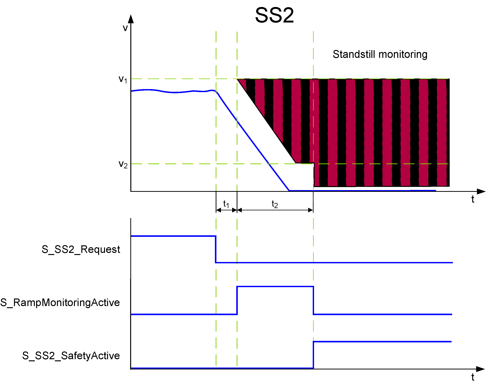

# SS2 - Safe Stop 2 Function

## General Function Description

The Safe Stop 2 function monitors the rapid and controlled stopping of a motor. When the drive is signaled to decelerate, the function block monitors the ramp-down as well as the standstill. As a result, the motor is still supplied with power, thus being able to resist external forces and the position control remains active to perform a standstill monitoring.

SS2 can realize a safety-related stop in accordance with **stop category 2** according to EN 60204-1

## Monitoring by the Safety-Related FB/Safety Logic

The monitoring behavior by the function block depends on the parameterization of the Safety Logic:

* If ramp monitoring is **deactivated**, monitoring is passive until the t2 time interval has elapsed (see figure and description below).
* If ramp monitoring is **activated**, the Safety Logic monitors the motor deceleration rate specified by the deceleration ramp.

In both cases, the SS2 function monitors the motor and then performs the SS2 standstill monitoring. Note that the safety-related function only monitors the movement. Controlling the axis is done by the Safety Logic autonomously and independent of the function block.

The request of the safety-related function occurs at the beginning of the t1 time interval (S\_SS2\_Request signal in the diagram on the left). t1 is set with the device parameter SS2\_StartDelayTime[t1].

Within the t1 time interval, the standard (non-safety-related) controller also receives the request from the connected process and initiates the motion control function according to the logic and drive parameterization defined in the standard (non-safety-related) application.

After t1 has elapsed, the deceleration of the drive is executed. The maximum allowed duration t2 of this ramp-down phase is defined by the device parameter SS2\_RampMonitoringTime[t2].

At the end of t2, speed must be zero and standstill monitoring (similar to the SOS function) is activated.

During t2, the deceleration can be monitored by setting the device parameter SS2\_RampMonitoring = Activated.

If ramp monitoring is **deactivated**, the deceleration curve is not monitored. Even acceleration is allowed during the t2 interval. Standstill has to be achieved the latest before t2 elapses. Otherwise, STO is activated as the defined fallback function.

If ramp monitoring is **activated**, the deceleration curve is monitored and must follow the parameterized ramp (as shown in the figure). Otherwise, STO is activated as the defined fallback function.

After zero speed has been achieved and while t2 has not yet elapsed, a **velocity tolerance** of the axis is allowed and monitored relative to v2.

If the SS2 monitored standstill is successfully achieved, the function block switches S\_SS2\_SafetyActive = SAFETRUE (see diagram).

Otherwise, if the STO fallback function has been activated due to an error detected as described above, this is indicated by S\_STO\_SafetyActive = SAFETRUE.

## Fallback Function

If the parameterized SS2\_RampMonitoringTime[t2] value is exceeded, or (in case of activated ramp monitoring) if the parameterized deceleration ramp is not respected as defined, or if the position tolerance (STol in the figure) is exceeded, the [STO function](D-SE-0062414.html#D-SE-0062414) is automatically executed as the fallback function.

## Application

The SS2 function is used if a controlled deceleration of the drive with a following standstill monitoring is required, for example, during commissioning or after a safety-relevant event.

SS2 is suitable to bring a large flywheel mass as quickly as possible to a halt or to slow down and come to a standstill from high drive speeds as fast as possible. Typical examples are grinding spindles, centrifuges, storage, and retrieval devices.

EIO0000002293.01