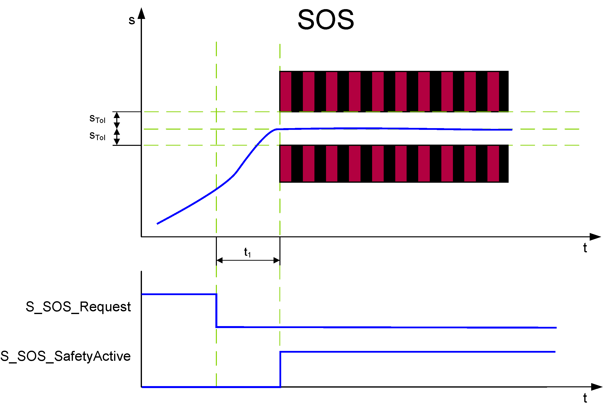

# SOS - Safe Operation Stop Function

## General Function Description

The SOS function monitors the drive at standstill with active position control performed by the standard (non-safety-related) controller and position monitoring performed by the Safety Option Module.

The SOS function helps prevent the motor from deviating more than a defined amount from the stopped position (device parameter SOS\_PositionTolerance[sTol] , shown as STol in the following graphic). The drive module provides energy to the motor to help enable it to resist external forces.

## Monitoring by the Safety-Related FB/Safety Logic

The request of the safety-related function occurs at the beginning of the t1 time interval (S\_SOS\_Request signal in the diagram). t1 is set with the device parameter SOS\_StartDelayTime[t1].

Within the t1 time interval, the standard (non-safety-related) controller also receives the request from the connected process and initiates the motion control function according to the logic and drive parameterization defined in the standard (non-safety-related) application.

After t1 has elapsed, position S0 is captured and SOS is monitored.

SOS performs standstill monitoring. The position control remains in operation. Thus, the motor can deliver full torque to maintain the position. The position is monitored and must remain within the parameterized position tolerance values (STol).

If the parameterized STol values are not exceeded after t1, the function block switches S\_SOS\_SafetyActive to SAFETRUE.

## Fallback Function

If the standstill monitoring detects that the position deviates more than the defined position tolerance from the standstill position (STol in the figure), the [STO function](D-SE-0062414.html#D-SE-0062414) is automatically executed as the fallback function.

## Application

SOS is useful for applications where machines for specific operations or parts of the machinery must stay at standstill where the drive must provide a holding torque. The method of the drive is to provide power to the motor to counter any torque applied from external forces.

EIO0000002293.01