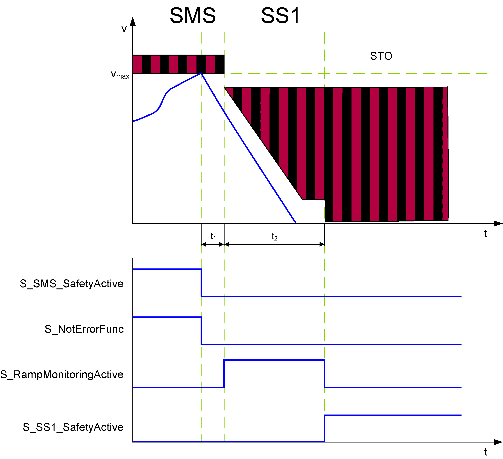

# SMS - Safe Maximum Speed Function

## General Function Description

The Safety Logic continuously monitors the parameterized Safe Maximum Speed (SMS) (set via the Safety Logic device parameter SMS\_MaxSpeed) regardless of the requested safety-related functions.

## Monitoring by the Safety-Related FB/Safety Logic

As the SMS monitoring function is continuously active, no function block input is available/required to request it. However, a function block output for indicating its activity is provided.

For the SMS safety-related function, no delay or monitoring times have to be parameterized.

In contrast to other safety-related functions, the Safe Maximum speed (Vmax in the figure) is continuously monitored.

STO and SMS have the highest priority of the available safety-related functions.

## Fallback Function

If the defined Safe Maximum Speed is exceeded, first the [SS1 function](D-SE-0062421.html#D-SE-0062421) and afterwards the [STO function](D-SE-0062414.html#D-SE-0062414) are automatically executed as the fallback functions.

An active fallback function is indicated by switching the corresponding function block S\_SS1\_SafetyActive or S\_STO\_SafetyActive to SAFETRUE.

EIO0000002293.01