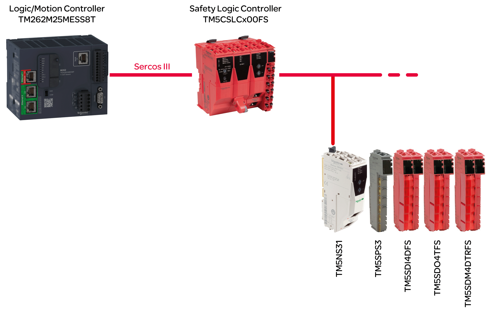

# Logic/Motion Controller Application with Embedded Safety - System Overview

## Architecture

The present document describes the integration of safety-related components (embedded safety) by using a Safety Logic Controller (SLC) and safety-related TM5/TM7 modules into a Logic/Motion Controller application via the Sercos III bus.

The following figure illustrates a small application setup which is used for explanatory purposes in the present document:

NOTE: Respect the specific limitations for the Logic/Motion Controller used. Refer to [*System Limitations*](D-SE-0096207.html#D-SE-0096207__D-SE-0096207.4) for details on the supported system architecture and the maximum number of connectable Sercos devices and safety-related TM5/TM7 I/O modules.

NOTE: The term “standard” is defined as “non-safety-related” in the present document. The term "standard" refers to non-safety-related items/objects. Examples: A standard process data item is only read/written by a non-safety-related I/O device, that is, a standard device. Standard variables, functions, function blocks are non-safety-related data. The term "standard controller" designates the non-safety-related Logic/Motion Controller.

## Devices Used

The following devices are used in the sample project described in the present document:

* TM262M25MESS8T Logic/Motion Controller ([*Compatible Logic/Motion Controller Types*](D-SE-0096207.html#D-SE-0096207__D-SE-0096207.2))
* TM5CSLCx00FS Safety Logic Controller
* TM5NS31 TM5 SERCOS III Bus Coupler
* TM5SPS3 Power Supply Module
* TM5SDI4DFS Digital Input Safety Module
* TM5SDO4TFS Digital Output Safety Module
* TM5SDM4DTRFS Digital Mixed Safety Module

The safety-related part of the architecture is composed of safety nodes (SN). A SN is a node within the Sercos network which complies to the openSafety protocol. Safety-related modules by Schneider Electric are red. They can be identified by the appendix FS in their commercial reference.

A typical application setup in practice may contain further Sercos devices (such as standard drive modules), as well as more than one TM5 bus coupler connected to the Sercos bus and a higher number of TM5 and/or TM7 I/O modules. However, only one SLC can be used under the Sercos Master (which is the Sercos I/O controller inside the Logic/Motion Controller).

The Logic/Motion Controller executes the (non-safety-related) standard control application. The SLC as safety-related controller is subordinate to the Logic/Motion Controller. It manages the tasks within a safety-related application thus executing a separate safety-related application program.

## Software Used

For embedding safety-related functionality as described in this documentation, EcoStruxure Machine Expert with the software components Modicon and EcoStruxure Machine Expert - Safety is used (also refer to [*Software Installation*](D-SE-0096236.html#D-SE-0096236).)

EcoStruxure Machine Expert Logic Builder is used for the following tasks:

* Configuration of the bus consisting of standard and safety-related devices. The safety-related devices must additionally be confirmed in Machine Expert - Safety.
* Parameterization of the standard devices and, partially, the safety-related devices.
* Development of the standard application program.
* Commissioning, controlling, monitoring, and debugging the Logic/Motion Controller.
* System diagnostics, for example in online editors or via SafeLogger.

EcoStruxure Machine Expert - Safety is used for the following tasks:

* Assignment of values to the safety-related parameters of the safety-related devices (SLC and safety-related I/O modules).
* Calculation of the safety-related response time, based on the response time-related parameters.
* Development of the safety-related application program.
* Commissioning, controlling, monitoring, and debugging the SLC.
* Documentation of the safety-related project.

The tasks listed above are described in detail in the following chapters.

EIO0000003921.02