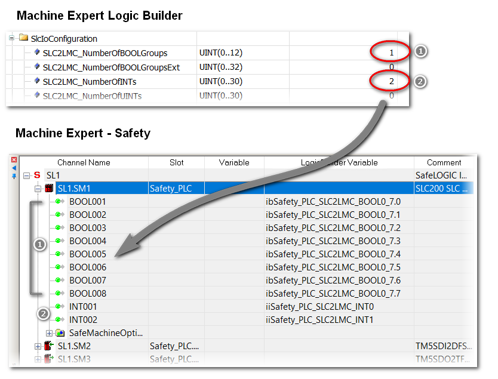

# Configuring the Safety Logic Controller

## Configuring the Logic Type of the SLC

The parameter SafeLogicType of the SLC in EcoStruxure Machine Expert influences, among other things, the way the safety-related response time is determined. This parameter has to be set to match the type of the SLC physically connected to your system.

| Step | Action |
| --- | --- |
| 1 | Open the parameter editor of the SLC. |
| 2 | Navigate to the parameter group SlcRelatedConfiguration. |
| 3 | Set the value of the parameter SafeLogicType to match the type of the SLC connected to your system. In the sample project, the parameter is set to the value SLC 400 / 3. |

## Exchange Data Configuration for the SLC

The standard application running on the Logic/Motion Controller and the safety-related application running on the SLC can directly exchange data.

When inserting an SLC into the Logic/Motion Controller project in EcoStruxure Machine Expert, a special memory area for the exchange data is reserved. In this area, exchange signals are available. Which exchange data are to be used in your project must be configured in the I/O configuration of the SLC.

NOTE: The exchange of data between the standard and the safety-related application is always defined as non-safety-related.

When configuring the data exchange, the amount of data is limited. Any detected error is reported when compiling if these limits are exceeded in your configuration.

The total amount of exchange data (in both directions) is limited to 75 points, where

* 8 Bool = 1 point
* 1 INT = 1 point
* 1 UINT = 1 point
* 1 UDINT = 1 point

The maximum number of bytes in direction SLC to Logic/Motion Controller or Logic/Motion Controller to SLC is limited to 128 bytes, where

* 8 Bool = 1 byte
* 1 INT = 2 bytes
* 1 UINT = 2 bytes
* 1 UDINT = 4 bytes

In addition, the amount of each data type is limited (according to the definition in the Type column of the Schneider Electric Sercos III Parameters editor). The limits are verified by Logic Builder during the configuration process.

## Configuring the Data Exchange

Perform the following steps in the Schneider Electric Sercos III Parameters editor of the SLC:

| Step | Action |
| --- | --- |
| 1 | Open the parameter group SlcIoConfiguration. |
| 2 | Define the data width of the exchange process data which is transferred:   * From the SLC to the Logic/Motion Controller (labeled with SLC2LMC\_NumberOfxxx).  SLC2LMC data can be written in the safety-related application. In the standard application, only read access is allowed to these exchange signals. * From the Logic/Motion Controller to the SLC (labeled with LMC2SLC\_NumberOfxxx).  LMC2SLC data can be written by the standard application and may be read in the safety-related application (read-only permission). |
| 3 | Compile the project in Logic Builder to make the exchange data available in Machine Expert - Safety.  **Result**: According to this configuration, exchange signals are available in Machine Expert - Safety (see [Programming the Safety–Related Application](D-SE-0096309.html)) which you can use in the safety-related code via drag and drop from the Devices window. Refer to the example shown below. |

## Notes on Data Exchange

Observe the following when configuring the exchange data:

* The maximum data width per transfer direction is 128 bytes.
* The value 1 for a BOOLGroup reserves a group of 8 bits, that is, 8 Boolean exchange variables. The same applies correspondingly to a BOOLGroupExt.
* For exchange data that has been configured in Logic Builder, at least a corresponding global variable must be declared in the safety-related application. In case of a reserved BOOLGroup or BOOLGroupExt, for at least one Boolean signal of the group, a Boolean global variable must be declared in the safety-related application. Otherwise, a compiler error is generated in Machine Expert - Safety.
* You can map the exchange signals in your Logic/Motion Controller application in the Schneider Electric Sercos III I/O Mapping editor.

  Application example: A safety-related SF\_EmergencyStop function block used in the safety-related application outputs a Boolean error flag. To read this value in the standard application and enable the Logic/Motion Controller to react on a function block error, proceed as described in chapter [*Exchanging data between Logic/Motion Controller and SLC*](D-SE-0096326.html#D-SE-0096326).

NOTE: In addition to the exchange signals of the SLC, the safety-related TM5 I/O modules also provide exchange signals. To map these signals in EcoStruxure Machine Expert Logic Builder, double-click the respective TM5 module in the Devices tree and open the editor TM5 Module I/O Mapping. An example can be found in the chapter [*Enabling a Safety-Related Output via the Standard Application*](D-SE-0096313.html#D-SE-0096313).

## Example

In the example shown below, one BOOLGroup and two Integers are reserved as exchange variables, both with the data direction SLC to Logic/Motion Controller. As a result, they are available in the safety-related application and they should be used in the code, or, at least global variables must be declared for them. In the standard application, only read access is allowed to these variables.

EIO0000003921.02