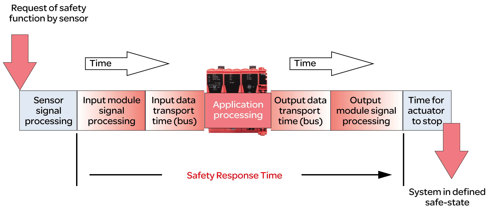

# Calculating the Safety Response Time

## General Information

The safety response time is the time between the arrival of a signal from a sensor or input device (such as a light curtain or an emergency stop pushbutton) at the input channel of a safety-related TM5/TM7 input module and the deactivation signal at the output channel of a safety-related TM5/TM7 module as illustrated by the following figure:

To calculate the safety response time (SRT), the system adds up the following times:

* Processing time in the safety-related input module ([Processing Times in I/O Modules](#D-SE-0096575__D-SE-0096575.5))
* Input transport time (bus transfer from input module to SLC)
* Processing time in the SLC
* Output transport time (bus transfer from SLC to output module)
* Processing time in the safety-related output module ([Processing Times in I/O Modules](#D-SE-0096575__D-SE-0096575.5))

As the figure illustrates, the SRT is not the same as the overall response time of a safety-related function as per ISO 13849-1, that is, the duration from the initial request of the safety-related function until the machine/process is in the defined state. The overall response time of a safety-related function as per ISO 13849-1 includes the response times of the equipment connected to the I/O modules, such as a light curtain to an input channel of an input module and a contactor connected to an output channel of an output module.

Typically, the defined safe state of a machine is a complete stop of machine functions identified to be hazardous. This means that you have to consider, among other things, the overall stopping performance as per, for example, ISO 13855, in your risk assessment and machine design. This overall stopping performance does not only include the maximum time between actuation of the safeguard (for example, emergency stop pushbutton engaged) and the output signal of output device reaching the deactivated state (for example, contactor de-energized). It also includes the stopping time which is the maximum time required to terminate hazardous machine functions after the output device has reached the deactivated state (for example, a motor has already reached a no-torque condition, but is still coasting down).

So, while the SRT is an essential part of the overall stopping performance and helps you to determine, for example, the minimum distance between a safety-related sensor (such as a light curtain) and the zone of operation, you need to consider additional factors not calculated by EcoStruxure Machine Expert - Safety in determining the response times required for your safety-related application.

NOTE: Additional standards, regulations, and directives not mentioned in the present document may apply to the determination of the stopping performance, required distances and other parameters determining the defined safe state of your machine/process. Perform such calculations and design your machine in compliance with all applicable standards, regulations, and directives.

| WARNING | |
| --- | --- |
|  | INSUFFICIENT AND/OR INEFFECTIVE SAFETY-RELATED FUNCTIONS  * Verify that the overall response time of your safety-related function includes all times and factors not considered in the safety response time as calculated by EcoStruxure Machine Expert - Safety, including, but not limited to the response time of the connected sensor/input device and output device/actuator. * Validate the overall response time of your safety related function from the request of the safety-related function to the point in time your machine/process has reached the defined safe state as determined by your risk assessment. * During commissioning or recommissioning of the machine/process, verify the correct operation and effectiveness of all safety-related functions and non-safety-related functions by performing comprehensive tests for all operating states, for the defined safe state of your machine/process, and for all potential error situations.  Failure to follow these instructions can result in death, serious injury, or equipment damage. |

| WARNING | |
| --- | --- |
|  | UNINTENDED EQUIPMENT OPERATION  * Place operator devices of the control system near the machine or in a place where you have full view of the machine. * Protect operator commands against unauthorized access.  Failure to follow these instructions can result in death, serious injury, or equipment damage. |

For further information, refer to [*Safety Response Time*](../../../../../api/crossBook?lang=en-US&virtualBookName=mwt&topicID=ol_wp100881) of the *EcoStruxure Machine Expert - Safety - User Guide*.

## Preconditions

Preconditions for calculating the safety response time:

* Correct values are defined for the pertinent parameters of the Safety Logic Controller (refer to [*Configuring the Safety-Related Response Time Relevant Parameters for TM5CSLC100FS and TM5CSLC200FS*](D-SE-0096307.html#D-SE-0096307__D-SE-0096307.9) and [*Configuring the Safety-Related Response Time Relevant Parameters for TM5CSLC100FS and TM5CSLC200FS*](D-SE-0096307.html#D-SE-0096307__ConfiguringTheSafety-RelatedRespons-89CDF10A)).
* Parameter ManualConfiguration is set to No for the I/O modules. With this setting, the values set for the Safety Logic Controller are also applied to the I/O modules.
* If the ManualConfiguration parameter is set to Yes for the I/O modules: Make sure that correct values are defined for the relevant parameters of each module involved. Refer to the chapter [*Relevant Module Parameters*](D-SE-0096308.html#D-SE-0096308__D-SE-0096308.3) for details.

## Processing Times in I/O Modules

For safety-related Schneider Electric I/O modules, the following signal processing times must be considered.

Schneider Electric input modules:

* Configured filter value of the switch-off filter
* 5000 µs when configuring the external clock signals
* I/O update time for TM5SAI4AFS (analog current measurement) and TM5STI4ATCFS (analog temperature measurement)
* Module processing time (timebase + I/O update time) for counter (TM5SDC1FS) module

NOTE: The I/O update time value depends on the configured input filter parameter. The module processing time depends on the configured timebase.

Schneider Electric output modules:

* TM5SDOxxxx modules: 800 µs max.
* TM5SDM4DTRFS: 50 ms max. (integrated relay)
* TM7SDM12DTFS: 1 ms max.

## Calculating the Safety-Related Response Time

Procedure in Machine Expert - Safety:

| Step | Action |
| --- | --- |
| 1 | Select Project > Response Time Calculator |
| 2 | You can now calculate the safety response time for individual input-output signal paths. To do so, select the input module for which the response time is to be calculated in the left list Input Modules, and, if applicable, an input channel of this module in the center list List of Channels.  **Result**: The parameters set for the selected input module/channel are shown in the area below. As long as no module is selected, no parameters are shown. |
| 3 | In the right list Output Modules/Drives, select the output module for which the response time is to be calculated.  **Result**: The dialog displays the calculated response times for the selected path. Document these values for verification purposes. |

NOTE: During commissioning and operation of the system, the safety response time has to be optimized, if required.

EIO0000003921.02