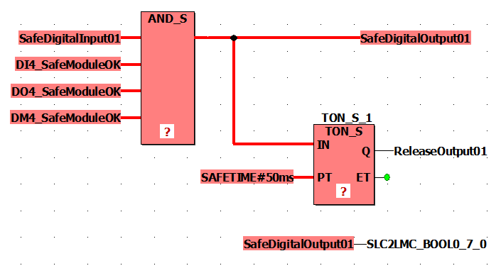

# Programming the Safety-related Application

## General information on the Safety-related Project

The following list provides essential facts on the user interface of Machine Expert - Safety and the characteristics of safety-related code and variables.

For further information and details, refer to the [*EcoStruxure Machine Expert - Safety - User Guide*](../../../../../api/crossBook?lang=en-US&virtualBookName=mwt&topicID=ol_welcometotheonlinehelpsystem).

* POUs are organized in the Project Tree Window.
* A safety-related project contains exactly one POU of the IEC 61131-3 type Program named Main. This POU cannot be deleted or renamed and no further user-defined IEC 61131-3 programs can be added (only FBs).
* The safety-related task in which this program is executed is also predefined but not visible in Machine Expert - Safety. You cannot edit this task configuration.

  NOTE: As only one safety-related task is executed by the SLC, a modification of the [SLC cycle time](D-SE-0096307.html#D-SE-0096307__D-SE-0096307.10) has the same effect as changing the task cycle time.
* You can create user-defined safety-related function blocks (according to IEC 61131-3) but no functions.
* You can insert libraries which provide safety-related functions and function blocks.
* Each POU is composed of one or several code worksheets and a variable table with local variable declarations. Double-click a tree icon to open the corresponding worksheet for editing.
* Global variable declarations are contained in a separate variable grid. Click the Global decl. icon on the main toolbar to open this table.
* The Edit Wizard provides functions and function blocks. After you have added a POU library (via the context menu of the Libraries folder in the project tree), the contained blocks can be selected in a separate Group.
* Safety-related and standard code is strictly distinguished in Machine Expert - Safety. Therefore, also safety-related and standard variables, or more precise, safety-related and standard data types, are distinguished. It is, for example, not possible to connect a variable with a standard data type to a formal parameter which expects a safety-related variable.

  Safety-related variables are displayed with a red background in the code. Variables of standard data types are shown without background.
* Safety-related system FUs/FBs as well as safety-related library FBs are displayed in red. Standard blocks are shown gray-blue. User FUs/FBs are displayed in green.
* When mixing safety-related and standard variables, Machine Expert - Safety performs a data flow analysis in the FBD/LD code and highlights the leading safety-related signal paths of a network by displaying them as thick red lines. A safety-related path always ends either at a safety-related output variable or, in case of a standard output variable, at the last object input located before this output. If a standard signal path ends at a safety-related output, this output is shown with a background hatched in red.

## Safety Application Example

The following simple program considers the TM5 I/O modules configured in the example project. The procedures to develop this example are described in the following sections.

Refer to the chapter [*FBD/LD Code Development*](../../../../../api/crossBook?lang=en-US&virtualBookName=mwt&topicID=ol_editinginfbd_ldusingthegraphiceditor) in the *EcoStruxure Machine Expert User Guide* for a comprehensive description of the editor functions.

The input signal SafeDigitalInput01 of the TM5SDI4DFS module is read and mapped via the AND\_S function to the output signal SafeDigitalOutput01 of the TM5SDO4TFS module. Due to the AND\_S function, the SafeModuleOK diagnostic signals of the safety-related I/O modules are evaluated. A failure detected in any module switches the SafeDigitalOutput01 signal off (SAFEFALSE).

In addition, the SafeDigitalOutput01 is written to the Boolean exchange variable SLC2LMC\_Bool0\_7\_0 which belongs to the SLC2LMC exchange data configured in the SLC device configuration in Logic Builder. This way, the standard application can read the status of the output. (The SafeDigitalOutputxx signal is available for digital output modules. It signals the standard application whether the safety-related output is set by the safety application). The direct connection of the safety-related variable to the standard exchange variable SLC2LMC\_Bool0\_7\_0 is possible because type conversions from safety-related to standard data types are allowed.

The timer function block TON\_S delays the ReleaseOutput01 signal. This release signal deactivates an active restart inhibit and enables the output channel of the SafeDigitalOutput01 signal of the TM5SDO4TFS module. The delay time is set to 50 ms.

NOTE: This programmed delay time influences the [overall safety response time of the system](D-SE-0096575.html#D-SE-0096575__D-SE-0096575.4).

## Inserting a Function/Function Block into the Code

Execute the following steps for the AND\_S function and the TON\_S function block:

| Step | Action |
| --- | --- |
| 1 | Open the Main program worksheet by double-clicking its icon in the Project Tree Window. |
| 2 | In the Edit Wizard selection area, select the desired block.  If the block is not visible, you must first select the Group <all FUs and FBs>. |
| 3 | Drag the block from the Edit Wizard selection area into the code worksheet, left-click to insert the block outline, and drop it with another left mouse click at the desired position. |
| 4 | In case of a function block (TON\_S in the example), an instance variable must be declared.  **Result**: The Variable dialog appears proposing an instance name which you can modify, if desired. |
| 5 | In the Variable dialog, click OK.  **Result**: The function block instance is inserted into the code and the related instance variable is inserted into the local declarations of the Main POU. You can open the declaration worksheet by clicking the ToggleWS icon in the main toolbar. |
| 6 | In the example, the AND\_S function needs four inputs. To adapt the function, right-click the block icon and select Object Properties from the context menu. Select IN2 in the Formal Parameters list and click Duplicate FP twice to add two further inputs. Close the dialog with OK. |

## Inserting Device Signals into the Code

The following procedure applies to the device signals that are provided under the device nodes in the Devices window. This includes exchange variables defined for the SLC as well as diagnostic and control signals of the safety-related I/O modules.

Procedure in Machine Expert - Safety:

| Step | Action |
| --- | --- |
| 1 | Open the code worksheet where you want to insert the signal. |
| 2 | In the Devices window, open the devices tree on the left and expand the node of the desired module (SL1.SMx). |
| 3 | Drag the desired signal into the code worksheet.  **Result**: When releasing the mouse button, the Variable dialog appears. |
| 4 | In the Variable dialog, accept the proposed name, select an existing global variable, or declare a new global variable. Refer to the figure for the variable names used in the example. |
| 5 | Confirm the Variable dialog by clicking OK and drop the variable at the desired position with a left click.  **Result**: The variable is inserted into the code and its variable declaration is automatically inserted into the global variable worksheet.  You can directly drop the variable on a block output or input to connect it on insertion. |

For the example, insert the following signals in the described way:

* SafeDigitalInput01 of the TM5SDI4DFS module connected to an AND\_S input.
* SafeModuleOK of each I/O module connected to an AND\_S input.
* SafeDigitalOutput01 of the TM5SDO4TFS module connected to the AND\_S output.

  Insert the variable a second time and drop it at a free position without any connection.
* ReleaseOutput01 of the TM5SDO4TFS module connected to the TON\_S output.
* SLC2LMC\_Bool0\_7\_0 exchange variable of the SLC connected to the input (blue connection point) of the unconnected SafeDigitalOutput01 variable. This way, the output variable is written to the Boolean exchange variable.

## Inserting Constant (Literals) into the Code

The following procedure describes how to insert literals into the code. Literals have to be used to enter constant values in the code. They can be used without specifying a declaration.

| Step | Action |
| --- | --- |
| 1 | You can insert unconnected or connected/assigned constants:   * To insert a constant already connected to a function or function block, double-click the desired formal parameter. * To insert a constant not connected to any object, click at a free worksheet position and press F5 or click the Variable icon on the editor toolbar.   **Result**: The Variable dialog appears. |
| 2 | Specify Scope = Constant. |
| 3 | A data type is proposed in the Type combo box. Adapt this setting, if required. |
| 4 | Enter the desired literal (constant) in the Name field.  Observe the rules below this table. |
| 5 | Press OK.  **Result**: The constant is inserted into the FBD/LD code. |

Refer to the chapter [*Constants (Literals): Inserting and Declaring*](../../../../../api/crossBook?lang=en-US&virtualBookName=mwt&topicID=ol_insertConstantsInCodeBody) in the *EcoStruxure Machine Expert User Guide* for further details on constants and the special case “Global Constants”.

Rules for constants:

* Literals must always be entered including the data type (for example, SAFEINT#1000).

  Exceptions: TRUE and FALSE are always handled as BOOL and SAFETRUE/SAFEFALSE are always handled as SAFEBOOL. It is, for example, not necessary to enter BOOL#TRUE.
* Standard INT constants can be entered without data type (for example, 1000 means INT#1000) as decimal inputs are automatically interpreted as INT.

  Exception: 0 and 1 if used with Boolean data type.

Refer to the chapter [*Constants vs. Literals*](../../../../../api/crossBook?lang=en-US&virtualBookName=mwt&topicID=ol_ConstantsLiterals) in the *EcoStruxure Machine Expert User Guide* for further information on literals according to the IEC 61131-3 standard.

## Inserting New Variables into the Code

The following procedure describes how to insert new variables into the code. The declaration is automatically inserted into the respective declaration worksheet.

| Step | Action |
| --- | --- |
| 1 | You can insert unconnected or connected/assigned variables:   * To insert a variable already connected to a function or function block, double-click the desired formal parameter. * To insert a variable not connected to any object, click at a free worksheet position and press F5 or click the Variable icon on the editor toolbar. * To insert a variable for a contact or coil, double-click the particular LD object.   **Result**: The Variable dialog appears. |
| 2 | Select the Scope of the variable.  **Result**: For local variables, the declaration is inserted into the declaration worksheet of the current POU (to be opened using the ToggleWS icon). A global declaration is inserted into the global declaration worksheet which you can open by clicking the Global Decl. icon. |
| 3 | Specify the data type of the new variable, enter a variable Name, and define the remaining properties. |
| 4 | Press OK.  **Result**: The variable is inserted into the FBD/LD code and the declaration into the corresponding declaration worksheet. |

There are more possibilities for declaring variables. Refer to the chapter [*Variables: Inserting and Declaring*](../../../../../api/crossBook?lang=en-US&virtualBookName=mwt&topicID=ol_DeclaringVarsWhileEditingCode) in the *EcoStruxure Machine Expert User Guide* for details.

## Connecting Objects in the Graphical Code

To draw lines between objects and block formal parameters, you must activate the connection mode by clicking the Connect icon on the editor toolbar.

Clicking the Mark icon on the editor toolbar switches the editor to mark mode in which you can select and move objects.

## Declaring a Safety-Related Variable for a Device Signal

The safety-related project must not contain unused safety-related TM5/TM7 modules. Unused means that none of the signals, which are listed under the device node in the Machine Expert - Safety Devices window, is used in the safety-related project. At least one signal of each module must be assigned to a global safety-related variable in Machine Expert - Safety. Otherwise, the compiler reports errors.

The same applies to the SLC exchange signals you have defined in Logic Builder (see section [*Exchange Data Configuration for the Safety PLC*](D-SE-0096299.html#D-SE-0096299__D-SE-0096299.4)).

NOTE: Declaring a safety-related variable and assigning it to a device signal without using it in the code is useful during project development as it makes the safety-related project compilable. In a practical application, you must make sure that the relevant variables are read or written in the safety-related application program.

The following steps apply to each type of signal provided in the Machine Expert - Safety Devices window:

| Step | Action |
| --- | --- |
| 1 | In Machine Expert - Safety, open the global variables worksheet by clicking the Global decl. icon on the toolbar. |
| 2 | Right-click into the grid and select New Variable from the context menu.  **Result**: A new variable with a default name (which you can modify) is created. |
| 3 | In the Devices window, open the device tree on the left. Expand the tree node of the device of which a device terminal is to be used. |
| 4 | Drag the device signal to be connected into the global variables worksheet and drop it on the desired declaration.  **Result**:   * The Channel Name of the connected device signal is now visible in the Terminal column of the global declaration in the variables worksheet. * The data type of the global variable has been adapted to the data type of the assigned device signal. * In the Devices window, the name of the connected variable is shown for this device signal in the Variable column. |

NOTE: With this procedure, you can also replace existing assignments between global variables and device signals. Observe the hazard messages in the chapter [*Connecting/Disconnecting Process Data Items and Global I/O Variables*](../../../../../api/crossBook?lang=en-US&virtualBookName=mwt&topicID=ol_SE_AssignProcessDataItems) of the *EcoStruxure Machine Expert - Safety - User Guide*.

To insert a declared variable into the code, use the Variable dialog which you open via the Variable icon on the editor toolbar. Refer to the chapter [*Variables: Inserting and Declaring*](../../../../../api/crossBook?lang=en-US&virtualBookName=mwt&topicID=ol_DeclaringVarsWhileEditingCode) of the *EcoStruxure Machine Expert - Safety - User Guide* for details.

## Compiling the Safety-related Project

After you have finished the development of the safety-related project, you must compile it. (If a POU is marked with an asterisk (\*) in the project tree, it has not yet been compiled after editing variables or code. After the successful compilation, the asterisk is removed.)

Procedure in Machine Expert - Safety:

| Step | Action |
| --- | --- |
| 1 | Press F9 or click the Compile icon on the toolbar. |
| 2 | Correct any errors that the compiler has detected and reported in the message window.  Double-click an error message to jump to the suspected error position. |
| 3 | After having compiled the project without any errors, proceed with the download of the project to the SLC. Refer to chapter [*Downloading the safety-related application*](D-SE-0096311.html#D-SE-0096311). |

EIO0000003921.02