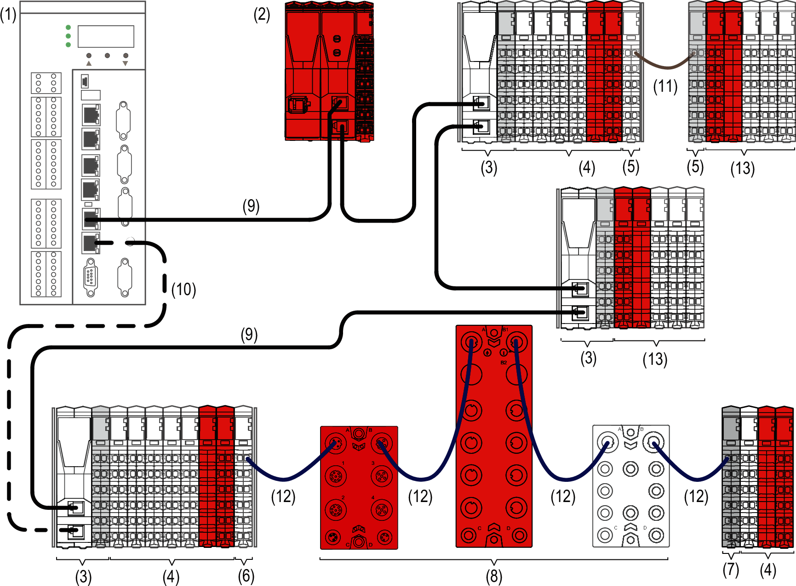

# TM5 / TM7 Safety-Related System I/O Architecture

## Introduction

The TM5 / TM7 Safety-Related System is an open system and can operate with PacDrive and M262 Logic Motion Controller via the Sercos III automation bus.

## TM5 / TM7 Safety-Related System I/Os

The following figure represents TM5 / TM7 Safety-Related System I/Os connected via the Sercos III automation bus to a Logic Motion Controller:

**1** Logic Motion Controller LMC •0• C

**2** Safety Logic Controller TM5CSLC100FS/TM5CSLC200FS or TM5CSLC300FS/TM5CSLC400FS (red, for safety-related applications only)

**3** Sercos III Bus Interface TM5NS31 and Interface Power Distribution Module TM5SPS3

**4** TM5 Safety-Related System I/O Modules (red, for safety-related applications only) and non-safety-related TM5 System I/O Modules

**5** Transmitter Module TM5SBET1 and Receiver Module TM5SBER2

**6** Transmitter Module TM5SBET7

**7** Receiver Module TM5SBER2

**8** TM7 Safety-Related System I/O Modules (red, for safety-related applications only) and non-safety-related TM7 System I/O Module

**9** Sercos III Ethernet Bus Cable

**10** Sercos III Ethernet Bus Cable (optional)

**11** TM5 Expansion bus cable TCSXCNNXNX100

**12** TM7 Expansion Bus Cable

**13** TM5 Safety Power Distribution module TM5SPS10FS, and non-safety-related TM5 System I/O Modules

## Remote Configuration Architecture

In addition to your distributed configuration you can place remote I/Os at a distance up to 100 m (328.1 ft) from the Sercos III Bus Interface.

NOTE: You can create remote I/Os with TM5 expansion modules and/or TM7 expansion blocks.

Refer to [*Modicon TM5 Transmitter and Receiver Modules Hardware Guide*](../../../../../api/crossBook?lang=en-US&virtualBookName=tm5bushw&topicID=D_SE_0003232) to design remote configurations.

EIO0000001064.04