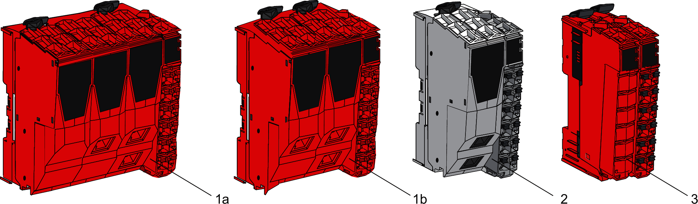

# Color Coding of the TM5 Safety-Related System

## Overview

The following figure shows colors of the TM5 Safety-Related System components:

**1a** Safety Logic Controller TM5CSLC100FS/TM5CSLC200FS

**1b** Safety Logic Controller TM5CSLC300FS/TM5CSLC400FS

**2** Non-safety-related Sercos III Bus Interface TM5NS31

**3** TM5 Safety-Related System I/O Module

## Safety Logic Controller Color Assignment

The Safety Logic Controller and its removable terminal block are colored in red.

## Memory Key Color Assignment

The Memory Key of the Safety Logic Controller is gray and red.

For more information refer to [Memory Key](GeneralInformationOn-8DE96139.html#GeneralInformationOn-8DE96139__MemoryKey-8DE958F2).

## Sercos III Bus Interface Color Assignment

Two colors are used for the four components of a [Sercos III Bus Interface](D-SE-0015378.html#D-SE-0015378__D-SE-0015378.5):

* White for the:

  + Sercos III Bus Interface bus base and,
  + Sercos III Bus Interface module.
* Gray for the:

  + Interface Power Distribution Module (IPDM) and,
  + associated terminal block.

## Slice Color Assignment

The components of a TM5 Safety-Related System module are colored in red.

| DANGER | |
| --- | --- |
|  | INCOMPATIBLE COMPONENTS CAUSE ELECTRIC SHOCK OR ARC FLASH  * Do not associate components of a slice that have different colors. * Always confirm the compatibility of slice components and modules before installation using the association table in this manual. * Verify that correct terminal blocks (minimally, matching colors and correct number of terminals) are installed on the appropriate electronic modules.  Failure to follow these instructions will result in death or serious injury. |

NOTE: Verify the compatibility of components with the [association table](D-SE-0015409.html#D-SE-0015409) before installation.

EIO0000001064.04