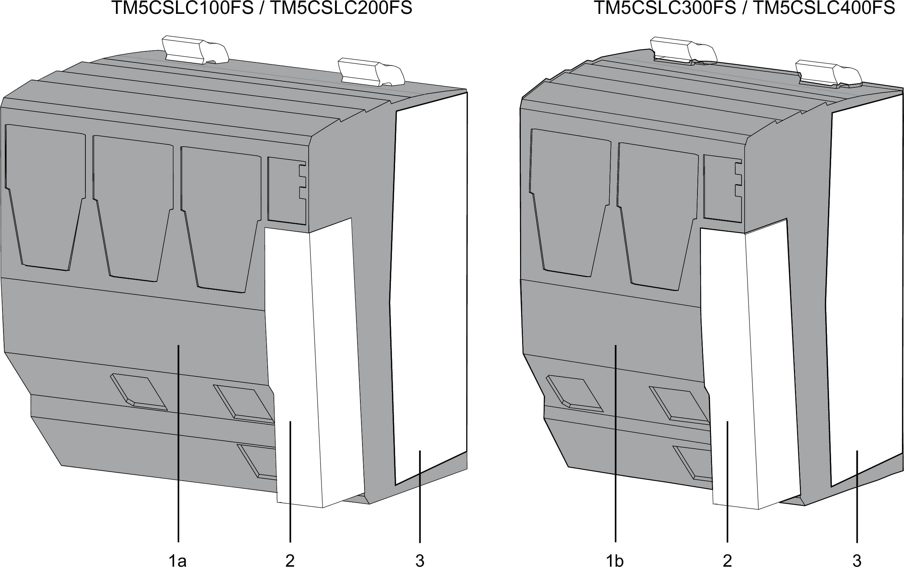

# Safety Logic Controller Presentation

## Features

The table below describes the features of TM5CSLC100FS / TM5CSLC200FS and TM5CSLC300FS / TM5CSLC400FS:

| Feature | TM5CSLC100FS | TM5CSLC200FS | TM5CSLC300FS | TM5CSLC400FS |
| --- | --- | --- | --- | --- |
| Maximum I/O modules via Sercos III interface | 20 safety-related modules | 100 safety-related modules | 20 safety-related modules | 100 safety-related modules |
| Interfaces | Sercos III, controlled node, integrated 2x switch | | | |
| Application memory | exchangeable: memory key | | | |
| Dimensions (W x H x D) | 87.5 x 99 x 75 mm (3.44 x 3.89 x 2.92 inches) | | 62.5+0.2 x 99 x 75 mm (24.60+0.07 x 3.89 x 2.92 inches) | |
| Weight | 290 g (10.23 oz) | | 208 g (7.34 oz) | |

## Ordering Information

The figure below presents the Safety Logic Controller in combination with the required accessories:

The table below presents the references for the Safety Logic Controllers and the terminal block:

| Number | Reference | Description | Color |
| --- | --- | --- | --- |
| 1a | TM5CSLC100FS | SLC 100 Sercos III | red |
| TM5CSLC200FS | SLC 200 Sercos III |
| 1b | TM5CSLC300FS | SLC 300 Sercos III |
| TM5CSLC400FS | SLC 400 Sercos III |
| 2 | TM5ACTB52FS(1) | TM5 terminal block, 12-pin, safety coded | red |
| 3 | TM5ACLPR10(1) | TM5 Locking plate | white |
| **(1)** Included in delivery of TM5CSLC100FS / TM5CSLC200FS / TM5CSLC300FS / TM5CSLC400FS | | | |

NOTE: A memory key is required for operation of the Safety Logic Controller, and is sold separately. For more information concerning the role of the memory key in the Safety Logic Controller system, refer to [Safety Logic Controller Memory Key in the *Modicon TM5 Safety Logic Controller TM5CSLC•00FS Hardware Guide*](../../../../../api/crossBook?lang=en-US&virtualBookName=slc100_slc200&topicID=D_SE_0011009).

EIO0000001064.04