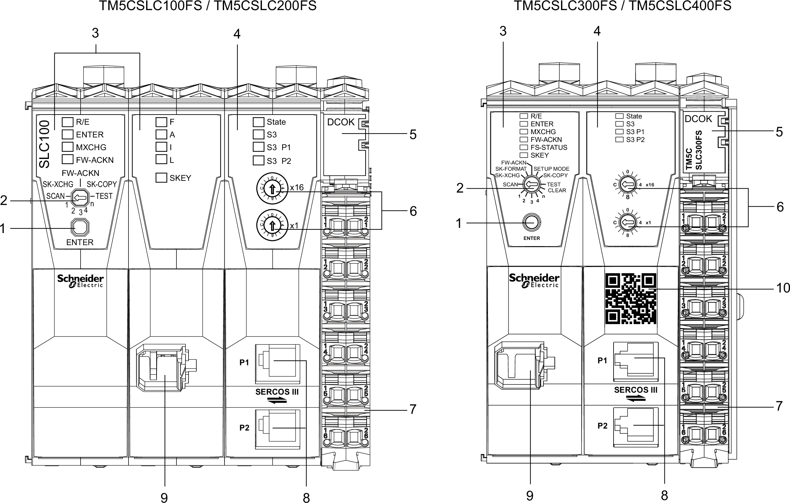

# Safety Logic Controller Description

## Description

The LED indicators, buttons and switches are integrated to operate the Safety Logic Controller.

The following figure presents the operating and connection elements:

| N° | Description | Function |
| --- | --- | --- |
| 1 | Confirmation button | Confirming a Function |
| 2 | Selection switch | Description of the Selection Switch Functions |
| 3 | Logic processor | Logic Processor LED indicators |
| 4 | Sercos III interface | Sercos III interface |
| 5 | Integrated power supply | Integrated Power Supply |
| 6 | Sercos address switches | Sercos Address |
| 7 | Terminal block for Safety Logic Controller power supply | Safety-Related Terminal Block Presentation |
| 8 | Sercos III connection with 2 x RJ45 | Sercos III RJ45 Ports |
| 9 | Memory key slot | Safety Logic Controller Memory Key |
| 10 | QR Code | Scanning the QR Code opens the product specific Schneider Electric website. |

These components enable you to perform the following operations:

* confirm the module replacement
* confirm the firmware update
* confirm the memory key replacement, including a possible transfer of module configuration from the previous memory key
* support for the replacement of Safety Logic Controller

For more information refer to the [Modicon TM5 Safety Logic Controller TM5CSLC•00FS Hardware Guide](../../../../../api/crossBook?lang=en-US&virtualBookName=slc100_slc200&topicID=D_SE_0011290).

EIO0000001064.04