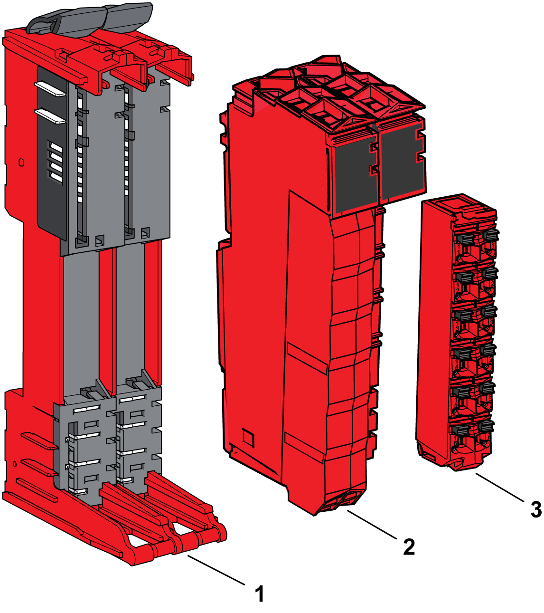
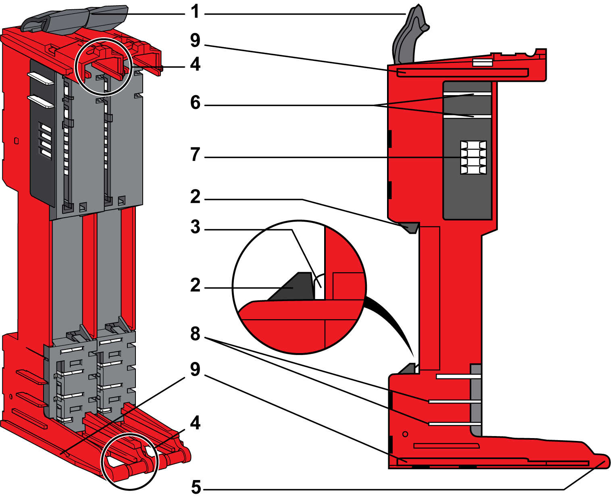
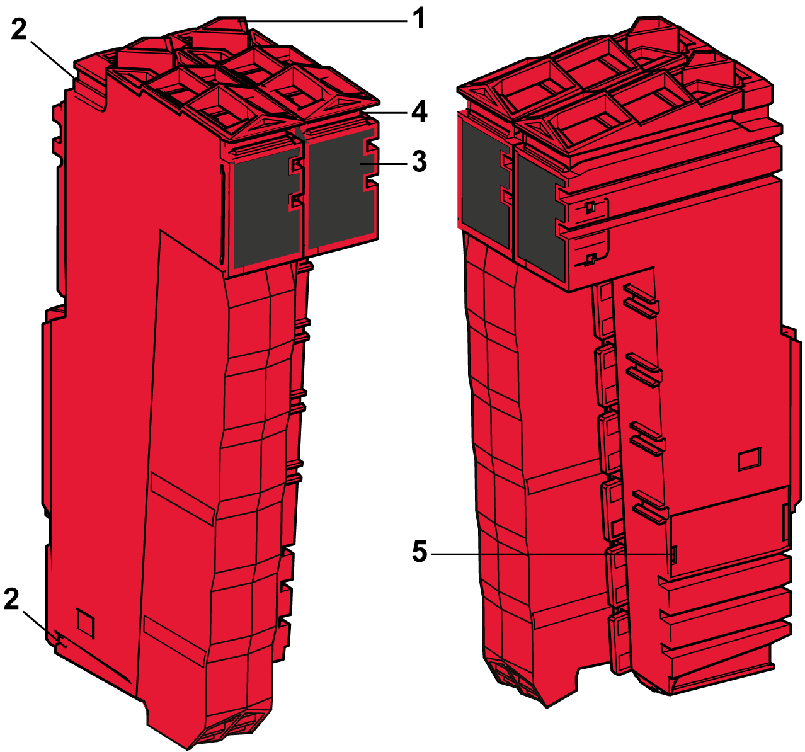

# Safety-Related Slice Description

## Overview

The following figure shows the three components of a safety-related slice:

**1** Safety-related bus base

**2** Safety-related electronic module

**3** Safety-related terminal block

| DANGER | |
| --- | --- |
|  | INCOMPATIBLE COMPONENTS CAUSE ELECTRIC SHOCK OR ARC FLASH  * Do not associate components of a slice that have different colors. * Always confirm the compatibility of slice components and modules before installation using the association table in this manual. * Verify that correct terminal blocks (minimally, matching colors and correct number of terminals) are installed on the appropriate electronic modules.  Failure to follow these instructions will result in death or serious injury. |

The safety-related bus base and the safety-related terminal block for the safety-related electronic module, must be ordered separately. For the references see respective sections below.

When assembled the three components form an integral unit that resists vibration and electrostatic discharge.

| NOTICE | |
| --- | --- |
|  | ELECTROSTATIC DISCHARGE  * Never touch the contacts of the electronic module. * Always keep the connector in place during normal operation.  Failure to follow these instructions can result in equipment damage. |

The [compatibility table](D-SE-0009385.html#D-SE-0009385) gives the possible associations between components of a slice.

## Safety-Related Bus Base Description

The following figures shows the different parts of the safety-related bus base:

**1** Locking lever

**2** DIN rail locking mechanism

**3** DIN rail contact

**4** Guides for assembly of the safety-related electronic module

**5** Rotation axle for safety-related terminal block

**6** TM5 bus power contacts

**7** TM5 bus data contacts

**8** 24 Vdc I/O power segment contacts

**9** Interlocking guides

This table below presents the types of [safety -related bus bases](D-SE-0015418.html#D-SE-0015418) to be used in the safety-related slice:

| Reference | Safety-Related Bus Base Description | Color |
| --- | --- | --- |
| TM5ACBM3FS | Bus base 24 Vdc for safety-related modules, safety coded  24 Vdc I/O power segment pass-through | Red |
| TM5ACBM4FS | Bus base 24 Vdc for safety-related modules, safety coded  24 Vdc I/O power segment left isolated | Red |

## Safety-Related Electronic Module Description

The following figure presents the different parts of the safety-related electronic modules:

**1** Locking lever

**2** Guides for assembly

**3** Display (LEDs)

**4** Slot for labeling

**5** Internal fuse exchangeable (depending on references)

This table presents the different types of safety-related electronic modules:

| Reference | Safety-Related Electronic Module Description | Color | Refer to |
| --- | --- | --- | --- |
| TM5S•••FS | Safety-related modules | Red | [Modicon TM5/TM7 I/O Safety Modules Hardware Guide](../../../../../api/crossBook?lang=en-US&virtualBookName=tm5ioshw&topicID=D_SE_0010250) |

## Safety-Related Terminal Block Description

The main features of the safety-related terminal block are:

* Tool-free wiring with spring clamp push-in technology
* Push-button wire release
* Ability to [label](D-SE-0001023.html#D-SE-0001023__D-SE-0001023.3) each terminal
* [Plain text labeling](D-SE-0001024.html#D-SE-0001024__D-SE-0001024.5) also possible
* [Test access](D-SE-0002456.html#D-SE-0002456__D-SE-0002456.4) for standard probes

The following figures present the different parts of the safety-related terminal blocks:

| TM5ACTB52FS | TM5ACTB5EFS | TM5ACTB5FFS |
| --- | --- | --- |
|  |  |  |
| **1** Wire release push-button  **2** Pin assignment  **3** Spring clamp connector  **4** Test access point  **5** Hinge for the axle on the safety-related bus base  **6** Latch for the safety-related electronic module  **7** Front slot for labeling  **8** Slot for cable tie  **9** Access point to terminal temperature compensation | | |

This table presents the [safety-related terminal blocks](D-SE-0015419.html#D-SE-0015419):

| Reference | Safety-Related Terminal Block Description | Color |
| --- | --- | --- |
| TM5ACTB52FS | 24 Vdc / 230 Vac, 12-pin terminal block for safety-related modules and Safety Logic Controller, safety coded | Red |
| TM5ACTB5EFS | 24 Vdc, 16-pin terminal block for safety-related modules, safety coded, 2x PT1000 integrated for terminal temperature compensation | Red |
| TM5ACTB5FFS | 24 Vdc, 16-pin terminal block for safety-related modules, safety coded | Red |

EIO0000001064.04