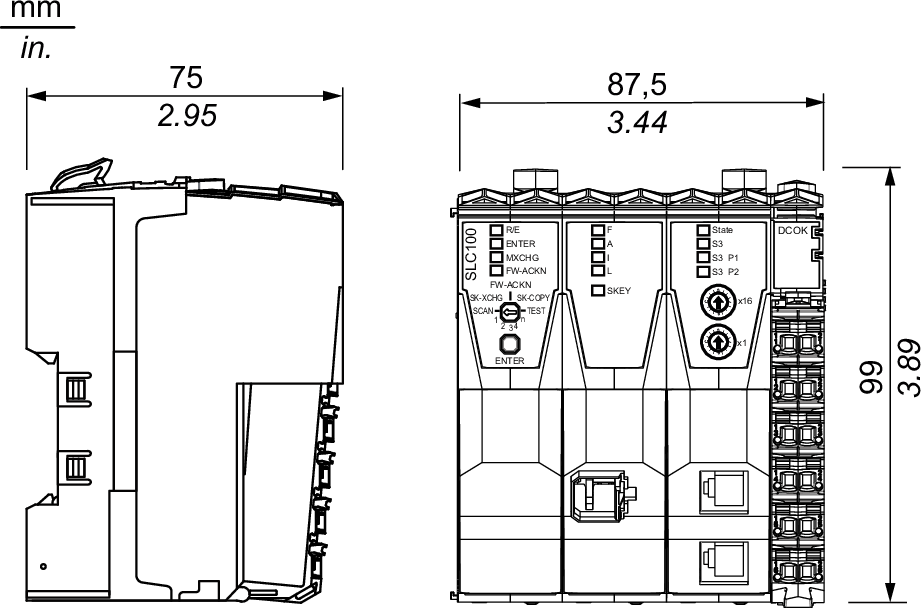
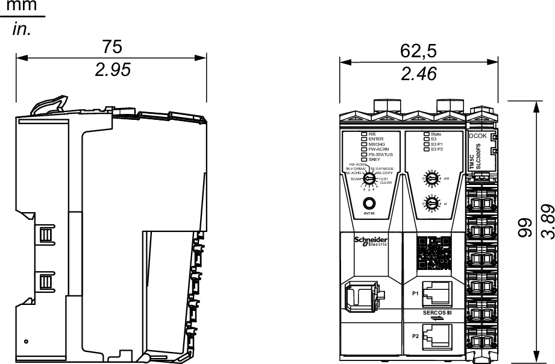
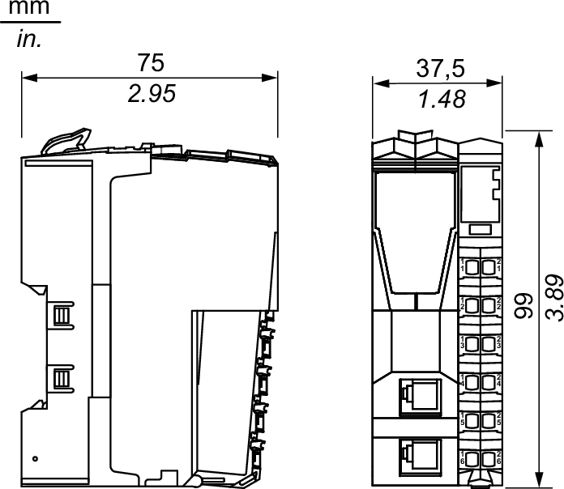
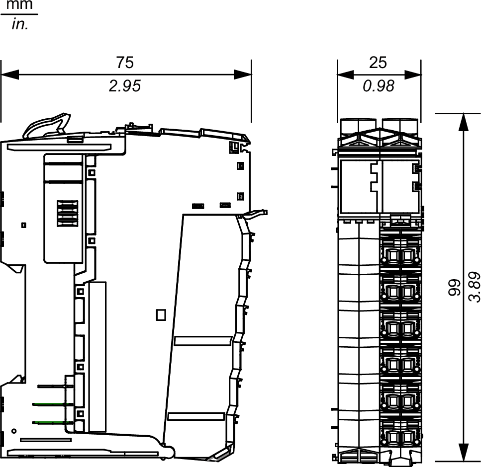
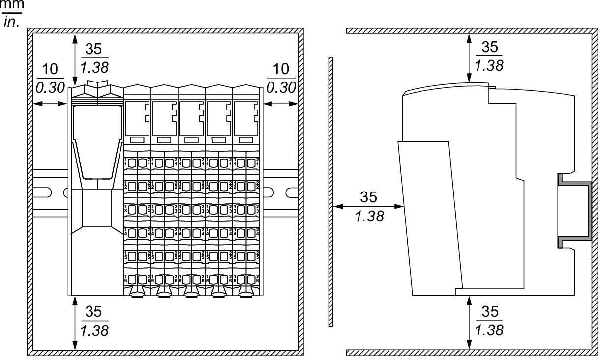
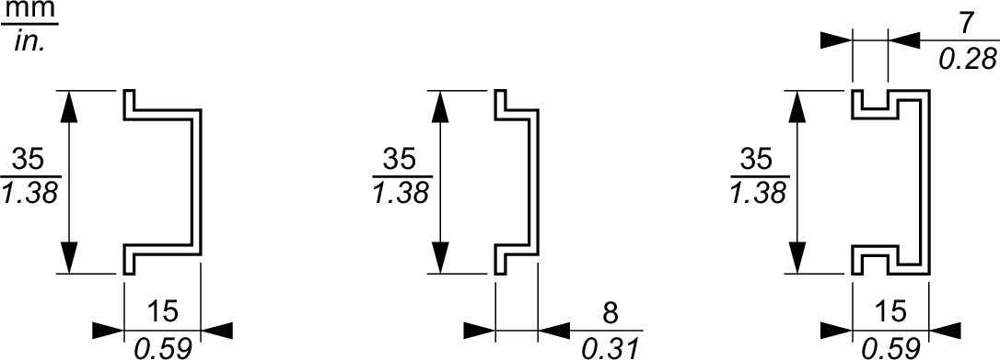

# Enclosing the TM5 Safety-Related System

## Introduction

Components of the TM5 Safety-Related System are mounted "side by side". There is no space between the TM5 components.

The TM5 Safety-Related System components have an IP20 rating and must be enclosed. For optimal cooling and air circulation, an adequate clearance must be respected between your TM5 Safety-Related System (installed in the enclosure) and surrounding fixed objects (such as wire ducts and inside surfaces of the enclosure).

## Size of the Enclosure

The size of the enclosure is determined by the number of expansion modules that are used with the Sercos III Bus Interface and any other auxiliary equipment. [Spacing requirements](#D-SE-0015385__D-SE-0015385.4) must be included in determining the size of the enclosure.

## Safety Logic Controller Dimensions

**TM5CSLC100FS/TM5CSLC200FS**:

**TM5CSLC300FS/TM5CSLC400FS**:

## Sercos III Bus Interface Dimensions

The following figure gives the dimensions of the Sercos III Bus Interface:

## Safety-Related Module Dimensions

The following figure gives the dimensions of the safety-related module:

## Spacing Requirements

NOTE: Keep adequate spacing for proper ventilation and to maintain an ambient temperature as described in the [environmental characteristics](D-SE-0015384.html#D-SE-0015384).

Clearances must be respected when installing the product.

There are 3 types of clearances:

* Between the TM5 Safety-Related System and the sides of the cabinet (including the panel door). This type of clearance allows proper circulation of air around the TM5 Safety-Related System.
* Between the TM5 Safety-Related System terminal blocks and the wiring ducts. This distance helps avoid electromagnetic interference between the terminal blocks and the wiring ducts.
* Between the TM5 Safety-Related System and other heat generating devices installed in the same cabinet.

| WARNING | |
| --- | --- |
|  | UNINTENDED EQUIPMENT OPERATION  * Place devices dissipating the most heat at the top of the cabinet and ensure adequate ventilation. * Avoid placing this equipment next to or above devices that might cause overheating. * Install the equipment in a location providing the minimum clearances from all adjacent structures and equipment as directed in this document. * Install all equipment in accordance with the specifications in the related documentation.  Failure to follow these instructions can result in death, serious injury, or equipment damage. |

The following graphic represents the minimum clearance requirements for a TM5 Safety-Related System in a cabinet:

## Mounting

You can mount the system on a DIN rail. For EMC (Electromagnetic Compatibility) compliance, a metal DIN rail must be attached to a flat metal mounting surface or mounted on an EIA (Electronic Industries Alliance) rack or in a NEMA (National Electrical Manufacturers Association) cabinet enclosure.

You can order a suitable DIN rail from Schneider Electric:

| Rail Depth | Reference |
| --- | --- |
| 15 mm (0.59 in.) | AM1DE200 |
| 8 mm (0.31 in.) | AM1DP200 |
| 15 mm (0.59 in.) | AM1ED200 |

## Thermal Considerations

For proper heat dissipation, keep adequate spacing around your TM5 Safety-Related System. Mount the TM5 Safety-Related System in the coolest area possible, most often at the bottom of the enclosure.

The following tables list some maximum dissipation values for estimating the wattage dissipation when you plan the cooling for your TM5 Safety-Related System and enclosure:

| Safety Logic Controller | Reference | Maximum Dissipation Value (W) | De-rating(1) |
| --- | --- | --- | --- |
| Modicon TM5 Safety Logic Controller | TM5CSLC100FS | 5.1 | No |
| TM5CSLC200FS | 5.1 | No |
| TM5CSLC300FS | 4.3 | No |
| TM5CSLC400FS | 4.3 | No |
| **(1)** De-ratings are specific to each device. Refer to the expansion hardware guides for details. | | | |

| Bus Interface | Reference | Maximum Dissipation Value (W) | De-rating(1) |
| --- | --- | --- | --- |
| Sercos III Bus Interface | TM5NS31 | 1.72 | No |
| Interface Power Distribution Module (IPDM) | TM5SPS3 | 1.82 | Yes |
| **(1)** De-ratings are specific to each device. Refer to [TM5SPS3 Characteristics](D-SE-0009143.html#D-SE-0009143). | | | |

| Type of Slice | Reference | Slice Maximum Dissipation Value (W) | De-rating (1) |
| --- | --- | --- | --- |
| Safety digital input | TM5SDI2DFS | 1.38 | No |
| TM5SDI4DFS | 1.7 | No |
| TM5SDI20DFS | 2.13 | Yes |
| Safety digital output | TM5SDO2TFS | 1.36 | Yes |
| TM5SDO2TAFS | 1.36 | Yes |
| TM5SDO2DTRFS | 1.54 | Yes |
| TM5SDO4TFS | 1.68 | Yes |
| TM5SDO4TAFS | 1.68 | Yes |
| TM5SDO6TBFS | 1.85 | Yes |
| Safety digital mixed input/output | TM5SDM4DTRFS | 1.54 | Yes |
| TM5SDM8TBFS | 1.78 | Yes |
| Safety analog input | TM5SAI4AFS(2) | 2.08 | Yes |
| TM5SAI4ATCFS | 1.58 | No |
| Safety counter | TM5SDC1FS | 1.13 | No |
| Safety Power Distribution Module (SPDM) | TM5SPS10FS | 1.83 | Yes |
| **(1)** De-ratings are specific to each device. Refer to the expansion hardware guides for details.  **(2)** Observe the instructions on Overheating [Overheating](../../../../../api/crossBook?lang=en-US&virtualBookName=tm5ioshw&topicID=D_SE_0057662_13) in the chapter for the TM5SAI4AFS Operating Conditions in the *Modicon TM5/TM7, I/O Safety Modules, Hardware Guide*. | | | |

The values above assume maximum bus voltage, maximum field-side voltage and maximum load currents. Typical values are often considerably lower.

| WARNING | |
| --- | --- |
|  | UNINTENDED EQUIPMENT OPERATION  * Place devices dissipating the most heat at the top of the cabinet and ensure adequate ventilation. * Avoid placing this equipment next to or above devices that might cause overheating. * Install the equipment in a location providing the minimum clearances from all adjacent structures and equipment as directed in this document. * Install all equipment in accordance with the specifications in the related documentation.  Failure to follow these instructions can result in death, serious injury, or equipment damage. |

NOTE: Keep adequate spacing for proper ventilation and to maintain an ambient temperature. Maximum ambient temperature depends on the mounting position.

EIO0000001064.04