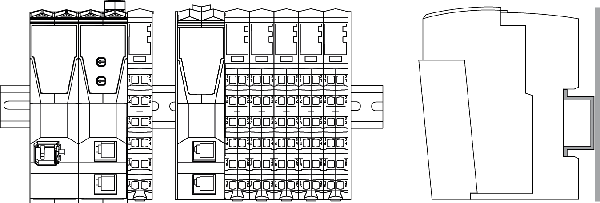
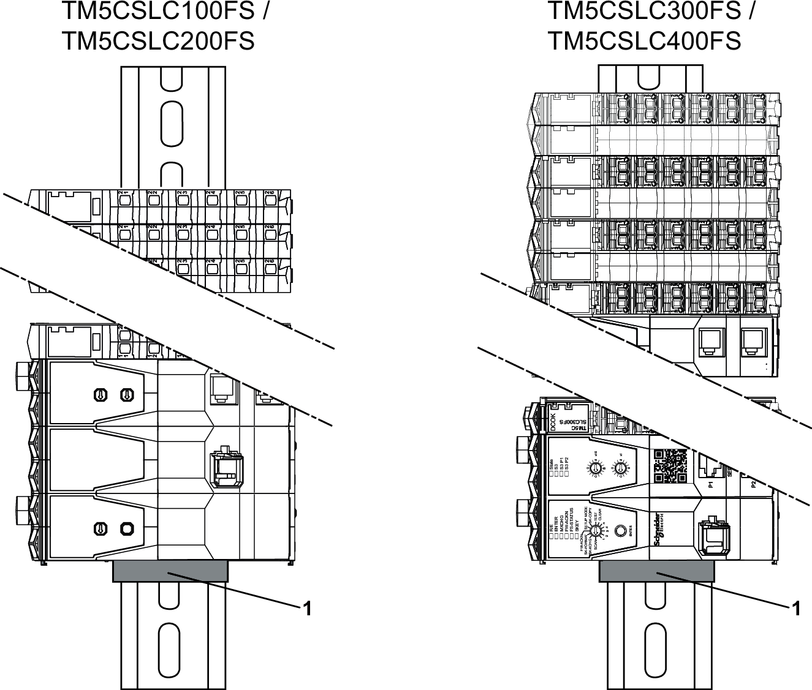
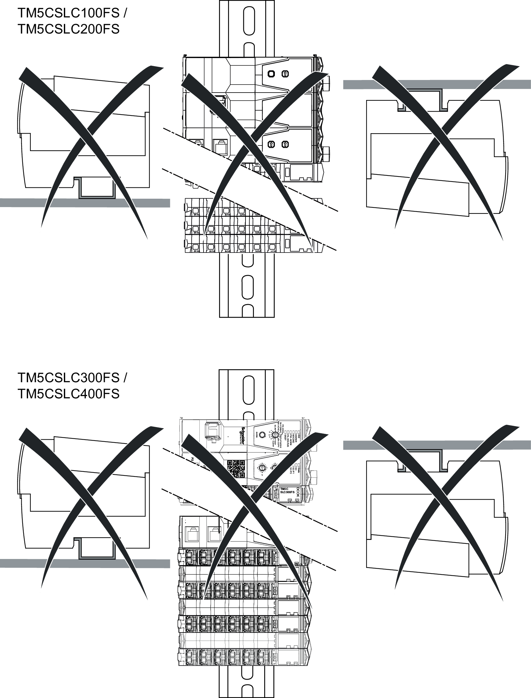

# Mounting Positions

## Introduction

This section shows the correct mounting positions for the TM5 Safety-Related System.

Remote and distributed configurations follow the same rules.

The TM5 Safety-Related System should only be positioned as shown in the correct or acceptable mounting position figures below.

## Correct Mounting Position

NOTE: The Safety Controller TM5CSLC100FS/TM5CSLC200FS or TM5CSLC300FS/TM5CSLC400FS can only be connected with the safety-related modules via the Sercos III Bus Interface TM5NS31. There is no electrical connection between Safety Controllers and the safety-related modules via the bus base.

NOTE: Keep adequate spacing for proper ventilation and to maintain an ambient temperature as described in the [environmental characteristics](D-SE-0015384.html#D-SE-0015384).

## Acceptable Mounting Positions

Whenever possible, the TM5 Safety-Related System should only be positioned in the horizontal mounting position. This position affords the best heat dissipation of the devices.

However, the TM5 Safety-Related System can also be mounted sideways on a vertical plane as shown below.

**1** End bracket

| NOTICE | |
| --- | --- |
|  | INOPERABLE EQUIPMENT  * Mount the expansion modules on top of the controller when mounting on a vertical plane. * Secure the first element of the TM5 configuration (controller, receiver and any slices) against slipping.  Failure to follow these instructions can result in equipment damage. |

NOTE: Use an end bracket (reference AB1 AB8R35 for example) to help secure the configuration.

NOTE: The TM5 configuration is temperature de-rated when installed vertically. Refer to the specific characteristics for your devices.

## Incorrect Mounting Position

The figures below show incorrect mounting positions:

EIO0000001064.04