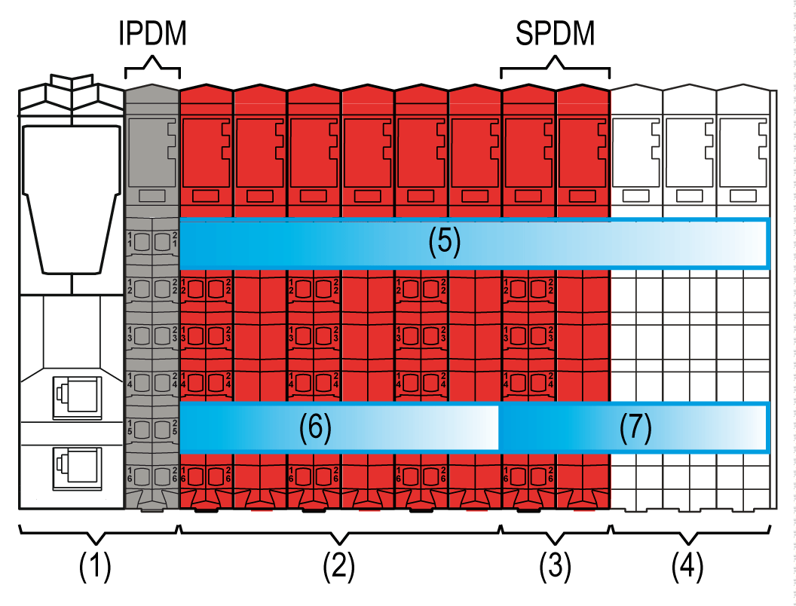
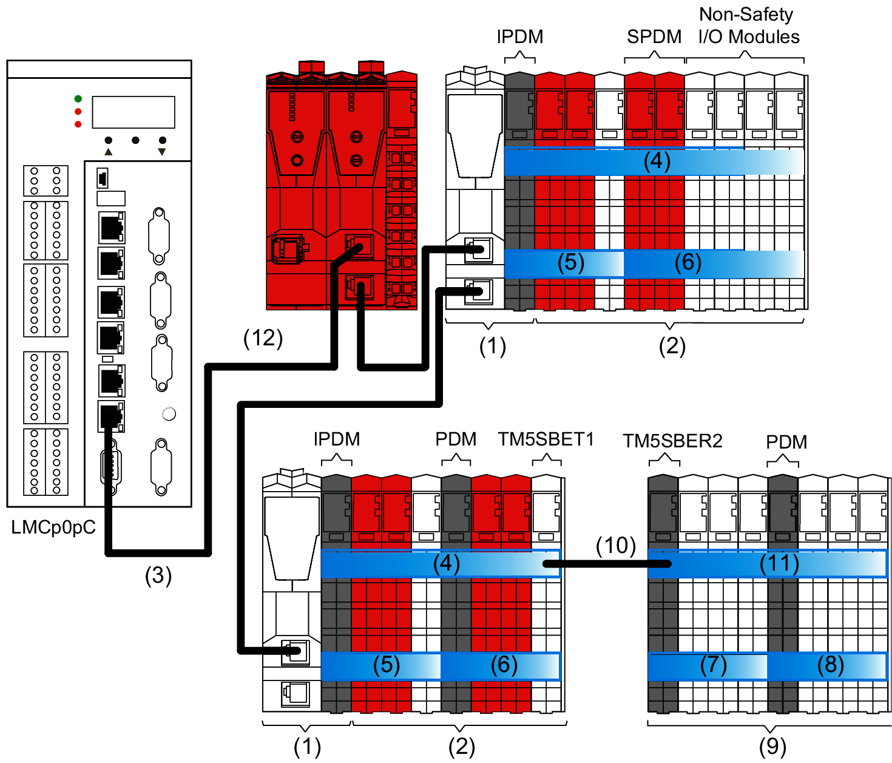

# TM5 Power Distribution Description

## Power Distribution Overview

Power distribution starts with the controller in the case of non-safety-related controllers, and otherwise starts with the remote/distributed interface modules in both safety-related and non-safety related systems.

The first (leftmost) component in the remote and [distributed](D-SE-0015375.html#D-SE-0015375) configurations of the TM5 System distributes power for the 24 Vdc I/O power segment and generates power for the TM5 power bus. There are other components that distribute power to create separate 24 Vdc I/O power segments, and others that distribute power and additionally generate supplemental power to the TM5 power bus.

The Interface Power Distribution Module (IPDM) of the Sercos III Bus Interface is the beginning of the power distribution for the distributed configuration.

NOTE:

* The [TM5SBET7 Transmitter module](D-SE-0009310.html#D-SE-0009310__D-SE-0009310.24) is the beginning of the power distribution for the TM7 power bus.
* The TM5SBER2 Receiver module is the beginning of the power distribution for the remote configuration.

Where and when needed, Power Distribution Modules (PDM) could be added to:

* Divide the 24 Vdc I/O power segment into several separated 24 Vdc I/O power segments, or;
* Divide the 24 Vdc I/O power segment into several separated 24 Vdc I/O power segments and provide supplementary power to the TM5 power bus if required by your I/O configuration.

## TM5SPS10FS Safety Power Distribution Module (SPDM)

Where and when needed, the TM5SPS10FS Safety Power Distribution Module (SPDM) can be added, in association with its dedicated, left-isolating [TM5ACBM4FS](D-SE-0015418.html#D-SE-0015418) safety-related bus base, and is a power source for specified non-safety-related I/O modules. The Safety Power Distribution Module (SPDM) supports the pre-defined safe state of poweroff (de-energized) to the I/O modules connected. As illustrated below, the TM5SPS10FS Safety Power Distribution Module (SPDM) is used to create an isolated group of non-safety related I/O modules.

NOTE: For the list of compatible non-safety-related I/O modules that you can connect to the TM5SPS10FS Safety Power Distribution Module (SPDM) and of the general rules/restrictions/limitations, refer to [TM5SPS10FS Presentation](../../../../../api/crossBook?lang=en-US&virtualBookName=tm5ioshw&topicID=D_SE_0057924) and to the Modicon TM5/TM7 I/O Safety Modules Hardware Guide.

**(1)** Sercos III Bus Interface

**(2)** Safety-related I/O modules

**(3)** TM5SPS10FS Safety Power Distribution Module (SPDM)

**(4)** Non-safety-related I/O modules

**(5)** TM5 bus and electronic module power supply

**(6)** 24 Vdc I/O power segment of safety-related I/O modules

**(7)** 24 Vdc I/O power segment of non-safety-related I/O modules

**IPDM** Interface Power Distribution Module (IPDM)

**SPDM** Safety Power Distribution Module (SPDM): TM5SPS10FS

For more information on the wiring, refer to [TM5SPS10FS Presentation](../../../../../api/crossBook?lang=en-US&virtualBookName=tm5ioshw&topicID=D_SE_0057924).

For detailed information on the TM5ACBM4FS safety-related bus base, refer to [TM5ACBM4FS Safety-Related System Bus Base](D-SE-0015418.html#D-SE-0015418).

## Power Distribution of a Distributed/Remote Configuration

The figure shows the power distribution overview of a distributed/remote configuration:

**(1)** Sercos III Bus Interface

**(2)** Distributed expansions

**(3)** Sercos III bus cable

**(4)** TM5 power bus of the distributed configuration

**(5...8)** 24 Vdc I/O power segments

**(9)** Remote expansion

**(10)** Expansion bus cable (l <= 100 m / 328.1 ft)

**(11)** TM5 power bus of the remote configuration

**(12)** Safety Logic Controller TM5CSLC100FS/TM5CSLC200FS or TM5CSLC300FS/TM5CSLC400FS (red, for safety-related applications only)

**IPDM** Interface Power Distribution Module

**PDM** Power Distribution Module

**SPDM** Safety Power Distribution Module

**TM5SBET1** Transmitter module

**TM5SBER2** Receiver module

## 24 Vdc I/O Power Segment Description

Power is distributed to the inputs and outputs of the TM5 System through the 24 Vdc I/O power segment.

The following table gives the first and last devices of the 24 Vdc I/O power segment(s):

| TM5 Configuration | | Segment Begin | Segment End |
| --- | --- | --- | --- |
| [Distributed](D-SE-0015375.html#D-SE-0015375) | First  24 Vdc I/O power segment | The IPDM | The last remote expansion module or the first  PDM/SPDM (from left to right) of the configuration |
| Second  24 Vdc I/O power segment | The first PDM  /SPDM (from left to right) of the configuration. | The last expansion module or the second PDM/SPDM (from left to right) of the configuration. |
| ... | ... | ... |
| Remote | First  24 Vdc I/O power segment | The Receiver module | The last remote expansion module or the first PDM/SPDM (from left to right) of the configuration |
| Second  24 Vdc I/O power segment | The first PDM /SPDM (from left to right) of the configuration. | The last expansion module or the second PDM/SPDM (from left to right) of the configuration. |
| ... | ... | ... |

A segment is a group of expansion modules that are supplied by the same power distribution module.

The power provided on the 24 Vdc I/O power segment is consumed by the 24 Vdc modules placed in this segment.

The reasons to build a new segment are:

* An SPDM is required to de-energize a segment.
* The first (leftmost) component in the remote and distributed [configurations](D-SE-0015375.html#D-SE-0015375) of theTM5 System distributes power for the 24 Vdc I/O power segment and generates power for the TM5 power bus.
* To separate groups of modules. For example, a group of inputs separated from a group of outputs.
* To provide power to the 24 Vdc I/O power segment (in the case that the power of the previous segment has been consumed by other I/O modules).
* To provide supplementary power to the TM5 power bus.

## TM5 Power Bus Description

The TM5 bus consists in two parts:

* TM5 data bus
* TM5 power bus

The TM5 power bus distributes the power to supply the electronics of the expansion modules of a remote or distributed configuration. If needed the power on the TM5 bus can be reinforced by adding specific PDMs/SPDMs depending on the reference.

The following table gives the first and last devices of the TM5 power bus:

| TM5 Configuration | Power Bus Begin | Power Bus End |
| --- | --- | --- |
| Remote | The Receiver module | The last remote expansion I/O or Transmitter module |
| [Distributed](D-SE-0015375.html#D-SE-0015375) | The IPDM | The last distributed expansion I/O or Transmitter module |

NOTE: The TM5SBET1 transmitter module must be the last electronic module in either the local or remote TM5 configuration that you intend to extend.

## Interface Power Distribution Module (IPDM)

The Interface Power Distribution Module ([IPDM](D-SE-0015379.html#D-SE-0015379__D-SE-0015379.6)) is the connection of the Sercos III Bus Interface to the external 24 Vdc power supplies.

Among other things, the IPDM connects:

* Directly the external power supply to the 24 Vdc I/O power segment.
* The external power supply to the internal power supply that generates the power distributed on the TM5 power bus, which is derived from the 24 Vdc Main power connection.

The following table describes the parts powered by the 24 Vdc I/O power segment and the TM5 power bus:

| Designation | Description |
| --- | --- |
| 24 Vdc I/O power segment | Serves:   * the distributed expansion modules, * the sensors and actuators connected to the distributed expansion modules, * the external devices connected to the Common Distribution Modules (CDM) of the distributed configuration. |
| TM5 power bus | Serves the electronic of the expansions (bus bases and electronic modules) of the distributed configuration. |

## Receiver Module (TM5SBER2)

The TM5SBER2 integrates an electronic power supply that generates the power distributed by the TM5 power bus.

It also connects the external 24 Vdc power supply to the 24 Vdc I/O power segment.

The following table describes the parts powered by the 24 Vdc I/O power segment and the TM5 power bus:

| Designation | Description |
| --- | --- |
| 24 Vdc I/O power segment | Serves:   * the remote expansion modules, * the sensors and actuators connected to the remote expansion modules, * the external devices connected to the Common Distribution Modules (CDM) of the remote configuration. |
| TM5 power bus | Serves the electronic of the expansions (bus bases and electronic modules). |

## Power Distribution Module (PDM)

Depending of the TM5 configuration and the current consumed on either the TM5 power bus or the 24 Vdc I/O power segment(s), you may need to add PDMs to create another 24 Vdc power segment and/or supplement power to the electronic of the expansions via the TM5 power bus.

For more information refer also to [TM5 Power Distribution Modules](D-SE-0004364.html#D-SE-0004364__D-SE-0004364.4).

The following table describes the parts powered by the 24 Vdc I/O power segment and the TM5 power bus:

| Designation | Description |
| --- | --- |
| 24 Vdc I/O power segment | Serves:   * the expansion modules of the segment determined by the PDM, * the sensors and actuators connected to the expansion modules of the segment determined by the PDM, * the external devices connected to the Common Distribution Modules (CDM) in the segment determined by the PDM. |
| TM5 power bus (depends on PDM references) | Serves the electronic of the expansions (bus bases and electronic modules) of the expanded configuration. |

## Safety Power Distribution Module (SPDM)

Depending of the TM5 configuration and the current consumed on either the TM5 power bus or the 24 Vdc I/O power segment(s), you may need to add SPDMs to create another 24 Vdc power segment and/or supplement power to the electronic of the expansions via the TM5 power bus.

The following table describes the parts powered by the 24 Vdc I/O power segment and the TM5 power bus:

| Designation | Description |
| --- | --- |
| 24 Vdc I/O power segment | Serves:   * the expansion modules of the segment determined by the PDM, * the sensors and actuators connected to the expansion modules of the segment determined by the PDM, * the external devices connected to the Common Distribution Modules (CDM) in the segment determined by the PDM. * the SPDM provides the option to remove power for the segment. |
| TM5 power bus (depends on PDM references) | Serves the electronic of the expansions (bus bases and electronic modules) of the expanded configuration. |

## Supplying the 24 Vdc I/O Power Segment and the TM5 Power Bus

TM5 Power System, Power Distribution Description, Supplying the 24 Vdc I/O Power Segment and the TM5 Power Bus:

| Equipment | | Maximum Current Distributed on the 24 Vdc I/O Power Segment | Current Supplied to the TM5 Power Bus | |
| --- | --- | --- | --- | --- |
| Function | Reference | 0...55 °C (32...131 °F) | 55...60 °C (131...140 °F) |
| Receiver module | TM5SBER2 | 10 A | 1156 mA | 750 mA |
| PDM | TM5SPS1 | 10 A | No | No |
| TM5SPS1F | 6.3 A | No | No |
| TM5SPS2 | 10 A | 1136 mA | 740 mA |
| TM5SPS2F | 6.3 A | 1136 mA | 740 mA |
| SPDM | TM5SPS10FS | 10 A | No | No |
| IPDM | TM5SPS3 | 10 A | 750 mA | 500 mA |

## Safety Logic Controller

The Safety Logic Controllers TM5CSLC100FS/TM5CSLC200FS and TM5CSLC300FS/TM5CSLC400FS provide an integrated power supply.

EIO0000001064.04