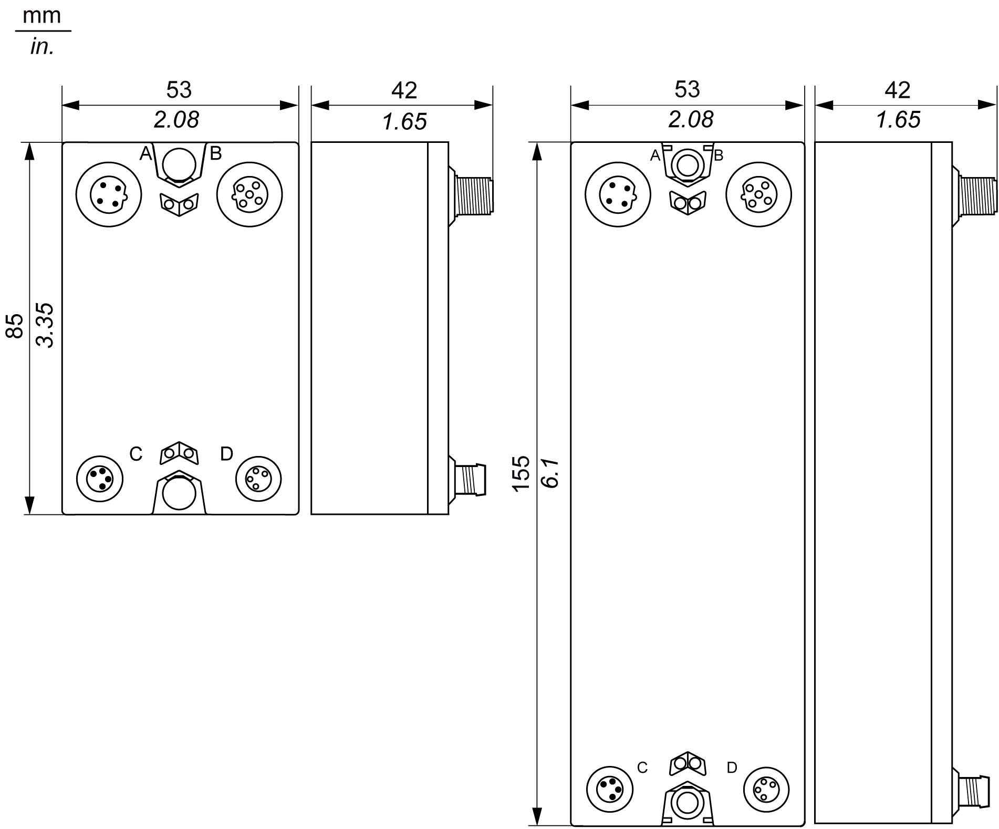
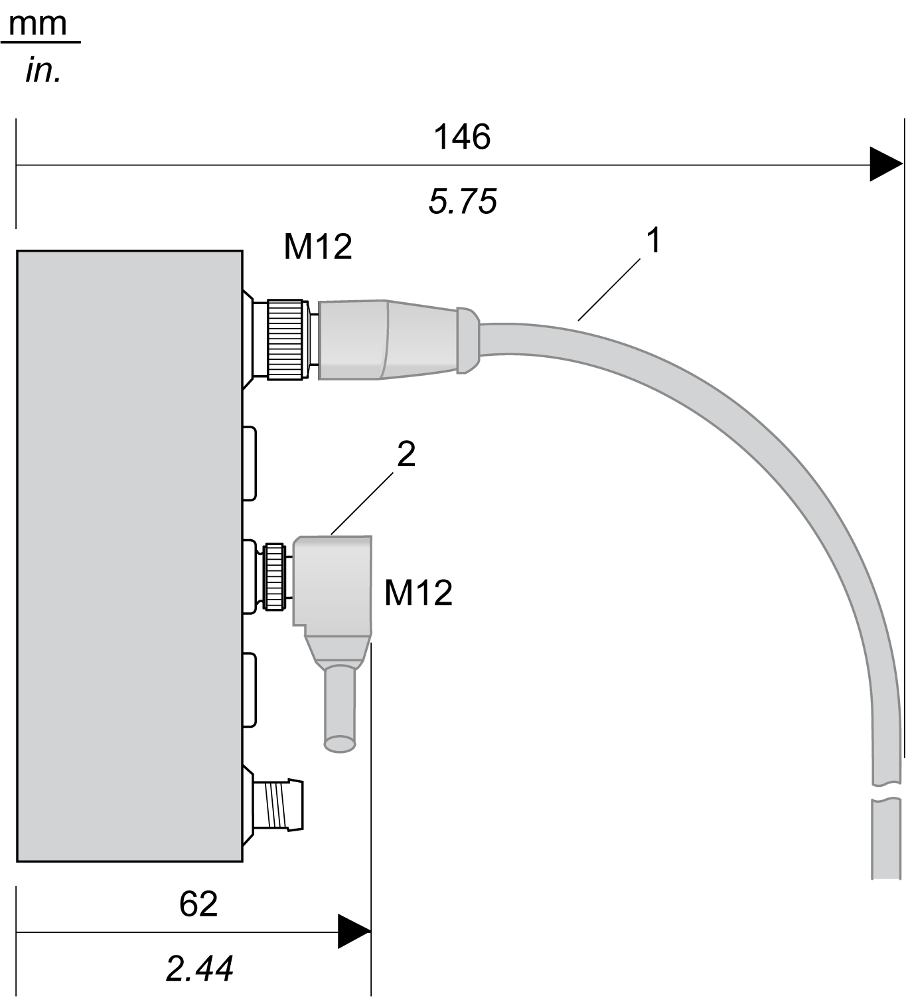

# Mechanical Requirements

## Dimensions

The following figure gives the dimensions of the TM7 Safety-Related System blocks size 1 (left) and size 2 (right):

| TM7 I/O Blocks | | |
| --- | --- | --- |
| Type of block | Reference | Size |
| Digital input block for safety-related applications | TM7SDI8DFS | 1 |
| Mixed input and output block for safety-related applications | TM7SDM12DTFS | 2 |

## Spacing Requirements

TM7 blocks can be installed side-by-side. However, you must observe the minimum spacings from the front face of each expansion block, based on cable connector type and [cable bend radius](D-SE-0009890.html#D-SE-0009890).

The following figure shows an example of wire bending requirements for a block connected with pre-wired straight cables and elbowed cables:

**1** Straight cable

**2** Elbowed cable

EIO0000001064.04