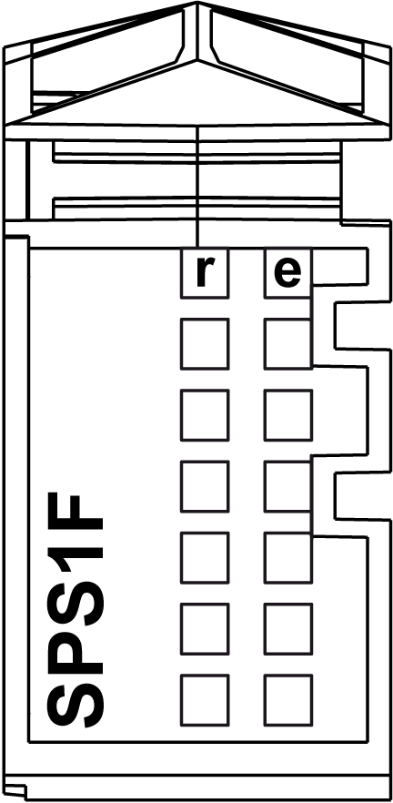

# TM5SPS1F Presentation

## Main Characteristics

The TM5SPS1F Power Distribution Module (PDM) feeds the 24 Vdc I/O power segment through an exchangeable fuse.

The table below describes the main characteristics of the TM5SPS1F electronic module:

| Main Characteristics | |
| --- | --- |
| Maximum current provided on 24 Vdc I/O power segment | 6300 mA |
| TM5 power bus current generated | No |

## Ordering Information

The following figure and table gives the references to create a slice with the TM5SPS1F electronic module:

| Number | Model Number | Description | Color |
| --- | --- | --- | --- |
| 1 | TM5ACBM01R  or  TM5ACBM05R | Bus base 24 Vdc I/O power segment left isolated  Bus base 24 Vdc I/O power segment left isolated with address setting | Gray  Gray |
| 2 | TM5SPS1F | Electronic module | Gray |
| 3 | TM5ACTBM12PS | Terminal block, 12-pin | Gray |

NOTE: For more information, refer to [TM5 Bus Bases and Terminal Blocks](../../../../../api/crossBook?lang=en-US&virtualBookName=pacdpig&topicID=D_SE_0004365).

## Status LEDs

The following figure shows the TM5SPS1F status LEDs:

The table below describes the TM5SPS1F status LEDs:

| LED | Color | Status | Description |
| --- | --- | --- | --- |
| r | Green | Off | Module supply not connected |
| Single flash | Reset state |
| Flashing | Preoperational state |
| On | RUN state |
| e | Red | Off | No error detected or module supply not connected. |
| Double flash | Indicates one of the following conditions:   * 24 Vdc I/O power segment, via the external power supply or supplies, is too low. * TM5 power bus, via the external power supply or supplies, is too low. |
| e+r | Steady red/single green flash | | Invalid firmware |

EIO0000001064.04