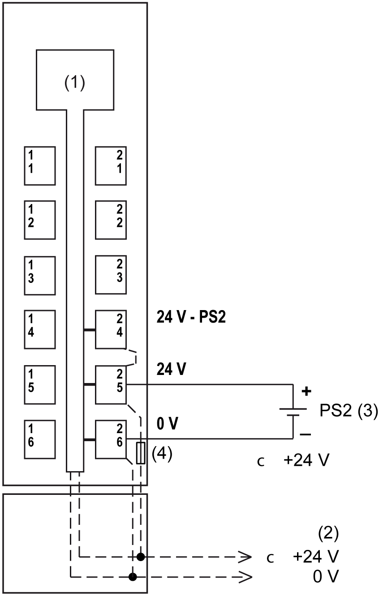

# TM5SPS1F Wiring Diagram

## Wiring Diagram

The following figure shows the wiring diagram for TM5SPS1F:

**1** Internal electronics

**2** 24 Vdc I/O power segment integrated into the bus bases

**3** PS2: External isolated power supply 24 Vdc

**4** Integrated fuse type T slow-blow 6.3 A 250 V exchangeable

NOTE: Connect the 0 Vdc power circuits together and to the functional ground (FE) of your system to meet the EMC requirements.

| DANGER | |
| --- | --- |
|  | HAZARD OF ELECTRIC SHOCK, EXPLOSION, OVERHEATING AND FIRE  * Do not connect the modules directly to line voltage. * Use only isolating PELV systems according to IEC 61140 to supply power to the modules. * Connect the 0 Vdc of the external power supplies to FE (Functional Earth/ground).  Failure to follow these instructions will result in death or serious injury. |

| WARNING | |
| --- | --- |
|  | UNINTENDED EQUIPMENT OPERATION  Do not connect wires to unused terminals and/or terminals indicated as “No Connection (N.C.)”.  Failure to follow these instructions can result in death, serious injury, or equipment damage. |

EIO0000001064.04