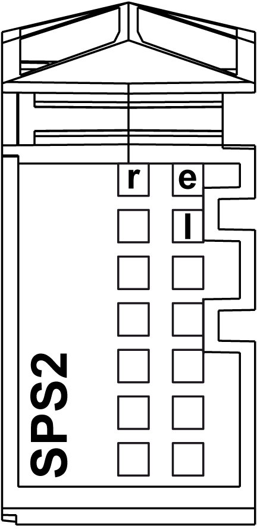

# TM5SPS2 Presentation

## Main Characteristics

The Power Distribution Module (PDM) TM5SPS2 feeds the TM5 power bus as well as the 24 Vdc I/O power segment.

The table below describes the main characteristics of the TM5SPS2 electronic module:

| Main characteristics | |
| --- | --- |
| Maximum current provided on 24 Vdc I/O power segment | 10000 mA |
| TM5 power bus current generated | 1136 mA |

## Ordering Information

The following figure and table gives the references to create a slice with the TM5SPS2 electronic module:

| Number | Reference | Description | Color |
| --- | --- | --- | --- |
| 1 | TM5ACBM01R  or  TM5ACBM05R | Bus base 24 Vdc I/O power segment left isolated  Bus base 24 Vdc I/O power segment left isolated with address setting | Gray  Gray |
| 2 | TM5SPS2 | Electronic module | Gray |
| 3 | TM5ACTBM12PS | Terminal block, 12-pin | Gray |

NOTE: For more information, refer to [TM5 Bus Bases and Terminal Blocks](../../../../../api/crossBook?lang=en-US&virtualBookName=pacdpig&topicID=D_SE_0004365).

## Status LEDs

The following figure shows the TM5SPS2 status LEDs:

The table below describes the TM5SPS2 status LEDs:

| LED | Color | Status | Description |
| --- | --- | --- | --- |
| r | Green | Off | Module supply not connected |
| Single flash | Reset state |
| Flashing | Preoperational state |
| On | RUN state |
| e | Red | Off | No error detected or module supply not connected. |
| Double flash | Indicates one of the following conditions:   * TM5 power bus is overloaded. * 24 Vdc I/O power segment, via the external power supply or supplies, is too low. * Input voltage for TM5 power bus, via the external power supply or supplies, is too low. |
| e+r | Steady red/single green flash | | Invalid firmware |
| l | Red | Off | TM5 power bus in the valid range |
| On | TM5 power bus is overloaded |

EIO0000001064.04