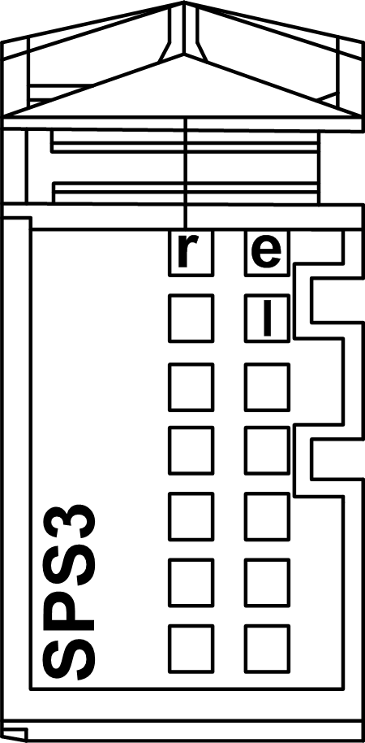

# TM5SPS3 Presentation

## Main Characteristics

The TM5SPS3 Interface Power Distribution Module (IPDM) consists of two dedicated electrical circuits:

* a 24 Vdc main power that serves the electronics of the Sercos III Bus Interface module and generates independent power for the TM5 power bus that serves the expansion modules.
* a 24 Vdc I/O power segment that serves:
  + the expansion modules,
  + the sensors and actuators connected to the expansion modules,
  + the external devices connected to the Common Distribution Modules (CDM)

The table below provides the main characteristics of the TM5SPS3 Interface Power Distribution Module (IPDM):

| Main Characteristics | |
| --- | --- |
| Maximum current provided on 24 Vdc I/O power segment | 10000 mA |
| TM5 power bus generated | 750 mA |

## Ordering Information

The following figure and table provide the references to create a TM5 Sercos III Bus Interface with the TM5SPS3 IPDM:

| Number | Reference | Description | Color |
| --- | --- | --- | --- |
| 1 | TM5ACBN1 | [Bus base for Sercos III Bus Interface module and Interface Power Distribution Module (IPDM)](D-SE-0015378.html#D-SE-0015378__D-SE-0015378.5) | White |
| 2 | TM5NS31 | [Sercos III Bus Interface module](D-SE-0015378.html#D-SE-0015378__D-SE-0015378.7) | White |
| 3 | TM5SPS3 | [Interface Power Distribution Module (IPDM)](D-SE-0015378.html#D-SE-0015378__D-SE-0015378.6) | Grey |
| 4 | TM5ACTB12PS | [Terminal block for PDM, IPDM and receiver electronic module](D-SE-0015378.html#D-SE-0015378__D-SE-0015378.8) | Grey |

NOTE: For more information, refer to [*TM5 Bus Bases and Terminal Blocks*](../../../../../api/crossBook?lang=en-US&virtualBookName=pacdpig&topicID=D_SE_0004365).

## Status LEDs

The following figure and table provide the TM5SPS3 IPDM status LEDs:

| LED | Color | Status | Description |
| --- | --- | --- | --- |
| r | Green | Off | Module supply not connected |
| Single flash | Reset status |
| Flashing | TM5 expansion bus in preoperational status |
| On | RUN status |
| e | Red | Off | No error detected or module supply not connected. |
| Double flash | Indicates one of the following conditions:   * 24 Vdc I/O power segment, via the external power supply or supplies, is too low. * TM5 power bus, via the external power supply or supplies, is too low. |
| e+r | Steady red/single green flash | | Invalid firmware |
| l | Red | Off | The TM5 Interface Power Distribution Module (IPDM) supply is within the valid range. |
| On | The TM5 Interface Power Distribution Module (IPDM) supply is insufficient. |

EIO0000001064.04