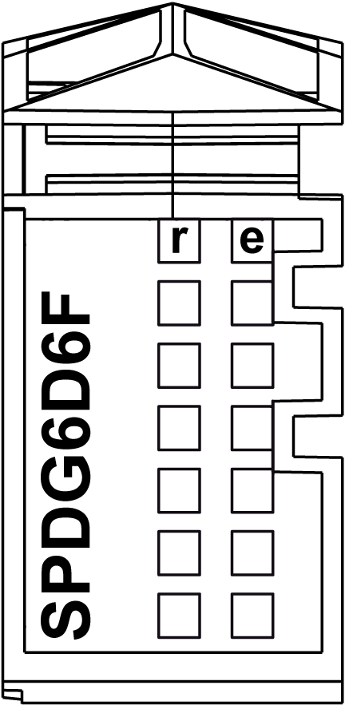

# TM5SPDG6D6F Presentation

## Main Characteristics

The TM5SPDG6D6F CDM provides six 0 Vdc and six 24 Vdc terminal connections from the 24 Vdc I/O power segment.

The module is equipped with an exchangeable fuse between the 24 Vdc potential on the terminal block and the 24 Vdc of the 24 Vdc I/O power segment. The status of the fuse is available with both the status LEDs and in the [I/O mapping tab](../../../../../api/crossBook?lang=en-US&virtualBookName=tm5prg&topicID=D_SE_0005886) of the EcoStruxure Machine Expert software.

The table below gives you the main characteristics of the TM5SPDG6D6F electronic module:

| Main Characteristics | | |
| --- | --- | --- |
| Power supply source | 24 Vdc I/O power segment | |
| Type of common connections | 0 Vdc | 24 Vdc |
| Number of common connections | 6 | 6 |

## Ordering Information

The following figure shows a slice with the TM5SPDG6D6F electronic module:

| Number | Model Number | Description | Color |
| --- | --- | --- | --- |
| 1 | TM5ACBM11  or  TM5ACBM15 | Bus base  Bus base with address setting | White  White |
| 2 | TM5SPDG6D6F | Electronic module | White |
| 3 | TM5ACTB12 | Terminal block, 12-pin | White |

NOTE: For more information, refer to [TM5 Bus Bases and Terminal Blocks](../../../../../api/crossBook?lang=en-US&virtualBookName=pacdpig&topicID=D_SE_0004365).

## Status LEDs

The following figure shows the TM5SPDG6D6F status LEDs:

The table below describes the TM5SPDG6D6F status LEDs:

| LEDs | Color | Status | Description |
| --- | --- | --- | --- |
| r | Green | Off | Module supply not connected |
| Single flash | Reset state |
| Flashing | Preoperational state |
| On | RUN state |
| e | Red | Off | No error detected or module supply not connected |
| On | Detected error or reset state |
| Single flash | Fuse is blown or absent |
| Double flash | Insufficient feed voltage |
| Triple flash | 24 Vdc I/O power segment OK, fuse is blown and feed voltage is too low |
| e+r | Steady red / single green flash | | Invalid firmware |

EIO0000001064.04