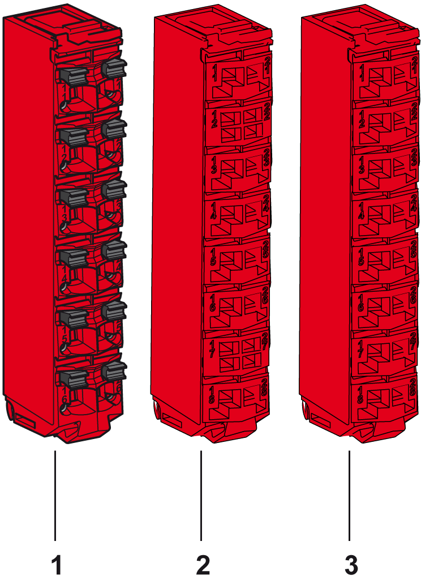

# TM5 Safety-Related System Terminal Block

## Overview

The main features of the terminal blocks are:

* Tool-free [wiring](D-SE-0018511.html#D-SE-0018511) with spring clamp push-in technology
* Simple push-button wire release
* Ability to [label](D-SE-0001023.html#D-SE-0001023__D-SE-0001023.3) each terminal
* [Plain text labeling](D-SE-0001024.html#D-SE-0001024__D-SE-0001024.5) also possible
* [Test access](D-SE-0002456.html#D-SE-0002456__D-SE-0002456.4) for standard probes

The following figure shows the TM5 Safety-Related System terminal block:

| Number | Reference | Description | Color |
| --- | --- | --- | --- |
| 1 | TM5ACTB52FS | 24 Vdc / 230 Vac, 12-pin terminal block for safety-related modules and Safety Logic Controller, safety coded | Red |
| 2 | TM5ACTB5EFS | 24 Vdc, 16-pin terminal block for safety-related modules, safety coded, 2x PT1000 integrated for terminal temperature compensation | Red |
| 3 | TM5ACTB5FFS | 24 Vdc, 16-pin terminal block for safety-related modules, safety coded | Red |

A slice must only be composed of a single color. For example, a gray bus base should only be assembled with a gray electronic module and a gray terminal block. However, color alone is not sufficient for compatibility; always confirm that functionality of slice components matches as well.

| DANGER | |
| --- | --- |
|  | INCOMPATIBLE COMPONENTS CAUSE ELECTRIC SHOCK OR ARC FLASH  * Do not associate components of a slice that have different colors. * Always confirm the compatibility of slice components and modules before installation using the association table in this manual. * Verify that correct terminal blocks (minimally, matching colors and correct number of terminals) are installed on the appropriate electronic modules.  Failure to follow these instructions will result in death or serious injury. |

## General Characteristics

| DANGER | |
| --- | --- |
|  | FIRE HAZARD  * Use only the correct wire sizes for the maximum current capacity of the I/O channels and power supplies. * For relay output (2 A) wiring, use conductors of at least 0.5 mm2 (AWG 20) with a temperature rating of at least 80 °C (176 °F). * For common conductors of relay output wiring (7 A), or relay output wiring greater than 2 A, use conductors of at least 1.0 mm2 (AWG 16) with a temperature rating of at least 80 °C (176 °F).  Failure to follow these instructions will result in death or serious injury. |

| WARNING | |
| --- | --- |
|  | UNINTENDED EQUIPMENT OPERATION  Do not exceed any of the rated values specified in the environmental and electrical characteristics tables.  Failure to follow these instructions can result in death, serious injury, or equipment damage. |

| WARNING | |
| --- | --- |
|  | UNINTENDED EQUIPMENT OPERATION  Do not connect wires to unused terminals and/or terminals indicated as “No Connection (N.C.)”.  Failure to follow these instructions can result in death, serious injury, or equipment damage. |

The following table shows the technical data for TM5 Safety-Related System terminal block, see also [environmental characteristics](D-SE-0015384.html#D-SE-0015384):

| General Characteristics | | |
| --- | --- | --- |
| Type of terminal | | Spring-clamp push-in terminal |
| Contact resistance | | ≤ 5 mΩ |
| Maximum voltage(1) | TM5ACTB52FS | 253 Vac |
| TM5ACTB5EFS | 50 Vdc |
| TM5ACTB5FFS |
| Current(1) | TM5ACTB52FS | 10 A maximum per connector |
| TM5ACTB5EFS | 2 A maximum per connector |
| TM5ACTB5FFS |
| Weight | TM5ACTB52FS | 20 g (0.7 oz) |
| TM5ACTB5EFS |
| TM5ACTB5FFS |
| Connection cross section | TM5ACTB52FS | |
| Solid wire line  Fine wire line  With wire cable end  With double wire cable end | 0.08 mm²...2.5 mm² (AWG 28...14)  0.25 mm²...2.5 mm² (AWG 24...14)  0.25 mm²...1.5 mm² (AWG 24...16)  2 x 0.25...2 x 0.75 mm² (AWG 2 x 24...2 x 18) |
| TM5ACTB5EFS  TM5ACTB5FFS | |
| Solid wire line  Fine wire line  With wire cable end  With double wire cable end | 0.08 mm²...1.5 mm² (AWG 28...16)  0.25 mm²...1.5 mm² (AWG 24...16)  0.25 mm²...0.75 mm² (AWG 24...20)  - |
| Wire | | Follow the [wiring rules](D-SE-0018511.html#D-SE-0018511__D-SE-0018511.8). |
| **(1)** Connected voltage and current depends on I/O electronics modules associated. | | |

| DANGER | |
| --- | --- |
|  | LOOSE WIRING CAUSES ELECTRIC SHOCK  Do not insert more than one wire per connector of the spring terminal blocks unless using a double wire cable end (ferrule).  Failure to follow these instructions will result in death or serious injury. |

## Maximum Insertion/Removal Cycles

The TM5 System bus bases are designed to withstand up to 50 electronic module insertion/removal cycles.

NOTE: If electronic modules are inserted and removed from a bus base more than 50 times, the integrity of the electronic module-to-bus base contacts are subject to possible degradation.

EIO0000001064.04