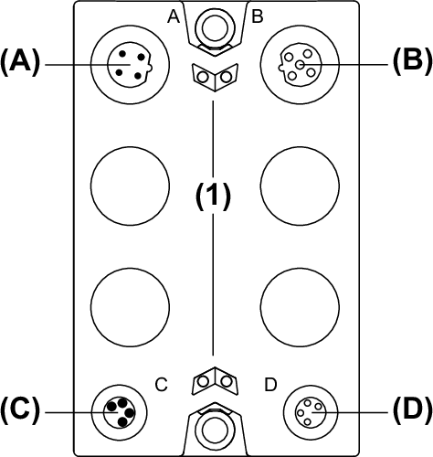
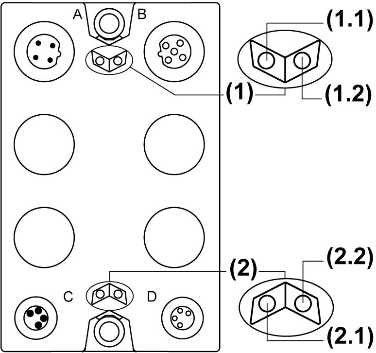

# TM7SPS1A Presentation

## Main Characteristics

The TM7SPS1A PDB supplies the TM7 power bus.

The following table provides the main characteristics of the TM7SPS1A block:

| Main Characteristics | |
| --- | --- |
| Rated output power | 15 W |
| Rated input voltage | 24 Vdc |
| Rated output voltage | 20 Vdc |
| Rated output current | 750 mA |
| TM7 bus connection type | M12, B coded, male and female connector types |
| Power supply connection type | M8, 4-pin, male and female connector types |

## Description

The following figure illustrates the TM7SPS1A block:

**(A)** TM7 bus IN connector

**(B)** TM7 bus OUT connector

**(C)** 24 Vdc power IN connector

**(D)** 24 Vdc power OUT connector

**(1)** Status LEDs

NOTE: Refer also to [Status LEDs](#D-SE-0009377__D-SE-0009377.11).

## Status LEDs

The following figure illustrates the status LEDs of the TM7SPS1A block:

**(1)** TM7 power bus status LEDs, set of two LEDs: 1.1 (green) and 1.2 (green)

**(2)** Power status LEDs, set of two LEDs: 2.1 (orange) and 2.2 (orange)

The table below describes the TM7 power bus status LEDs of the TM7SPS1A block:

| TM7 power bus status LEDs | | Description |
| --- | --- | --- |
| LED 1.1 | LED 1.2 |
| OFF | OFF | No power supply on TM7 Bus, or detected error on TM7 Power bus |
| ON | ON | TM7 power supply is in valid range |

The table below describes the power status LEDs of the TM7SPS1A block:

| Power status LEDs | | Description |
| --- | --- | --- |
| LED 2.1 | LED 2.2 |
| OFF | OFF | No power supply, or power supply below the lower limit value |
| ON | ON | Power block supply is in valid range |

EIO0000001064.04