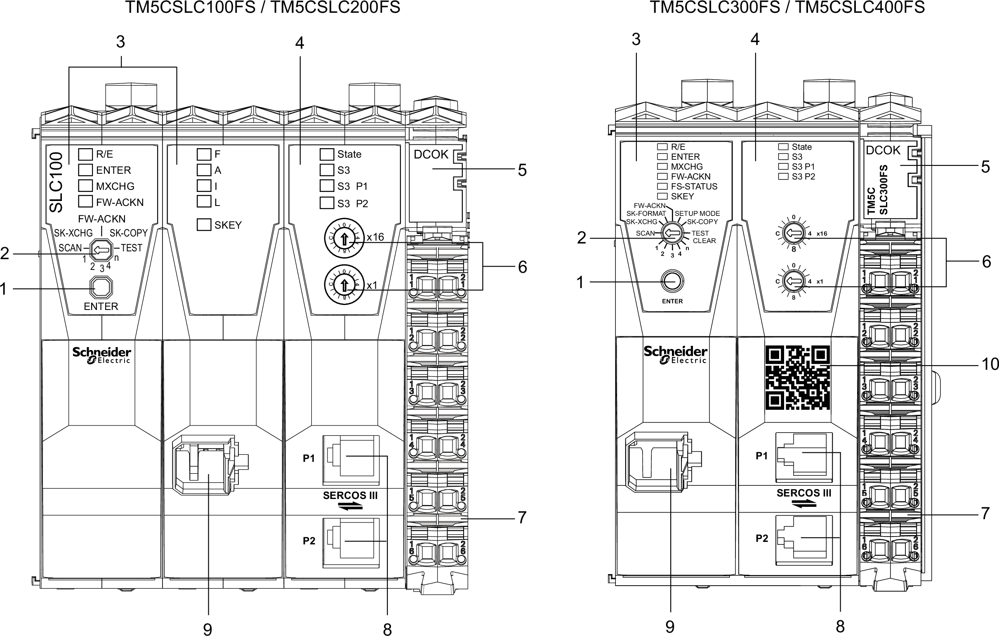

# Safety Logic Controller Description

## Description

The LED indicators, buttons and switches are integrated to operate the Safety Logic Controller.

The following figure presents the operating and connection elements:

| N° | Description | Reference / Function |
| --- | --- | --- |
| 1 | Confirmation button | [Confirming a Function](D-SE-0011446.html#D-SE-0011446__D-SE-0011446.15) |
| 2 | Selection switch | [Description of the Selection Switch Functions](D-SE-0011446.html#D-SE-0011446__D-SE-0011446.17) |
| 3 | Logic processor | [Logic Processor LED indicators](D-SE-0011295.html#D-SE-0011295) |
| 4 | Sercos III interface | [Sercos III interface](D-SE-0011447.html#D-SE-0011447) |
| 5 | Integrated power supply | [Integrated Power Supply](D-SE-0011448.html#D-SE-0011448) |
| 6 | Sercos address switches | [Sercos Address](D-SE-0011447.html#D-SE-0011447__D-SE-0011447.16) |
| 7 | Terminal block for Safety Logic Controller power supply | [Safety-Related Terminal Block Presentation](D-SE-0010864.html#D-SE-0010864) |
| 8 | Sercos III connection with 2 x RJ45 | [Sercos III RJ45 Ports](D-SE-0011447.html#D-SE-0011447__D-SE-0011447.17) |
| 9 | Memory key slot | [Safety Logic Controller Memory Key](D-SE-0011009.html#D-SE-0011009) |
| 10 | QR code | Scanning the QR code opens the product specific Schneider Electric website. |

These components enable you to perform the following operations:

* confirm the module replacement
* confirm the firmware update
* confirm the memory key replacement, including a possible transfer of module configuration from the previous memory key
* support for the replacement of Safety Logic Controller

EIO0000000889.09