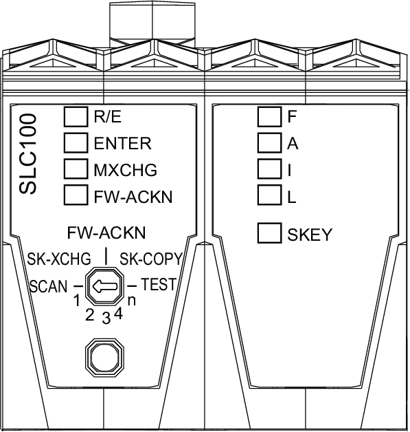
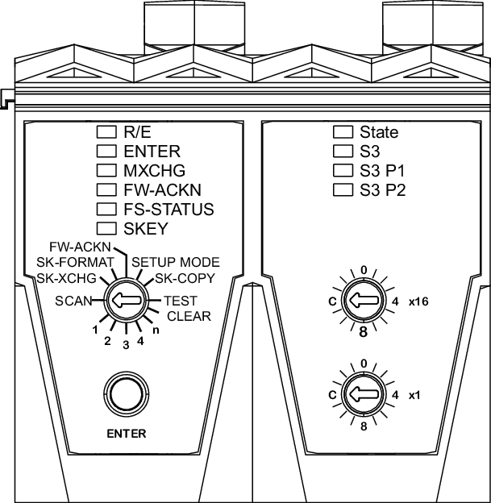

# Logic Processor LED Indicators

## Description of the Logic Processor LED Indicators for TM5CSLC100FS and TM5CSLC200FS

The figure and table present the LED indicators for the logic processor of the TM5CSLC100FS and TM5CSLC200FS:

| LED indicator | LED color | LED status | | | | Description | Instructions / information for the user |
| --- | --- | --- | --- | --- | --- | --- | --- |
| **R/E** | N/A | off | | | | Boot phase | - |
| green | on | | | | Application found and executed |
| flashing | | | | Application exists but is not being processed |
| orange | on | | | | EcoStruxure Machine Expert - Safety software is in RUN (Debug) state |
| flashing | | | | EcoStruxure Machine Expert - Safety software is in STOP (Debug) state or HALT (Debug) state, application stopped |
| fast flashing | | | | No application found on the memory key |
| **ENTER**(1) | green | on | | | | Waiting for confirmation | - |
| 1x flash for 0.8 s | | | | Confirmation of correct entry |
| flashes (1 Hz) for 5 s | | | | Operator error detected |
| **MXCHG**(1) | orange | off | | | | Valid module configuration | - |
|  | | | | Replacement of one module detected | Select the position 1 on the selection switch and press the confirmation button ENTER. |
|  | | | | Replacement of two modules detected | Select the position 2 on the selection switch and press the confirmation button ENTER. |
|  | | | | Replacement of three modules detected | Select the position 3 on the selection switch and press the confirmation button ENTER. |
|  | | | | Replacement of four modules detected | Select the position 4 on the selection switch and press the confirmation button ENTER. |
|  | | | | Replacement of more than four modules detected | Select the position n on the selection switch and press the confirmation button ENTER. |
|  | | | | Missing module detected  The flash sequence for a missing module is 100 ms on, 100 ms off. | - |
| **FW-ACKN**(1) | orange | off | | | | Valid firmware configuration | - |
| flashing | | | | Firmware update successful | Select the position FW-ACKN on the selection switch and press the confirmation button ENTER. |
| on | | | | Memory key was exchanged | Select the position SK-XCHG on the selection switch and press the confirmation button ENTER. |
| **F**  **A**  **I**  **L** | red | **F** | **A** | **I** | **L** | These four LEDs indicate first the boot status, then, when the system is running, the general state of the controller. | - |
| x | - | x | x | * Boot phase * Loading of the firmware * Memory key is missing * Project CRC (Cyclic Redundancy Check) is wrong or not defined * Safety Logic Controller cycle time is exceeded | If the LED status persists:   * Refer to the Safe logger for additional diagnostic information on the error. * Verify if the memory key is plugged correctly. * Re-download the corresponding project, and verify the project CRC. * Verify the cycle time and increase it if necessary. |
| x | x | x | x | Hardware test (max. approx. 5 s) | - |
| x | **X** | x | **X** | Initialization and start-up of the firmware |
| - | - | - | **X** | Pre-operational state |
| - | - | - | - | Operational state |
| x | x | x | x | Controller in error state(2) |
| x = illuminated  **X**= brightly illuminated  - = off | | | | |
| alternating flashing of **FI** and **AL** | | | | EcoStruxure Machine Expert - Safety software is connected and in RUN (Debug) state |
| **SKEY** | orange | off | | | | No access to the memory key | - |
| flashing | | | | Access to the memory key |
| **(1)** When a module scan is being executed, the **ENTER**, **MXCHG**, and **FW-ACKN** LED indicators are flashing.  **(2)** When the controller is in error state, the states of the other LED indicators (**R/E**, **ENTER**, **MXCHG**, and **FW-ACKN**) are not updated. | | | | | | | |

## Description of the Logic Processor LED Indicators for TM5CSLC300FS and TM5CSLC400FS

The figure and table present the LED indicators for the logic processor of the TM5CSLC300FS and TM5CSLC400FS:

| LED indicator | LED color | LED status | | | | Description | Instructions / information for the user |
| --- | --- | --- | --- | --- | --- | --- | --- |
| **R/E** | N/A | off | | | | Boot phase | - |
| green | on | | | | Application found and executed |
| flashing | | | | Application exists but is not being processed |
| orange | on | | | | EcoStruxure Machine Expert - Safety software is in RUN (Debug) state |
| flashing | | | | EcoStruxure Machine Expert - Safety software is in STOP (Debug) state or HALT (Debug) state, application stopped |
| fast flashing | | | | No application found on the memory key |
| **ENTER**(1) | green | on | | | | Waiting for confirmation | - |
| 1x flash for 0.8 s | | | | Confirmation of correct entry |
| flashes (1 Hz) for 5 s | | | | Operator error detected |
| **MXCHG**(1) | orange | off | | | | Valid module configuration | - |
|  | | | | Replacement of one module detected | Select the position 1 on the selection switch and press the confirmation button ENTER. |
|  | | | | Replacement of two modules detected | Select the position 2 on the selection switch and press the confirmation button ENTER. |
|  | | | | Replacement of three modules detected | Select the position 3 on the selection switch and press the confirmation button ENTER. |
|  | | | | Replacement of four modules detected | Select the position 4 on the selection switch and press the confirmation button ENTER. |
|  | | | | Replacement of more than four modules detected | Select the position n on the selection switch and press the confirmation button ENTER. |
|  | | | | Missing module detected  The flash sequence for a missing module is 100 ms on, 100 ms off. | - |
| **FW-ACKN**(1) | orange | off | | | | Valid firmware configuration | - |
| flashing | | | | Firmware update successful | Select the position FW-ACKN on the selection switch and press the confirmation button ENTER. |
| on | | | | Memory key was exchanged | Select the position SK-XCHG on the selection switch and press the confirmation button ENTER. |
| **FS-STATUS** | red | - | | | | Indicates the boot behavior or the **FS-STATUS** state for the entire module after booting. | - |
| on | | | | Safety-related state is active.  When the controller is in the defined safe state, the states of the other LED indicators (**R/E**, **ENTER**, **MXCHG**, and **FW-ACKN**) are not updated. |
| off | | | | Safety-related firmware OPERATIONAL state. |
|  | | | | Boot phase or memory key is missing. | - |
|  | | | | Safety-related firmware PRE\_OPERATIONAL state, or the Safety Logic Controller is not in state SafeRUN (parameter SafeOSstate <> SafeRUN). | - |
|  | | | | Safety-related communication channel not OK, openSAFETY connection valid bit not stable/not set, or the Safety Logic Controller is not in state SafeRUN (parameter SafeOSstate <> SafeRUN).  If the Safety Logic Controller remains in this state for a longer time, verify the parameter Default Safe Data Duration.  For more information, refer to the [Safe Logic Controller TM5CSLCx00FS for PacDrive Device Objects and Parameters Guide](../../../../../api/crossBook?lang=en-US&virtualBookName=PD.Parameter.SafeLogicController&topicID=D_SE_0093254) and to the *Safe Logic Controller TM5CSLCx00FS for M262, Device Objects and Parameters Guide*. |
|  | | | | Boot phase, inoperable firmware, setup mode active.  For more information refer to [Setup Mode](D-SE-0011446.html#D-SE-0011446__SETUPMODEForAnd-17FC2DF5). |
|  | | | | The firmware for this module is a non-certified pilot version of EcoStruxure Machine Expert - Safety. |
|  | | | | EcoStruxure Machine Expert - Safety is in Debug mode. |  |
| **SKEY** | orange | off | | | | No access to the memory key | - |
| flashing | | | | Access to the memory key |
| **(1)** When a module scan is being executed, the **ENTER**, **MXCHG**, and **FW-ACKN** LED indicators are flashing. | | | | | | | |

| DANGER | |
| --- | --- |
|  | UNINTENDED EQUIPMENT OPERATION  * A constantly lit FS-STATUS LED indicates a possible safety-related system error. * It is your responsibility to ensure that all necessary repair measures are initiated after an error occurs since subsequent errors can result in dangerous situations!  Failure to follow these instructions will result in death or serious injury. |

## Testing the LED Indicators for the Logic Processor

Follow this procedure to test the LED indicators:

| Step | Action |
| --- | --- |
| 1 | Position the selection switch to **TEST**. |
| 2 | Press the confirmation button.  **Result:** All LED indicators on the logic processor, except the LEDs of the Sercos III interface and the LED of the integrated power supply, illuminate for as long as you press the confirmation button. |

EIO0000000889.09