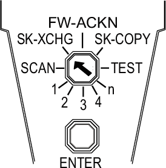
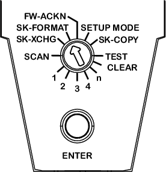

# Logic Processor Selection Switch and Confirmation Button

## Overview

Whenever you make a change in the configuration (module or memory key replacement, or firmware update), you need to acknowledge the change on the Safety Logic Controller using the selection switch and the confirmation button.

## Description of the Selection Switch Functions of TM5CSLC100FS and TM5CSLC200FS

The following table describes the selectable functions of TM5CSLC100FS and TM5CSLC200FS:

| Selection switch position | Function | Description |
| --- | --- | --- |
| **FW-ACKN** | Module [firmware update](#D-SE-0011446__FirmwareUpdate-1A020837) | To acknowledge the firmware update on one or more modules (1) |
| **SK-XCHG** | [Memory key replacement](D-SE-0011009.html#D-SE-0011009__D-SE-0011009.6) | To confirm the memory key replacement(1) |
| Unlabeled position between **SK-XCHG** and **FW-ACKN**. | [Formatting the Memory Key](D-SE-0011009.html#D-SE-0011009__D-SE-0011009.8) | To format the memory key. |
| **SK-COPY** | [Memory key copy](D-SE-0011009.html#D-SE-0011009__D-SE-0011009.6) | To copy the configuration data from the memory key to the safety logic(1) |
| **SCAN** | Scan | To perform a module scan |
| **TEST** | [Test](D-SE-0011295.html#D-SE-0011295__D-SE-0011295.13) | To perform an LED indicator test |
| **1, 2, 3, 4, n** | Module(s) replacement | To confirm the replacement of 1, 2, 3, 4 or more than 4 module(s) |
| **(1)** Triggers an automatic restart. | | |

## Description of the Selection Switch Functions of TM5CSLC300FS and TM5CSLC400FS

The following table describes the selectable functions of TM5CSLC300FS and TM5CSLC400FS:

| Selection switch position | Function | Description |
| --- | --- | --- |
| **FW-ACKN** | Module [firmware update](#D-SE-0011446__FirmwareUpdate-1A020837) | To acknowledge the firmware update on one or more modules |
| **SK-FORMAT** | [Formatting the Memory Key](D-SE-0011009.html#D-SE-0011009__D-SE-0011009.8) | To format the memory key(1) |
| **SETUP MODE** | [Setup mode](#D-SE-0011446__SETUPMODEForAnd-17FC2DF5) | To enable or disable(1) the setup mode. |
| **CLEAR** | Clear data | This function is unsupported.(1) |
| **SK-XCHG** | [Memory key replacement](D-SE-0011009.html#D-SE-0011009__D-SE-0011009.6) | To confirm the memory key replacement |
| **SK-COPY** | [Memory key copy](D-SE-0011009.html#D-SE-0011009__D-SE-0011009.6) | To copy the configuration data from the memory key to the safety logic(1) |
| **SCAN** | Scan | To perform a module scan |
| **TEST** | [Test](D-SE-0011295.html#D-SE-0011295__D-SE-0011295.13) | To perform an LED indicator test |
| **1, 2, 3, 4, n** | Module(s) replacement | To confirm the replacement of 1, 2, 3, 4 or more than 4 module(s) |
| **(1)** Triggers an automatic restart. | | |

## Confirming a Function (except the Function Formatting the Memory Key)

To confirm a configuration change, proceed as follows:

| Step | Action |
| --- | --- |
| 1 | Select the desired function by means of the selection switch.  NOTE: If you do not place the selection switch properly, the LED **ENTER** flashes for 5 s to display a detected error.  **Example:** To replace one specific module, place the selection switch on **1**. If the selection switch is not set to **1** when only one module was replaced, an error is detected and the LED **ENTER** flashes for 5 s. |
| 2 | Press the confirmation button for 0.5 to 5 s to receive a confirmation.  **Result:** After 0.5 s, the LED **ENTER** is illuminated. |
| 3 | Release the confirmation button.  **Result**: The LED **ENTER** remains illuminated for additional 0.8 s. |
| NOTE: If you release the confirmation button before 0.5 s, it has no effect. If you press the confirmation button longer than 5 s, the LED **ENTER** flashes for 5 s to display a detected error. | |

## Confirming the Function Formatting the Memory Key

For information on how to confirm the formatting of the memory key, refer to the description for [Formatting the Memory Key](D-SE-0011009.html#D-SE-0011009__D-SE-0011009.8).

## Firmware Update

* A firmware update is indicated by the **FW-ACKN** status and must be confirmed with the **FW-ACKN** selection switch.
* After firmware modification, run a full functional test.

| DANGER | |
| --- | --- |
|  | unintended equipment operation  * Only qualified personnel familiar with the safety application and its functions and trained in the procedure of exchanging firmware may perform functional testing. * Validate the overall safety function.  Failure to follow these instructions will result in death or serious injury. |

## Selection Switch SETUP MODE of TM5CSLC300FS and TM5CSLC400FS

* The setup mode supports you during commissioning.
* An active setup mode is indicated by the LED **FS-STATUS** (refer to [Description of the Logic Processor LED Indicators for TM5CSLC300FS and TM5CSLC300FS](D-SE-0011295.html#D-SE-0011295__DescriptionOfTheLEDIndicatorsForThe-177D250C)) and an entry in the Safe Logger.
* The setup mode can be activated and deactivated using the SlcRemoteController library (refer to [*SlcRemoteController Library Guide*](../../../../../api/crossBook?lang=en-US&virtualBookName=PD.Lib.SlcRemoteController&topicID=D_SE_0075102)) or using the selector switch and confirmation button on your controller.
* When the setup mode is active, the acknowledgement requests Memory key exchange, Firmware acknowledge and Module replacement are no longer required.

| DANGER | |
| --- | --- |
|  | Unintended equipment operation  * Setup mode may only be enabled during commissioning of the machine. * Setup mode must be disabled during operation. * Power cycling the Safety Logic Controller does not disable the setup mode.  Failure to follow these instructions will result in death or serious injury. |

| DANGER | |
| --- | --- |
|  | inoperable safety function  * Test the proper functioning of the safety functions and the wiring after setup mode and after every device replacement. * If a memory key or a Safety Logic Controller is replaced during active setup mode, the setup mode will be deactivated. * Only qualified personnel may perform a test of the safety functions. * Validate the overall safety function.  Failure to follow these instructions will result in death or serious injury. |

EIO0000000889.09