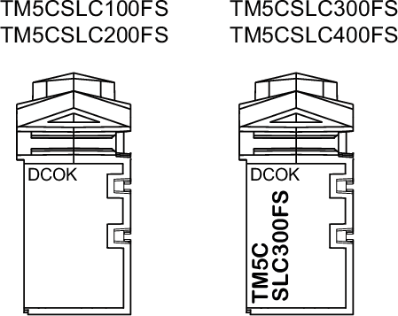
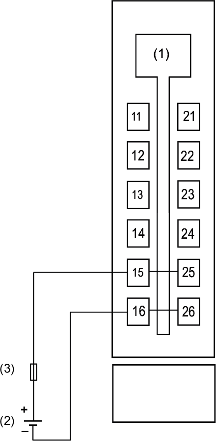

# Integrated Power Supply

## Presentation

A power supply is integrated in the Safety Logic Controller TM5CSLC100FS /TM5CSLC200FS and TM5CSLC300FS / TM5CSLC400FS.

## LED indicators

The following figure presents the status LED indicators for integrated power supply:

The following table describes the LED status for the integrated power supply:

| LED indicator | LED color | LED status | State description |
| --- | --- | --- | --- |
| **DCOK** | green | on | Power applied to the controller |
| off | No power applied to the controller |

## Wiring Diagram

| DANGER | |
| --- | --- |
|  | FIRE HAZARD  Use only the correct wire sizes for the maximum current capacity of the power supplies.  Failure to follow these instructions will result in death or serious injury. |

| DANGER | |
| --- | --- |
|  | HAZARD OF ELECTRIC SHOCK, EXPLOSION, OVERHEATING AND FIRE  * Do not connect the modules directly to line voltage. * Use only isolating PELV systems according to IEC 61140 to supply power to the modules. * Connect the 0 Vdc of the external power supplies to FE (Functional Earth/ground).  Failure to follow these instructions will result in death or serious injury. |

The following figure presents the wiring diagram of the power supply for the Safety Logic Controller:

**1** Internal electronics

**2** External isolated power supply 24 Vdc (-15% / +20%)

**3** External fuse, Type T slow-blow, 1 A, 250 V

EIO0000000889.09