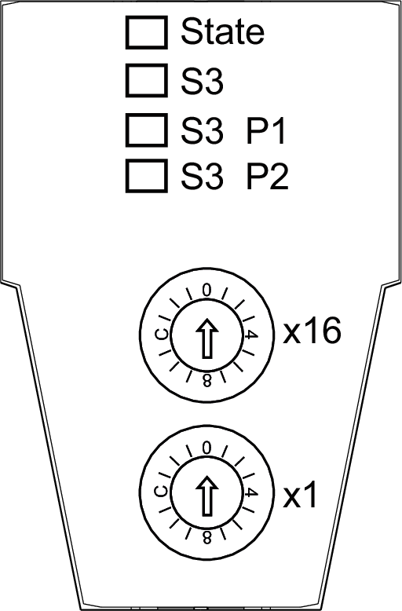
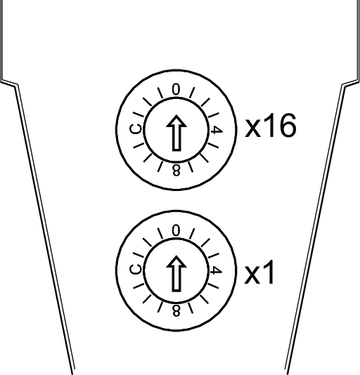
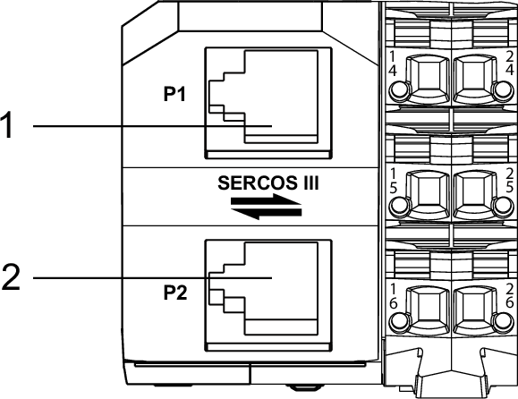

# Sercos III Interface

## LED Indicators for the Sercos III Interface

The following figure presents the LED indicators for the Sercos III interface of the TM5CSLC100FS / TM5CSLC200FS and TM5CSLC300FS / TM5CSLC400FS:

The following LED indicators are provided:

* **State**
* **S3**
* **S3 P1**
* **S3 P2**

## **State** LED Indicator

The **State** LED is a green (status) / red (error) dual LED indicator:

The following table describes the **State** LED indicator:

| LED color | LED status | State description |
| --- | --- | --- |
| - | off | No supply voltage applied or device is inoperable. |
| green | on | No detected error, bus interface is initialized and ready for operation. |
| green | flashing (12.5 Hz) | Initialization phase (booting of the I/O modules or setting up the I/O functional groups). |
| green | flashing (4 Hz) | Recoverable error detected, such as missing I/O module (this LED indicator is reset when the error state is corrected). |
| green | flashing (0.66 Hz) | New or modified configuration data (I/O modules or bus interface) have been received but not yet stored in the flash memory. |
| red | flashing (8 Hz) | Unrecoverable error detected (for example, lack of resources, error detected in the firmware data flow). |

NOTE: After applying power to the bus interface, several red flashing signals are displayed. These signals are not error indications, but indication of the initialization process.

NOTE: If the firmware update is unsuccessful (corrupted file, interruption of the update, etc.), the bus interface restarts with the previous version of the firmware.

## **S3** (Sercos III) LED Indicator

The following table describes the **S3** LED indicator:

| LED color | LED status | State description | Instructions |
| --- | --- | --- | --- |
| - | off | Power is removed or there is no communication due to a connection interruption. | Apply power or verify physical connections |
| green | on | Active Sercos III connection without a detected error in the Communication Phase 4 (CP4). | n.a. |
| green | flashing (4 Hz, 125 ms) | The device is in Loopback mode. Loopback describes the situation in which the Sercos III telegrams have to be sent back on the same port on which they were received.  Possible causes:   * line topology * Sercos III ring break | Close the ring. |
| red | on | Sercos III diagnostic class error has been detected on port 1 and/or Sercos III communication is no longer possible on the ports (for example due to an encoder error). | Reset condition   * clear the detected device errors * acknowledge the detected error in the menu * switch from CP2 to CP3 alternatively.  NOTE: Diagnostic messages pending in the system are not acknowledged by this. |
| red/green | flashing (4 Hz, 125 ms) | Detected communication error.  Possible causes:   * improper functioning of the telegram * detected CRC (Cyclic Redundancy Check) error | Reset condition   * The configuration indicates the detected error * acknowledge the detected error. * switch from CP2 to CP3 alternatively.  NOTE: Diagnostic messages pending in the system are not acknowledged by this. |
| orange | on | The device is in a communication phase CP0 up to and including CP3. Sercos III telegrams are received. | n.a. |
| orange | flashing (4 Hz, 125 ms) | Device identification | Triggered by using the parameter `IdentifyDevice`(1) or the DriveAssistant tool. |
| **(1)** IdentifyDevice is a parameter in EcoStruxure Machine Expert. | | | |

## **S3 P1**/**S3 P2** LED Indicators

The following table describes the **S3 P1** (Port 1) and **S3 P2** (Port 2) LED indicators:

| LED color | LED status | State description |
| --- | --- | --- |
| - | off | no cable connected |
| green | flashing | active Sercos III communication |
| green | on | link, but no telegrams / communication (for example controller is booting) |

## Sercos Address

The Sercos address is set by two switches. Positioning the switches at 0 triggers the auto-addressing feature.

NOTE: Only Sercos addresses between 1 and 255 are allowed.

The following figure presents the Sercos address switches:

NOTE: The Sercos address is in hexadecimal notation. Set the address (1...255 dec) manually by the two Sercos address switches.

The following table describes the Sercos address, set with the 2 hexadecimal switches:

| Sercos address | Description |
| --- | --- |
| 0 dec (0 hex) | Auto-addressing (not a valid address)   * For PacDrive LMC controllers, the setting 0 is recognized when the value SerialNumberController or TopologyAddress or ApplicationType is selected for the parameter IdentificationMode(1). * For Modicon TM262M• controllers, the setting 0 is recognized, when the value Topology mode is selected for the parameter IdentificationMode(1). |
| 1-255 dec (1-FF hex) | Manual addressing   * For PacDrive LMC controllers, this setting is recognized when the value SercosAddress is selected for the parameter IdentificationMode(1). * For Modicon TM262M• controllers, this setting is recognized when the value Sercos mode is selected for the parameter IdentificationMode(1). |
| **(1)** IdentificationMode is a parameter in EcoStruxure Machine Expert. | |

**Example:**

In order to set the Sercos address 190 (dec) / BE (hex), set the two hexadecimal switches as follows:

* Switch x1 = E
* Switch x16 = B

## Sercos III Ports

The following figure presents the RJ45 connectors of the Safety Logic Controller:

**1** Sercos III PORT A (**P1**)

**2** Sercos III PORT B (**P2**)

The following table lists the pin assignments for the RJ45 connectors:

| Pin | Assignment |
| --- | --- |
| 1 | RXD (Receive Data) |
| 2 | RXD\ |
| 3 | TXD (Transmit Data) |
| 4 | Termination |
| 5 | Termination |
| 6 | TXD\ |
| 7 | Termination |
| 8 | Termination |

For more information about the Sercos III ports, refer to [Fieldbus Characteristics](D-SE-0011292.html#D-SE-0011292__D-SE-0011292.16).

EIO0000000889.09