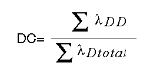

# DC

diagnostic coverage

Fractional decrease in the probability of dangerous hardware failures resulting from the operation of the automatic diagnostic tests

(definition IEC 61508)

The fraction of the possible dangerous failures λD is divided into failures which are detected by diagnostics and failures which remain undetected.

λD=λDD+λDU

The diagnostic coverage (DC) defines the fraction of the dangerous failures which are detected.

λDD=λD • DC

λDU=λD • (1-DC)

The definition may also be represented in terms of the following equation, where DC is the diagnostic coverage, λDD is the probability of detected dangerous failures and λD total is the probability of total dangerous failures:

EIO0000000889.09