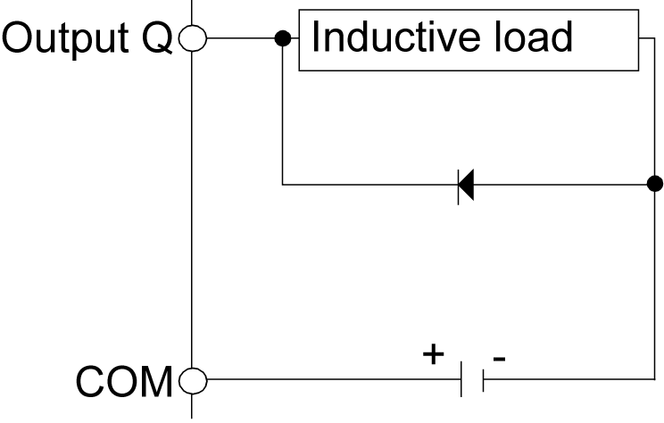
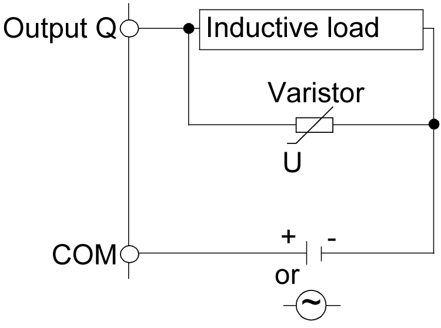

# Wiring Best Practices

## Introduction

There are several rules that must be followed when wiring the TM5/TM7 System.

## Wiring Rules

| DANGER | |
| --- | --- |
|  | HAZARD OF ELECTRIC SHOCK, EXPLOSION OR ARC FLASH  * Disconnect all power from all equipment including connected devices prior to removing any covers or doors, or installing or removing any accessories, hardware, cables, or wires except under the specific conditions specified in the appropriate hardware guide for this equipment. * Always use a properly rated voltage sensing device to confirm the power is off where and when indicated. * Replace and secure all covers, accessories, hardware, cables, and wires and confirm that a proper ground connection exists before applying power to the unit. * Use only the specified voltage when operating this equipment and any associated products.  Failure to follow these instructions will result in death or serious injury. |

The following rules must be applied when wiring the system:

* I/O and communication wiring must be kept separate from the power wiring. Route these 2 types of wiring in separate cable ducting.
* Verify that the operating conditions and environment are within the specification values.
* Use proper wire sizes to meet voltage and current requirements.
* Use copper conductors only.
* In the case of TM5 Safety-related I/O modules:

  + Use twisted pair, shielded cables for analog, expert, or fast I/O and TM5 bus signals.
  + Use twisted pair, shielded cables for encoder, networks and Sercos III bus.
* In the case of TM7 Safety-related I/O modules:

  + Use only the expansion bus and I/O cables specifically designed for TM7 I/O.

## Sercos Cable Characteristics

Cable characteristics of the Sercos cable (see the Schneider Electric catalog for the various cables available):

| Property | Value |
| --- | --- |
| Voltage isolation (jacket) | 300 Vdc |
| Temperature range | -20...+60 °C / -4...+140 °F |
| Cable diameter | 5.8 ± 0.2 mm (0.23 ± 0.008 in.) |
| Bending radius | 8 x diameter (fixed routing) |
| Sheath | PVC, flame-retardant |
| Cable type and shielding | CAT6 with S/FTP (Sercos III) |

## TM5 Safety–Related I/O Wiring

| WARNING | |
| --- | --- |
|  | UNINTENDED EQUIPMENT OPERATION  * Use shielded cables for all fast I/O, analog I/O and communication signals. * Ground cable shields for all analog I/O, fast I/O and communication signals at a single point1. * Route communication and I/O cables separately from power cables.  Failure to follow these instructions can result in death, serious injury, or equipment damage. |

1Multipoint grounding is permissible (and in some cases inevitable) if connections are made to an equipotential ground plane dimensioned to help avoid cable shield damage in the event of power system short-circuit currents.

To ground the shielded cables, refer to the section [Grounding the TM5 System](../../../../../api/crossBook?lang=en-US&virtualBookName=pacdpig&topicID=D_SE_0002601)

This table provides the wire sizes to use with the removable terminal block TM5ACTB52FS:

This table provides the wire sizes to use with the removable terminal blocks TM5ACTB5EFS and TM5ACTB5FFS:

| DANGER | |
| --- | --- |
|  | FIRE HAZARD  * Use only the correct wire sizes for the maximum current capacity of the I/O channels and power supplies. * For relay output (2 A) wiring, use conductors of at least 0.5 mm2 (AWG 20) with a temperature rating of at least 80 °C (176 °F). * For common conductors of relay output wiring (7 A), or relay output wiring greater than 2 A, use conductors of at least 1.0 mm2 (AWG 16) with a temperature rating of at least 80 °C (176 °F).  Failure to follow these instructions will result in death or serious injury. |

The spring clamp connectors of the terminal block are designed for only one wire or one cable end. Two wires to the same connector must be installed with a double wire cable end to help prevent loosening.

| DANGER | |
| --- | --- |
|  | LOOSE WIRING CAUSES ELECTRIC SHOCK  Do not insert more than one wire per connector of the spring terminal blocks unless using a double wire cable end (ferrule).  Failure to follow these instructions will result in death or serious injury. |

## TM5 Terminal Block

Inserting an incorrect terminal block into the electronic module can cause unintended operation of the application and/or damage the electronic module.

| DANGER | |
| --- | --- |
|  | ELECTRIC SHOCK OR UNINTENDED EQUIPMENT OPERATION  Connect the terminal blocks to their designated location.  Failure to follow these instructions will result in death or serious injury. |

NOTE: To help prevent a terminal block from being inserted incorrectly, ensure that each terminal block and electronic module is clearly and uniquely [coded](../../../../../api/crossBook?lang=en-US&virtualBookName=pacdpig&topicID=D_SE_0000888).

## TM5 Strain Relief Using Cable Tie

There are 2 methods to reduce the stress on cables:

* The [terminal blocks](../../../../../api/crossBook?lang=en-US&virtualBookName=pacdpig&topicID=D_SE_0015379_7) have slots to attach cable ties. A cable tie can be fed through this slot to secure cables and wires to reduce stress between them and the terminal block connections.
* After grounding the TM5 System by means of the grounding plate TM2XMTGB, wires can be bundled and affixed to the grounding plate tabs using wire ties to reduce stress on the cables.

The following table provides the size of the cable tie and presents the two methods to reduce the stress on the cables:

| Cable Tie Size | Terminal Block | TM2XMTGB Grounding Plate |
| --- | --- | --- |
| Thickness | 1.2 mm (0.05 in.) maximum | 1.2 mm (0.05 in.) |
| Width | 4 mm (0.16 in.) maximum | 2.5...3 mm (0.1...0.12 in.) |
| Mounting illustration |  |  |

## TM7 Safety–Related I/O Wiring

The TM7 System blocks, when using Schneider Electric IP67 pre-fabricated cables, incorporate a grounding system intrinsic to the mounting and connecting hardware. The TM7 System blocks must always be mounted on a conductive backplane. The backplane or object used for mounting the blocks (metal machine frame, mounting rail or mounting plate) must be grounded (PE) according to your local, regional and national requirements and regulations. For more important information, refer to grounding of your [system blocks](D-SE-0002601.html#D-SE-0002601).

NOTE: If you do not use Schneider Electric IP67 pre-fabricated cables, you must use shielded cables and conductive connectors (metal threads on the connector), and be sure to connect the cable shield to the metal sleeve of the connector.

| WARNING | |
| --- | --- |
|  | IMPROPER GROUNDING CONTINUITY  * Use only cables with insulated, shielded jackets. * Use only IP67 connectors with metal threads. * Connect the cable shield to the metal threads of the connectors. * Always comply with local, regional and/or national wiring requirements.  Failure to follow these instructions can result in death, serious injury, or equipment damage. |

The following figure presents the grounding of the TM7 System:

## Protecting Outputs from Inductive Load Damage

Depending on the load, a protection circuit may be needed for the outputs on the controllers and certain modules. Inductive loads using DC voltages may create voltage reflections resulting in overshoot that will damage or shorten the life of output devices.

| WARNING | |
| --- | --- |
|  | INDUCTIVE LOADS  Use an appropriate external protective circuit or device to reduce the risk of inductive direct current load damage.  Failure to follow these instructions can result in death, serious injury, or equipment damage. |

If your controller or module contains relay outputs, these types of outputs can support up to 240 Vac. Inductive damage to these types of outputs can result in welded contacts and loss of control. Each inductive load must include a protection device such as a peak limiter, RC circuit or flyback diode. Capacitive loads are not supported by these relays.

| WARNING | |
| --- | --- |
|  | RELAY OUTPUTS WELDED CLOSED  * Always protect relay outputs from inductive alternating current load damage using an appropriate external protective circuit or device. * Do not connect relay outputs to capacitive loads.  Failure to follow these instructions can result in death, serious injury, or equipment damage. |

**Protective circuit A**: this protection circuit can be used for both AC and DC load power circuits.

**C** Value from 0.1 to 1 μF

**R** Resistor of approximately the same resistance value as the load

**Protective circuit B**: this protection circuit can be used for DC load power circuits.

Use a diode with the following ratings:

* Reverse withstand voltage: power voltage of the load circuit x10.
* Forward current: more than the load current.

**Protective circuit C**: this protection circuit can be used for both AC and DC load power circuits.

In applications where the inductive load is switched on and off frequently and/or rapidly, ensure that the continuous energy rating (J) of the varistor exceeds the peak load energy by 20 % or more.

EIO0000000861.10