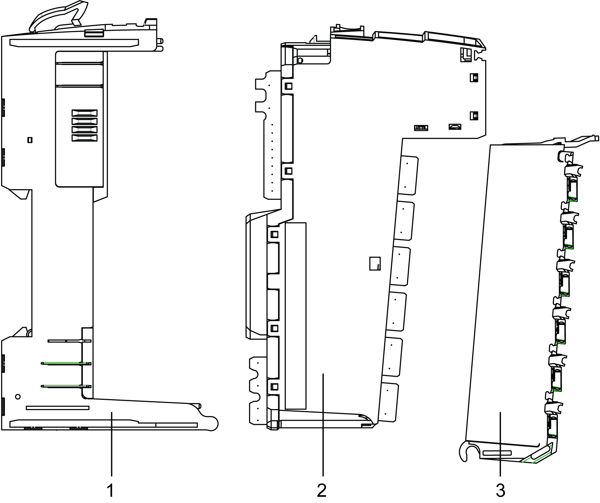
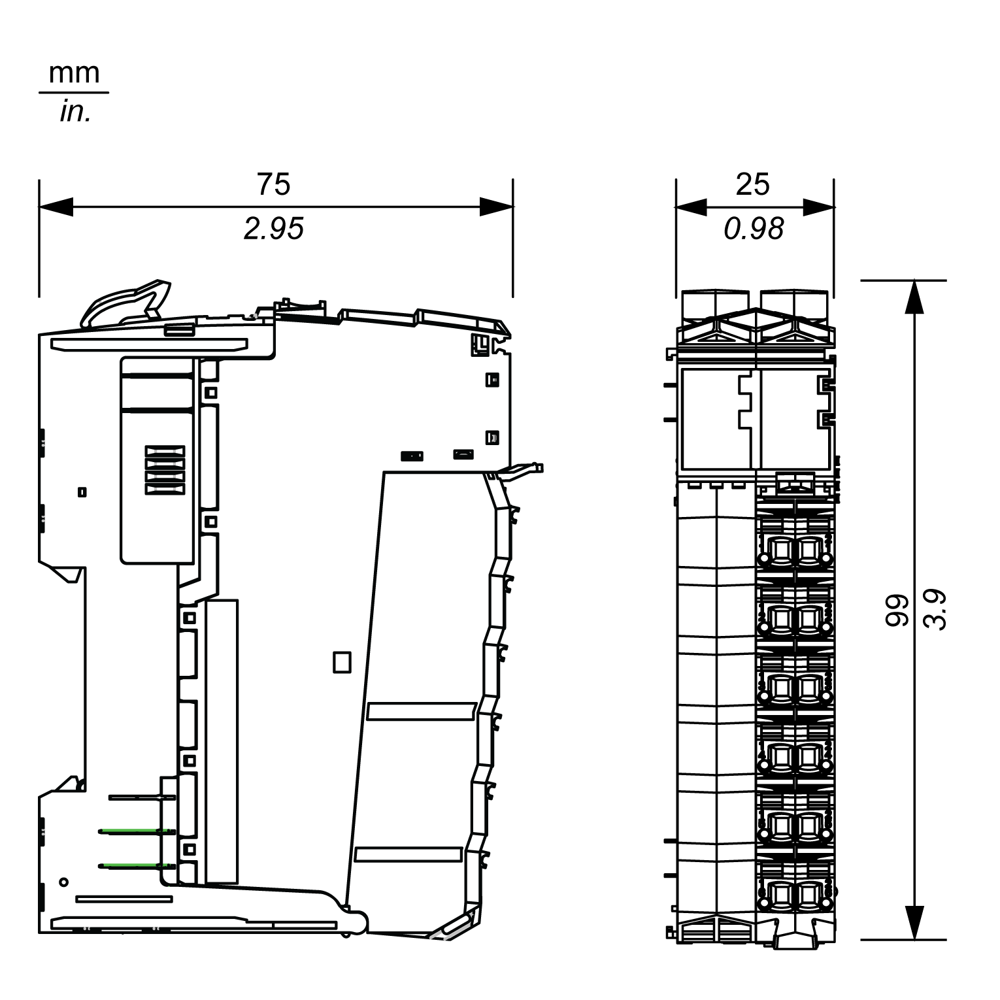

# TM5 Physical Description

## Introduction

Each slice consists of three elements. These elements are a red Safety bus base, a red electronic Safety I/O module, and a red Safety terminal block.

| DANGER | |
| --- | --- |
|  | INCOMPATIBLE COMPONENTS CAUSE ELECTRIC SHOCK OR ARC FLASH  * Do not associate components of a slice that have different colors. * Verify that correct terminal blocks (minimally, matching colors and correct number of terminals) are installed on the appropriate electronic modules.  Failure to follow these instructions will result in death or serious injury. |

## Elements

The following figure presents the elements of a slice:

1. Safety bus base
2. Electronic Safety I/O module
3. Safety terminal block

When assembled, the three components form an integral unit that resists vibration.

| NOTICE | |
| --- | --- |
|  | ELECTROSTATIC DISCHARGE  * Never touch the pin connectors of the block. * Always keep the cables or sealing plugs in place during normal operation.  Failure to follow these instructions can result in equipment damage. |

## Dimensions

The following figure presents the dimensions of a slice:

## Safety Bus Bases

For a detailed description of the Safety bus base, refer to:

* [TM5ACBM3FS Safety bus base](D-SE-0010854.html#D-SE-0010854)
* [TM5ACBM4FS Safety bus base](D-SE-0057618.html#D-SE-0057618)

## Safety terminal block Pin Assignment

The following figure presents the pin assignments for the Safety terminal block:

| TM5ACTB52FS | TM5ACTB5EFS | TM5ACTB5FFS |
| --- | --- | --- |
|  |  |  |
| For a detailed description, refer to:   * [TM5ACTB52FS Safety terminal block](D-SE-0010864.html#D-SE-0010864) * [TM5ACTB5EFS Safety terminal block](D-SE-0057608.html#D-SE-0057608) * [TM5ACTB5FFS Safety terminal block](D-SE-0057599.html#D-SE-0057599) | | |

## Accessories

Refer to the [PacDrive TM5 / TM7 Safety Flexible System, System Planning and Installation Guide](../../../../../api/crossBook?lang=en-US&virtualBookName=pacdpigs&topicID=D_SE_0017150) and to the [M262 Embedded Safety - Integration Guide](../../../../../api/crossBook?lang=en-US&virtualBookName=m262safety&topicID=D_SE_0096027).

## Labeling

Refer to the [PacDrive TM5 / TM7 Safety Flexible System, System Planning and Installation Guide](../../../../../api/crossBook?lang=en-US&virtualBookName=pacdpigs&topicID=D_SE_0017150) and to the [M262 Embedded Safety - Integration Guide](../../../../../api/crossBook?lang=en-US&virtualBookName=m262safety&topicID=D_SE_0096027).

EIO0000000861.10