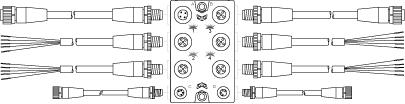
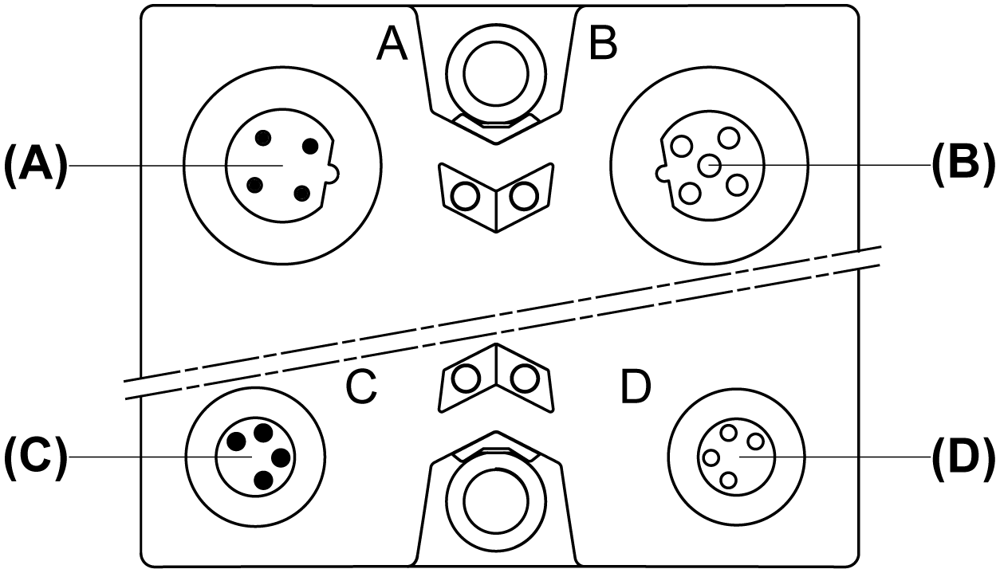

# TM7 Physical Description

## Introduction

The TM7 System consists of IP67 I/O blocks along with field bus, expansion, sensor/actuator and power cables.

## General View of a TM7 I/O Block and Cables

The following figure presents a TM7 I/O block and associated cables:

| Item | TM7 Cable Type | TM7 Block Connector |
| --- | --- | --- |
| A | Expansion bus drop cable | TM7 bus IN |
| B | Expansion bus drop cable | TM7 bus OUT |
| 1...4 | Sensor or actuator cable | I/O connectors |
| C | Power drop cable | 24 Vdc power IN connector |
| D | Power drop cable | 24 Vdc power OUT connector |

| WARNING | |
| --- | --- |
|  | IP67 NON-CONFORMANCE  * Properly fit all connectors with cables or sealing plugs and tighten for IP67 conformance according to the torque values as specified in this document. * Do not connect or disconnect cables or sealing plugs in the presence of water or moisture.  Failure to follow these instructions can result in death, serious injury, or equipment damage. |

| NOTICE | |
| --- | --- |
|  | ELECTROSTATIC DISCHARGE  * Never touch the pin connectors of the block. * Always keep the cables or sealing plugs in place during normal operation.  Failure to follow these instructions can result in equipment damage. |

## TM7 Cables References

For more information on the type and length of cables, along with their references, refer to [TM7 Cables](../../../../../api/crossBook?lang=en-US&virtualBookName=pacdpig&topicID=D_SE_0009890).

## TM7 I/O Blocks Pin and Connector Assignments of Communication and Power Connectors)

The following figure presents the connector assignments of a TM7 I/O block for the communication and power connectors (A, B, C and D):

**(A)** TM7 bus IN connector M12

**(B)** TM7 bus OUT connector M12

**(C)** 24 Vdc power IN connector M8

**(D)** 24 Vdc power OUT connector M8

The following figure presents the pin assignments of the TM7 bus IN (A) and OUT (B) connectors:

| Connection | Pin | Designation |
| --- | --- | --- |
|  | 1 | TM7 V+ |
| 2 | TM7 Bus Data |
| 3 | TM7 0 Vdc |
| 4 | TM7 Bus Data |
| 5 | N.C. |

The following figure presents the pin assignments of the 24 Vdc power IN (C) and OUT (D) connectors:

| Connection | Pin | Designation |
| --- | --- | --- |
|  | 1 | 24 Vdc I/O power segment |
| 2 | 24 Vdc I/O power segment |
| 3 | 0 Vdc |
| 4 | 0 Vdc |

NOTE:

* The status of the LED indicators are provided in the *Presentation* section of the I/O block.
* The pin assignments of the I/O connectors are provided in the *Wiring* section of each I/O block.

## Dimensions

The following figures presents the dimensions of the TM7 blocks:

|  |  |
| --- | --- |
| TM7SDI8DFS | TM7SDM12DTFS |

EIO0000000861.10