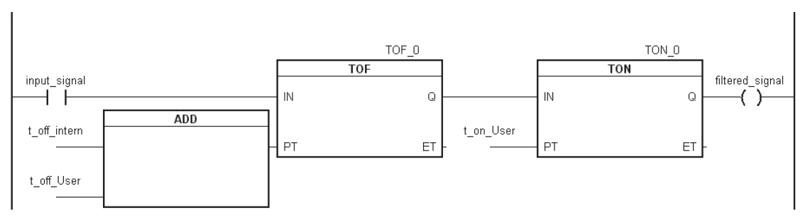
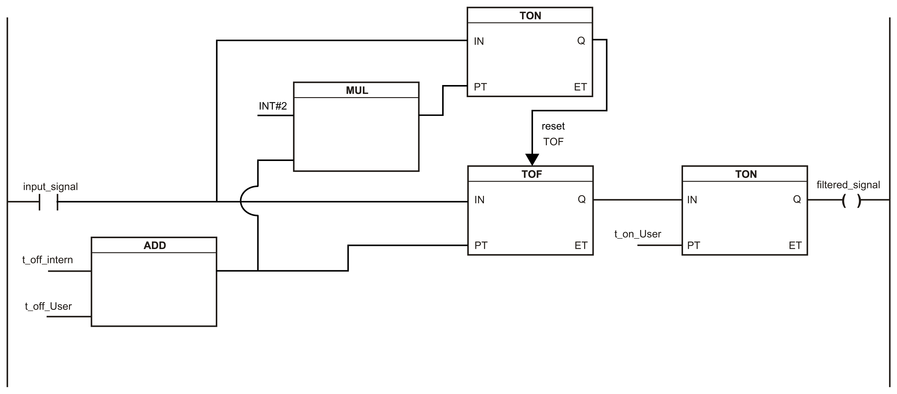

# Filters

## Overview

The Safety Digital Input modules are equipped with separately configurable switch-on and switch-off filters. The functionality of the filter depends on the firmware version and is presented in the following table and figures:

| Module type | Version | Schema TOFF filter | Additional filter time to be considered for the total reaction time |
| --- | --- | --- | --- |
| I/O-Module | <301 | Schema 1 | 2x TOFF filter time |
| I/O-Module | ≥301 | Schema 2 | 1x TOFF filter time |

Schema 1

Schema 2

**Input signal:** Status of the input channel

**Filtered signal:** Filtered status of the input channel - used as an input for the PLCopen function block and forwarded to the Safety Logic Controller.

**t\_off\_intern:** Internal parameter for suppressing the external test pulses (only in external test pulse mode: 5 ms)

**t\_off\_user:** Parameters for the switch-off filter

**t\_on\_user:** Parameters for the switch-on filter

## Unfiltered

The input status is registered with a fixed offset with respect to the network cycle and transferred.

## Switch-on Filter

The filtered status is registered for the transition from 0 to 1 with a fixed offset with respect to the network cycle and transferred. The filter value parameter can be set, and the limit values are listed in the technical data of the EcoStruxure Machine Expert - Safety software.

Errors caused by short circuits to other signals are detected by the module within the [error detection time](D-SE-0010240.html#D-SE-0010240__D-SE-0010240.11) at the latest. By default, the switch-on filter is set to the error detection time value, which filters spurious signals that can be caused by a short circuit. If the switch-on filter is set to a value less than the error detection time, brief switch-on pulses can occur in combination with possible spurious signals, causing false-positive requests of the safety system.

NOTE: The functioning filter is dependent on the internal cycle time of the module, which is dependent on the TM5 bus cycle time. The actual functioning filter can therefore deviate below the input value by the maximum internal cycle time (refer to the *General Characteristics* of the module).

## Switch-Off Filter

The filtered status is registered for the transition from 1 to 0 with a fixed offset with respect to the network cycle and transferred. The switch-off filter can be configured separately. This makes it possible to use the switch-off filter in applications (for example testing gaps of the light curtain) and to shorten reaction times. The filter value parameter can be set, and the limit values are listed in the technical data of the EcoStruxure Machine Expert - Safety software.

If a switch-off filter is used, then the total response time of the safety system is extended. This means that the configured filter value must be added to the total response time.

| WARNING | |
| --- | --- |
|  | INACCURATE RISK ASSESSMENT  Be sure to include in your risk assessment the configured filter value added to the total response time of your system.  Failure to follow these instructions can result in death, serious injury, or equipment damage. |

NOTE: The functioning filter is dependent on the internal cycle time of the module, which is dependent on the TM5 bus cycle time. The actual functioning filter can therefore deviate below the input value by the maximum [internal cycle time](D-SE-0010240.html#D-SE-0010240__D-SE-0010240.10).

EIO0000000861.10