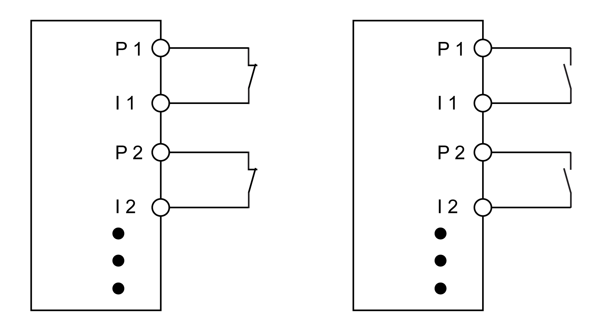
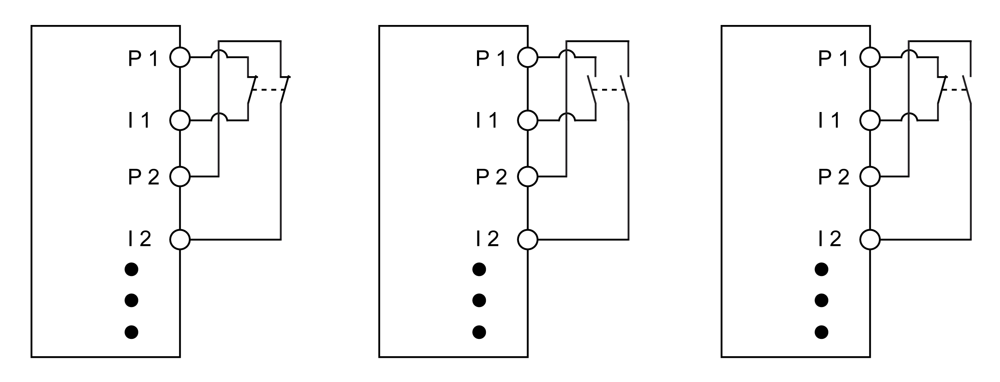
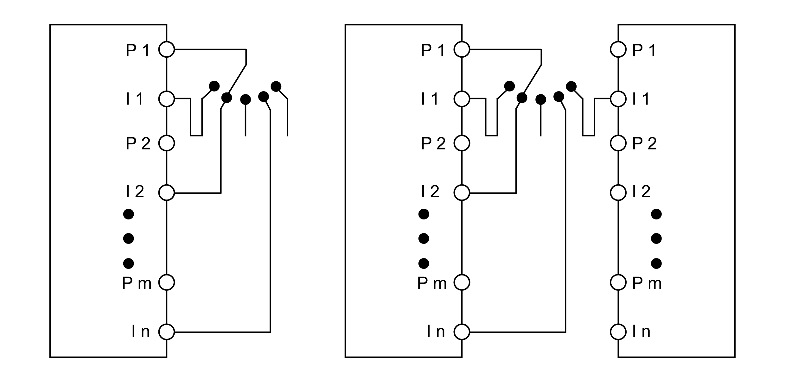
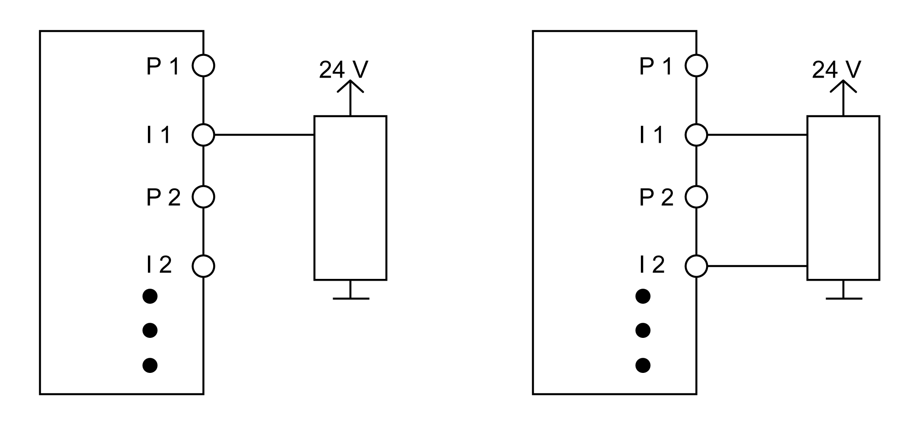
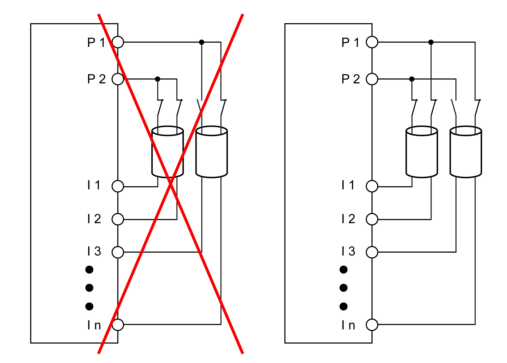

# Connection Examples

## Overview

The following sections present typical connection examples, which only represent one of the possible wiring methods.

## Connecting Single-Channel Sensors with Contacts

The following graphic presents the single-channel connection of sensors with contacts:

**P** Test (pulse) output

**I** Input

Single-channel sensors with contacts are a simple connection. With this connection, the module corresponds to Category 3 according to EN ISO 13849. This only applies to the module and not to the wiring presented.

| WARNING | |
| --- | --- |
|  | NON-CONFORMANCE TO SAFETY FUNCTION REQUIREMENTS  Wire the sensor in accordance with the required category and features of the sensor.  Failure to follow these instructions can result in death, serious injury, or equipment damage. |

The test output issues a specific signal that helps detect wiring issues, such as a short circuit of the +24 V, COM, or other signal channels.

NOTE: The status of the connected sensors with contacts is signaled via channel-specific LED indicators. The LED indicators **OO** and **OC** are not relevant in this single-channel connection.

| WARNING | |
| --- | --- |
|  | UNINTENDED EQUIPMENT OPERATION  Be sure that your risk assessment takes into account errors which are undetectable by the Safety I/O module, and that appropriate additional measures are implemented according to your risk assessment.  Failure to follow these instructions can result in death, serious injury, or equipment damage. |

This wiring provides the following error detection when `PulseMode`=`internal`:

| Potential error | Error detection | |
| --- | --- | --- |
| **Open** | **Closed** |
| Ground error on test (pulse) output | Detected | Detected |
| Test (pulse) output short-circuit with 24 V | Detected | Detected |
| Short circuit between test (pulse) output and other test (pulse) signal | Detected | Detected |
| Ground error on signal input | Not detected | Detected |
| Signal input short-circuit with 24 V | Detected | Detected |
| Short circuit between signal input and other test (pulse) signal | Detected | Detected |
| Short circuit between test (pulse) output and signal input | Not detected | Not detected |
| Broken wire | Not detected | Not detected |

Make all necessary repairs in a timely manner if an error occurs because subsequent errors could create a hazardous situation.

| WARNING | |
| --- | --- |
|  | UNINTENDED EQUIPMENT OPERATION  * Immediately replace any and all modules that indicate that they are in an inoperable state. * Ensure that the effect on un-repaired equipment is taken into account in your risk assessment. * Make all necessary repairs to equipment before re-starting, or continuing service of, your machine.  Failure to follow these instructions can result in death, serious injury, or equipment damage. |

NOTE: With the configuration `PulseMode`=`internal`, the test pulses have a low phase of about 300 µs. This low phase is designed such that no additional decline in total response time can occur in the system. However, issues can arise with the factory setting clock form when line lengths are used that exceed the maximum cable length (refer to [General Characteristics](D-SE-0010240.html#D-SE-0010240)). In such cases, the external clock form can also be used for normal, electro-mechanic contacts. Keep in mind, however, that the effectiveness of error detection is reduced, and the total response time is increased.

## Connecting Two-Channel Sensors with Contacts

The following graphic presents the two-channel sensors with contacts:

**P** Test (pulse) output

**I** Input

* Two-channel sensors with contacts can be connected directly to a safety-related digital input module.
* The two-channel evaluation is handled directly by the module.

With this connection, the module corresponds to Category 4 according to EN ISO 13849. This only applies only to the module and not to the wiring presented.

| WARNING | |
| --- | --- |
|  | NON-CONFORMANCE TO SAFETY FUNCTION REQUIREMENTS  Wire the sensor in accordance with the required category and features of the sensor.  Failure to follow these instructions can result in death, serious injury, or equipment damage. |

The test output issues a specific signal that helps detect wiring issues, such as a short circuit of the +24 V, COM, or other signal channels.

NOTE: The status of the connected sensors with contacts is signaled via channel-specific LED indicators and the status of the two-channel evaluation is signaled via the **OO** (for combinations with NC/NC contact) or **OC** LED indicators (for combinations with NC/NO contact).

On module types that do not have these LED indicators, errors detected by the two-channel monitoring are indicated by the LED indicator for the respective channel flashing red.

| WARNING | |
| --- | --- |
|  | UNINTENDED EQUIPMENT OPERATION  Be sure that your risk assessment takes into account errors which are undetectable by the Safety I/O module, and that appropriate additional measures are implemented according to your risk assessment.  Failure to follow these instructions can result in death, serious injury, or equipment damage. |

This wiring provides the following error detection when `PulseMode`=`internal` in combination with two-channel evaluation in the module or in the Machine Expert - Safety software:

| Potential error | Error detection | |
| --- | --- | --- |
| **Open** | **Closed** |
| Ground error on test (pulse) output | Detected | Detected |
| Test (pulse) output short-circuit with 24 V | Detected | Detected |
| Short circuit between test (pulse) output and other test (pulse) signal | Detected | Detected |
| Ground error on signal input | Not detected | Detected |
| Signal input short-circuit with 24 V | Detected | Detected |
| Short circuit between signal input and other test (pulse) signal | Detected | Detected |
| Short circuit between test (pulse) output and signal input | Detected 1) | Not detected |
| Broken wire | Not detected | Detected 1) |
| 1) Two-channel evaluation of the module | | |

Make all necessary repairs in a timely manner if an error occurs because subsequent errors could create a hazardous situation.

| WARNING | |
| --- | --- |
|  | UNINTENDED EQUIPMENT OPERATION  * Immediately replace any and all modules that indicate that they are in an inoperable state. * Ensure that the effect on un-repaired equipment is taken into account in your risk assessment. * Make all necessary repairs to equipment before re-starting, or continuing service of, your machine.  Failure to follow these instructions can result in death, serious injury, or equipment damage. |

NOTE: With the configuration `PulseMode`=`internal`, the test pulses have a low phase of about 300 µs. This low phase is designed such that no additional decline in total response time can occur in the system. However, issues can arise with the factory setting clock form when line lengths are used that exceed the maximum cable length (refer to [General Characteristics](D-SE-0010240.html#D-SE-0010240)). In such cases, the external clock form can also be used for normal, electro-mechanic contacts. Keep in mind, however, that the effectiveness of error detection is reduced, and the total response time is increased.

## Connecting Multi-Channel Sensors with Contacts

The following graphic presents the connection of multi-channel, electro-mechanical switches:

**P** Test (pulse) output

**I** Input

Multi-channel switches (operating mode switches, switching devices with shifting capability) may be connected to several safety-related, digital input devices. All inputs must be configured to use the same test (pulse) rate coming from the same test (pulse) source. The modules that are not using an internal test source must be configured to use an external test source (`PulseMode`=`external`). That is to say, a test source external to itself, but from another TM5/TM7 module as you can see in the left-most wiring diagram.

The modules that use an internal test (pulse) source must be configured to use an internal test source (`PulseMode`=`internal`).

The difference between using a single module and multiple modules is the system response time. In the case of multiple modules, test (pulse) rate must be set to a wave form of 4 ms low phase. In the case of a single module, you can set a wave form of 300 µs low phase.

| WARNING | |
| --- | --- |
|  | UNINTENDED EQUIPMENT OPERATION  Add 5 ms to the total response time when configuring `PulseMode`=`external`.  Failure to follow these instructions can result in death, serious injury, or equipment damage. |

When connecting multi-channel sensors with contacts, the multi-channel analysis must be executed in the safety-related application (PLCopen function block `ModeSelector`).

NOTE: Achieving the desired category according to EN ISO 13849 depends on the error models of the switching element (for example mode selector switch) and must be examined in combination with the error detection present in the PLCopen function block.

The status of the connected sensors is indicated by channel-specific LED indicators. The LED indicators **OO** and **OC** are not relevant when using multi-channel selectors.

| WARNING | |
| --- | --- |
|  | UNINTENDED EQUIPMENT OPERATION  Be sure that your risk assessment takes into account errors which are undetectable by the Safety I/O module, and that appropriate additional measures are implemented according to your risk assessment.  Failure to follow these instructions can result in death, serious injury, or equipment damage. |

This wiring provides the following error detection when `PulseMode`=`external`:

| Potential error | Error detection |
| --- | --- |
| Ground error on test (pulse) output | Detected |
| Test (pulse) output short-circuit with 24 V | Detected |
| Short circuit between test (pulse) output and other test (pulse) signal | Detected 1) |
| Ground error on signal input (active signal) | Detected 1) |
| Ground error on signal input (inactive signal) | Not detected |
| Signal input short-circuit with 24 V | Detected |
| Short circuit between signal input and other test (pulse) signal | Detected 1) |
| Short circuit between test (pulse) output and signal input (active signal) | Not detected |
| Broken wire (active signal) | Detected 1) |
| Short circuit between test (pulse) output and signal input (input signal) | Detected 1) |
| Broken wire (inactive signal) | Not detected |
| 1) Detected in the application by PLCopen function block `ModeSelector`. | |

This wiring provides the following error detection when `PulseMode`=`internal`:

| Potential error | Error detection | |
| --- | --- | --- |
| **Open** | **Closed** |
| Ground error on test (pulse) output | Detected | Detected |
| Test (pulse) output short-circuit with 24 V | Detected | Detected |
| Short circuit between test (pulse) output and other test (pulse) signal | Detected | Detected |
| Ground error on signal input | Not detected | Detected |
| Signal input short-circuit with 24 V | Detected | Detected |
| Short circuit between signal input and other test (pulse) signal | Detected | Detected |
| Short circuit between test (pulse) output and signal input | Not detected | Not detected |
| Broken wire | Not detected | Not detected |

Make all necessary repairs in a timely manner if an error occurs because subsequent errors could create a hazardous situation.

| WARNING | |
| --- | --- |
|  | UNINTENDED EQUIPMENT OPERATION  * Immediately replace any and all modules that indicate that they are in an inoperable state. * Ensure that the effect on un-repaired equipment is taken into account in your risk assessment. * Make all necessary repairs to equipment before re-starting, or continuing service of, your machine.  Failure to follow these instructions can result in death, serious injury, or equipment damage. |

NOTE: With the configuration `PulseMode`=`internal`, the test pulses have a low phase of about 300 µs. This low phase is designed such that no additional decline in total response time can occur in the system. However, issues can arise with the factory setting clock form when line lengths are used that exceed the maximum cable length (refer to [General Characteristics](D-SE-0010240.html#D-SE-0010240)). In such cases, the external clock form can also be used for normal, electro-mechanic contacts. Keep in mind, however, that the effectiveness of error detection is reduced, and the total response time is increased.

## Connecting Electronic Sensors

The following graphic presents the connection of electronic sensors (EPE, inductive sensors, and so on):

**P** Test (pulse) output

**I** Input

Electronic sensors (light curtain, laser scanners, inductive sensors) may also be connected to safety-related digital input modules.

Some electronic sensors feature OSSD (Output Signal Switching Device) outputs. These types of outputs include a pulse train similar to the test outputs of the Safety I/O module. However, these pulses are not exploitable by the module. For this reason, the input channels must be configured to `PulseMode``=none`.

Further, gaps in the test of the connected OSSD outputs must be masked out with the switch-off filter of the module to help avoid false-positive safety-related requests. The configuration of a switch-off filter lengthens the safety-related response time.

| WARNING | |
| --- | --- |
|  | UNINTENDED EQUIPMENT OPERATION  Ensure that the configured filter value is added to the total response time.  Failure to follow these instructions can result in death, serious injury, or equipment damage. |

When `PulseMode``=none`, the module cannot detect wiring issues.

| WARNING | |
| --- | --- |
|  | UNINTENDED EQUIPMENT OPERATION  * Include in your risk assessment the possibility of inoperable electronic sensors, short-circuits and other wiring issues. * If necessary, employ supplementary measures to mitigate issues that may arise using electronic sensors.  Failure to follow these instructions can result in death, serious injury, or equipment damage. |

With single-channel wiring, the module corresponds to Category 3 according to EN ISO 13849. With two-channel wiring, the module corresponds to Category 4 according to EN ISO 13849. This only applies to the module and not to the wiring presented.

| WARNING | |
| --- | --- |
|  | NON-CONFORMANCE TO SAFETY FUNCTION REQUIREMENTS  Wire the sensor in accordance with the required category and features of the sensor.  Failure to follow these instructions can result in death, serious injury, or equipment damage. |

Make all necessary repairs in a timely manner if an error occurs because subsequent errors could create a hazardous situation.

| WARNING | |
| --- | --- |
|  | UNINTENDED EQUIPMENT OPERATION  * Immediately replace any and all modules that indicate that they are in an inoperable state. * Ensure that the effect on un-repaired equipment is taken into account in your risk assessment. * Make all necessary repairs to equipment before re-starting, or continuing service of, your machine.  Failure to follow these instructions can result in death, serious injury, or equipment damage. |

## Using the Same Test Outputs

When using the same test outputs for different inputs, the inputs must be isolated from one another. Otherwise, damage to the cables may cause errors that are not detected by the module.

The following graphic presents the connection with the same test (pulse) signals:

**P** Test (pulse) output

**I** Input

| WARNING | |
| --- | --- |
|  | UNINTENDED EQUIPMENT OPERATION  Wire same test signal in different cables, or implement other error-prevention measures in accordance with EN ISO 13849-2.  Failure to follow these instructions can result in death, serious injury, or equipment damage. |

EIO0000000861.10