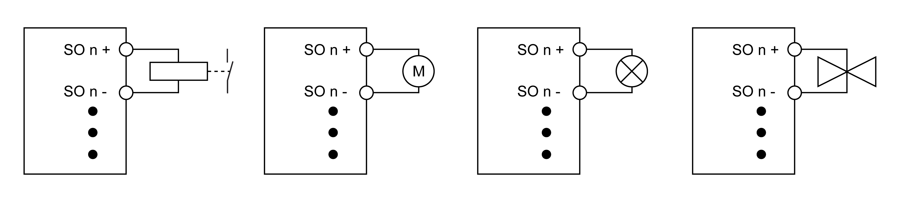
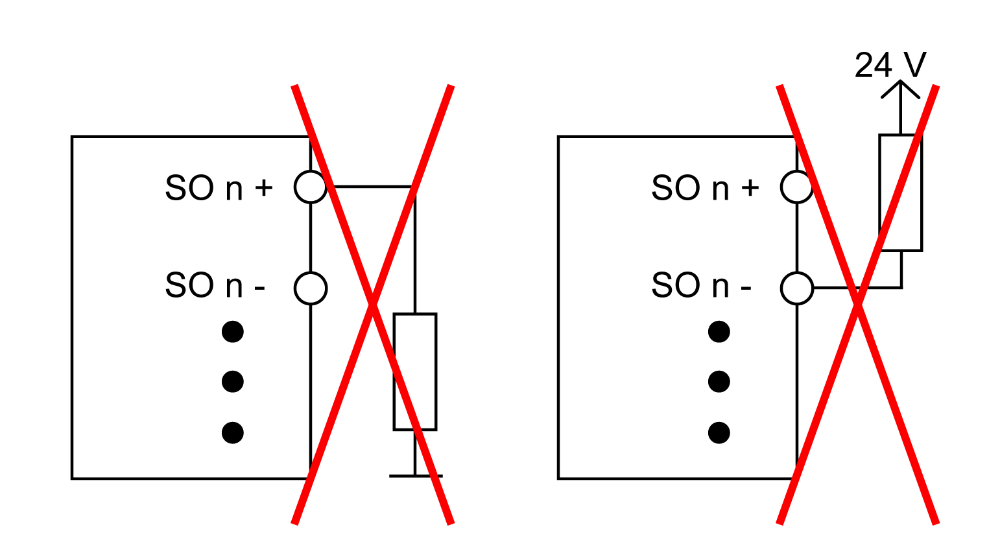

# Connection Examples

## Overview

The following sections list typical connection examples, which only represent some of the possible wiring methods. You must consider the error detection listed in the respective examples.

| WARNING | |
| --- | --- |
|  | UNINTENDED EQUIPMENT OPERATION  Be sure that your risk assessment takes into account errors which are undetectable by the Safety I/O module, and that appropriate additional measures are implemented according to your risk assessment.  Failure to follow these instructions can result in death, serious injury, or equipment damage. |

For more information regarding error detection, refer to the sections described in [Error Detection](D-SE-0015093.html#D-SE-0015093).

NOTE: For information on the Enabling Principle and Restart Behavior, refer to the I/O configuration in EcoStruxure Machine Expert / EcoStruxure Machine Expert - Safety.

## Connecting Safety-Oriented Actuators

Safety-related actuators (contactors, motors, muting lamps, valves) that are compatible with output module performance data may be connected directly. With this connection, the module corresponds to Category 4 according to EN ISO 13849. This only applies to the module and not to the wiring presented.

| WARNING | |
| --- | --- |
|  | NON-CONFORMANCE TO SAFETY FUNCTION REQUIREMENTS  Wire the actuator in accordance with the required category and features of the actuator.  Failure to follow these instructions can result in death, serious injury, or equipment damage. |

For the TM5SDO2TFS, TM5SDO2TAFS, TM5SDO4TFS and TM5SDO4TAFS modules, the output channels also de-energize the load on the COM side. Verify whether the actuators you have connected permit the disconnection from the COM side.

| WARNING | |
| --- | --- |
|  | UNINTENDED EQUIPMENT OPERATION  Verify that the I/O modules are compatible with the actuators that are connected.  Failure to follow these instructions can result in death, serious injury, or equipment damage. |

| WARNING | |
| --- | --- |
|  | UNINTENDED EQUIPMENT OPERATION  Be sure that your risk assessment takes into account errors which are undetectable by the Safety I/O module, and that appropriate additional measures are implemented according to your risk assessment.  Failure to follow these instructions can result in death, serious injury, or equipment damage. |

With this wiring, the modules detect following errors:

| Error | Error at output | | | |
| --- | --- | --- | --- | --- |
| `DisableOSSD`= No | | `DisableOSSD`= Yes-ATTENTION | |
| De-energized | Energized | De-energized | Energized |
| Ground error on `SO n+` | | | | |
| TM5SDO•FS | **not detected** | detected | **not detected** | detected |
| Ground error on `SO n-` | | | | |
| TM5SDO•TFS, TM5SDO•TAFS | **not detected** | detected | **not detected** | **not detected** |
| `SO n+` short-circuit with 24 Vdc | | | | |
| TM5SDO•TFS, TM5SDO•TAFS | detected | detected | detected | **not detected** |
| TM5SDO6TBFS | detected 1) | **not detected** | detected 1) |
| TM5SDM8TBFS | detected 1) |
| TM7SDM12DTFS |
| `SO n-` short-circuit with 24 Vdc | | | | |
| TM5SDO•TFS, TM5SDO•TAFS | detected | detected | detected | detected |
| `COM` short-circuit with 24 Vdc | | | | |
| TM5SDO6TBFS | **not detected** | **not detected** | **not detected** | **not detected** |
| TM5SDM8TBFS |
| TM7SDM12DTFS |
| Short circuit between `SO n+` and the other signal (high) | | | | |
| TM5SDO•TFS, TM5SDO•TAFS | detected | detected | detected | **not detected** |
| TM5SDO6TBFS | detected 1) | **not detected** | detected 1) |
| TM5SDM8TBFS | detected 1) |
| TM7SDM12DTFS |
| Short circuit between `SO n-` and the other signal (high) | | | | |
| TM5SDO•TFS, TM5SDO•TAFS | detected | detected | detected | **not detected** |
| Short circuit between `COM` and the other signal (high) | | | | |
| TM5SDO6TBFS | **not detected** | **not detected** | **not detected** | **not detected** |
| TM5SDM8TBFS |
| TM7SDM12DTFS |
| Broken wire | | | | |
| TM5SDO•TFS, TM5SDO•TAFS | **not detected** | **not detected**2) | **not detected** | **not detected**2) |
| TM5SDO6TBFS | **not detected** | **not detected** |
| TM5SDM8TBFS |
| TM7SDM12DTFS |
| Short circuit between `SO n+` and `SO n-` | | | | |
| TM5SDO•TFS, TM5SDO•TAFS | **not detected** | detected | **not detected** | detected |
| 1) Short-circuits on `SO n` caused by high potentials will be detected by the modules, however the connected actuator cannot be de-energized due to the positive power switching design of the channel.  2) Broken wire can be acknowledged via the `CurrentOk` signal. However, this signal cannot be used for safety purposes. | | | | |

With this wiring, the TM5SPS10FS, TM5SDO6TBFS, TM5SDM8TBFS and TM7SDM12DTFS modules have the following error detection:

| Error | Error at Output | |
| --- | --- | --- |
| De-energized | Energized |
| Ground error on `SO x` | not detected | detected |
| `SO x` short-circuit with 24 Vdc | detected1) | detected1)  NOTE: This error is not detected for TM5SDO6TBFS. |
| COM short-circuit with 24 Vdc | not detected | not detected |
| Short circuit between `SO x` and the other signal (high) | detected1) | detected1)  NOTE: This error is not detected for TM5SDO6TBFS. |
| Short circuit between COM and the other signal (high) | not detected | not detected |
| Broken wire | not detected | not detected1) |
| 1) Short-circuits on `SO x` caused by high potentials will be detected by the modules, however the connected actuator cannot be de-energized due to the positive power switching design of the channel. | | |

NOTE: With `DisableOSSD` set to Yes-ATTENTION, the modules have reduced error detection capabilities and no longer meet the requirements of SIL 3 according to IEC 62061, nor PL e according to ISO 13849. If you have set the parameter as such, you need to review the cited standards for more information in regards to your responsibilities.

## Invalid Connection of an Actuator for Type A Outputs

The information on invalid connection of an actuator applies to the following modules:

* TM5SDO2TFS
* TM5SDO2TAFS
* TM5SDO4TFS
* TM5SDO4TAFS

Directly connecting an actuator from +24 Vdc to `SO n-`, or connecting `SO n+` to an actuator, and then to the external ground is invalid. These types of wiring errors will not be detected by the modules.

| WARNING | |
| --- | --- |
|  | INOPERATIVE SAFETY-RELATED FUNCTIONALITY  * Do not directly connect an actuator from +24 Vdc to `SO n-`. * Do not directly connect an actuator from `SO n+` to an external ground connection.  Failure to follow these instructions can result in death, serious injury, or equipment damage. |

Make all necessary repairs in a timely manner if an error occurs because subsequent errors could create a hazardous situation.

| WARNING | |
| --- | --- |
|  | UNINTENDED EQUIPMENT OPERATION  * Immediately replace any and all modules that indicate that they are in an inoperable state. * Ensure that the effect on un-repaired equipment is taken into account in your risk assessment. * Make all necessary repairs to equipment before re-starting, or continuing service of, your machine.  Failure to follow these instructions can result in death, serious injury, or equipment damage. |

EIO0000000861.10