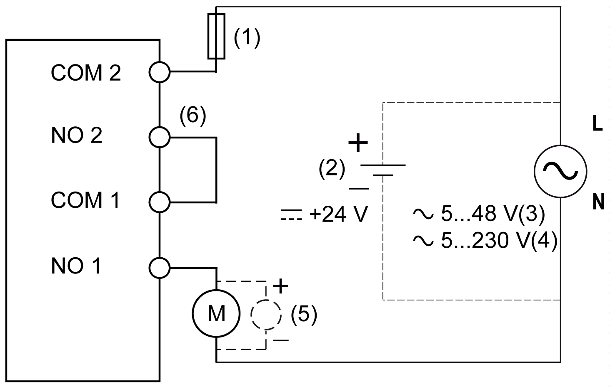

# Connection Examples

## Overview

The connection examples listed here only represent some of the possible wiring methods. However, the following must be taken into consideration regardless:

* Two relay channels must be connected in series when used for a higher safety level (greater than or equal to category 2 or PL b according to ISO 13849 or SIL 1 according to IEC 62061).
* The relay contacts must be protected with a fuse ([Relay Output Characteristics](D-SE-0010927.html#D-SE-0010927__D-SE-0010927.11)).

| DANGER | |
| --- | --- |
|  | FIRE HAZARD  * Use only the correct wire sizes for the current capacity of the I/O channels and power supplies. * For relay output (2 A) wiring, use conductors of at least 0.5 mm2 (AWG 20) with a temperature rating of at least 80 °C (176 °F). * For common conductors of relay output wiring (6 A), or relay output wiring greater than 2 A, use conductors of at least 1.0 mm2 (AWG 16) with a temperature rating of at least 80 °C (176 °F).  Failure to follow these instructions will result in death or serious injury. |

NOTE: For information on the Enabling Principle and Restart Behavior, refer to the I/O configuration in EcoStruxure Machine Expert / EcoStruxure Machine Expert - Safety.

## Connecting Safety-Oriented Actuators for Relay Outputs in Series

**1** Fuse

**2** External power supply 24 Vdc

**3** External power supply 5...48 Vac (TM5SDM4DTRFS)

**4** External power supply 5...230 Vac (TM5SDO2DTRFS)

**5** Inductive load protection

**6** External bridge NO 2 - COM 1

Inductive damage to relay types of outputs can result in welded contacts and loss of control. Each inductive load must be with a protection device such as a peak limiter, RC circuit or flyback diode. Capacitive loads are not supported by these relays.

| WARNING | |
| --- | --- |
|  | RELAY OUTPUTS WELDED CLOSED  * Always protect relay outputs from inductive alternating current load damage using an appropriate external protective circuit or device. * Do not connect relay outputs to capacitive loads.  Failure to follow these instructions can result in death, serious injury, or equipment damage. |

For applications that correspond to SIL 3 or 4, the two normally closed contacts for the two relays must be wired in series. In this case, control of the two relays must be handled using signal `SafeDigitalOutput0102`.

Controlling the two relay contacts using the single signal `SafeDigitalOutput01` and `SafeDigitalOutput02` is invalid for applications corresponding to SIL 3 or 4 because certain operating states can cause the two normally closed contacts to weld together. Therefore, simultaneously using the signals `SafeDigitalOutput0102` and `SafeDigitalOutput01` or `SafeDigitalOutput02` is restricted as such by the EcoStruxure Machine Expert - Safety software.

Using the signal `SafeDigitalOutput0102` causes a switch-on sequence to be activated that switches on relay 2 with a 20 ms delay. This behavior is necessary to prevent welding of the two normally closed contacts in certain operating states.

| WARNING | |
| --- | --- |
|  | UNINTENDED EQUIPMENT OPERATION  Do not use the signals `SafeDigitalOutput0102` and `SafeDigitalOutput01` or `SafeDigitalOutput02` simultaneously.  Failure to follow these instructions can result in death, serious injury, or equipment damage. |

NOTE: SIL 4 is only obtainable with the use of additional equipment.

A relay channel does not have error detection with regard to wiring issues. All errors resulting from damaged or incorrect wiring (including inappropriate loads) must be detected through supplementary measures or a connected device.

To help prevent possible error caused by short-circuits to other voltage levels, wiring that protects against short-circuits is needed for connecting the actuator.

Other errors that are not detected by the module (or not detected on time) may lead to unintended machine states and therefore must be uncovered using additional measures.

| WARNING | |
| --- | --- |
|  | UNINTENDED EQUIPMENT OPERATION  Be sure that your risk assessment takes into account errors which are undetectable by the Safety I/O module, and that appropriate additional measures are implemented according to your risk assessment.  Failure to follow these instructions can result in death, serious injury, or equipment damage. |

Make all necessary repairs in a timely manner if an error occurs because subsequent errors could create a hazardous situation.

| WARNING | |
| --- | --- |
|  | UNINTENDED EQUIPMENT OPERATION  * Immediately replace any and all modules that indicate that they are in an inoperable state. * Ensure that the effect on un-repaired equipment is taken into account in your risk assessment. * Make all necessary repairs to equipment before re-starting, or continuing service of, your machine.  Failure to follow these instructions can result in death, serious injury, or equipment damage. |

EIO0000000861.10