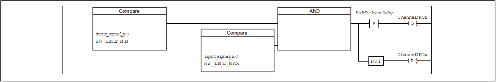
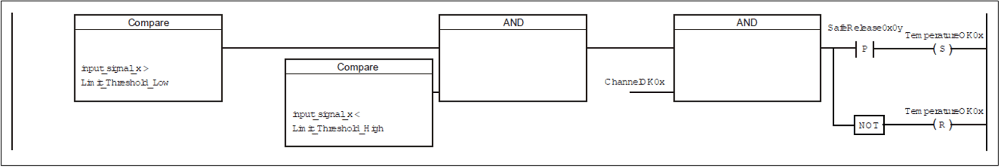
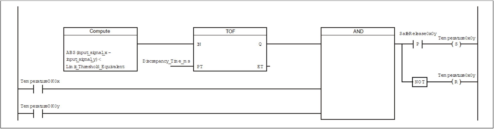

# Error Detection - TM5STI4ATCFS Safety Module 2x2AI Thermocouple

## Detected Internal Module Errors

The red **SE** LED indicator makes it possible to evaluate the following error states

* Detected internal module error (hardware error)
* Overtemperature/Undertemperature
* Overvoltage/Undervoltage
* Incompatible firmware version

NOTE: Errors that occur within the module are detected according to the requirements of the relevant standards and within the minimum safety-related response time specified in the technical data of the EcoStruxure Machine Expert - Safety software.

After an error within the module is detected, the module reverts to a defined safe state.

The internal module tests needed for this are only performed, however, if the firmware of the module was booted and the module is in either the preoperational state or the operational state. If this state is not achieved (for example, because the module is not configured in the application), then the module remains in boot state.

Boot mode on a module is indicated by a slow flashing **SE** LED (2 Hz or 1 Hz).

NOTE: The error detection time specified in the technical data is relevant only for detecting external errors (for example wiring errors) in single-channel structures.

## External Wiring Errors

Recognizable errors are detected by the module within the error detection time.

If a module detects an error, then:

* The channel LED indicator is lit constantly red
* The `SafeChannelOKxx` signal is set to `SAFEFALSE`.
* The `SafeTemperatureOKxx` signal is set to `SAFEFALSE`.
* An entry is generated in the Safelogger of EcoStruxure Machine Expert.

Other errors that are not detected by the module (or not detected on time) may lead to unintended machine states and therefore must be uncovered using additional measures.

| WARNING | |
| --- | --- |
|  | UNINTENDED EQUIPMENT OPERATION  Be sure that your risk assessment takes into account errors which are undetectable by the Safety I/O module, and that appropriate additional measures are implemented according to your risk assessment.  Failure to follow these instructions can result in death, serious injury, or equipment damage. |

For more information on errors that are, and are not, detected by the Safety I/O module, refer to the table for error detection in the *Connection Examples* hereafter.

Make all necessary repairs in a timely manner if an error occurs because subsequent errors could create a hazardous situation.

| WARNING | |
| --- | --- |
|  | UNINTENDED EQUIPMENT OPERATION  * Immediately replace any and all modules that indicate that they are in an inoperable state. * Ensure that the effect on un-repaired equipment is taken into account in your risk assessment. * Make all necessary repairs to equipment before re-starting, or continuing service of, your machine.  Failure to follow these instructions can result in death, serious injury, or equipment damage. |

## Inputs - Thermocouple

Error detection for safety-related inputs of type: Thermocouple

| Potential error | Detection | Comment |
| --- | --- | --- |
| Non-wired inputs | Detected | Module switches to the [defined safe state](#D-SE-0088320__D-SE-0088320.6). |
| Short circuit between T+ or T- and external 24 V or GND | Not detected | Signal distortion does not result due to the electrical isolation of the channels; nevertheless, it is mandatory to use shielded signal lines. |
| Short circuit between T+ and T- | Not detected | This error results in signal distortion that may be detected by two-channel evaluation in some circumstances. |
| Reverse polarity of T+ and T- | Not detected | This error results in signal distortion that may be detected by two-channel evaluation in some circumstances. |
| Disturbance voltage | Not detected | This error results in signal distortion that may be detected by two-channel evaluation in some circumstances. Shielded cables are mandatory for the signal lines.  Different installation paths must be used for the wiring of both signals of the signal pair. |

NOTE: You must take appropriate measures to detect and correct errors that are not detected by the input.

NOTE: Signal and supply lines must be installed in accordance with EN ISO 13849-2:2010, Table D.5.

## Inputs - PT100 / PT1000

Error detection for safety-related inputs of type: PT100 / PT1000

| Potential error | Detection | Comment |
| --- | --- | --- |
| Open circuit on Sense+ or Sense- | Detected | General indication for one or more non-wired channels. |
| Short circuit between Sense+, Sense- and external 24 V or GND | Not detected | Signal distortion usually does not result due to the electrical isolation of the channels; nevertheless, it is mandatory to use shielded signal lines. |
| Short circuit between Sense+ and Sense- | Detected | General indication for one or more non-wired channels. |
| Disturbance voltage | Not detected | This error results in signal distortion that may be detected by two-channel evaluation in some circumstances. Shielded cables are mandatory for the signal lines.  Different installation paths must be used for the wiring of both signals of the signal pair. |

NOTE: You must take appropriate measures to detect and correct errors that are not detected by the input.

NOTE: Signal and supply lines must be installed in accordance with EN ISO 13849-2:2010, Table D.5.

## Defined Safe State

When opening the thermocouple inputs, the module switches into the defined safe state.

| Step | Action |
| --- | --- |
| 1 | Switch off the module. |
| 2 | Each open thermocouple input of the module has to be wired with one jumper.  **Result:** The module can be switched on again. |

## Signal Errors

HW\_LIMIT\_MIN designates the lower limit and HW\_LIMIT\_MAX designates the upper limit of the measurement range specified in the chapter [TM5STI4ATCFS Presentation](D-SE-0057798.html#D-SE-0057798).

Signal evaluation takes place in three stages:

Stage 1: Evaluation of signals against absolute time limits

Stage 2: Evaluation of signals against configurable time limits

Stage 3: Evaluation of signals against configurable signal pair limits

A reset must be performed in order to leave an error state. For this, a valid signal must be received at the analog input for the duration of the I/O update time. The error can then be acknowledged by a rising edge of the signal SafeRelease0x0y.

## Channel Diagnostics

Channel electronics are automatically tested internally by the module. A test signal is generated in the module and applied to each channel once every 75 minutes for a maximum time of 1 s. To avoid signal distortion, the signal value of the channel being tested is held in a static state during this time. Only one channel is tested at a time. In accordance with EN IEC 61508:2010, the module is considered as a one out of two diagnostic system for the duration of the channel test.

In firmware version 322 and greater, the behavior for the duration of channel diagnostics is structured as follows:

The safety-related analog input channels (data type SAFEINT) are constituted as the arithmetic mean value of the two individual signals. For the duration of channel diagnostics, however, it is not the arithmetic mean value that is used, but the signal value of the channel that is not currently being diagnosed. An active channel test is indicated by channel TestActive.

## Channel Diagnostic Sequence

The sequence for channel diagnostic is independent of the firmware version and structured as follows:

| Diagnostic window | Time sequence | Channel sequence |
| --- | --- | --- |
| Diagnostic window 1 | Every 75 min | TC1, Sense 1 |
| Diagnostic window 2 | 15 min after diagnostic window 1 | TC4, Sense 2 |
| Diagnostic window 3 | 30 min after diagnostic window 1 | TC3 |
| Diagnostic window 4 | 45 min after diagnostic window 1 | TC4 |

For further information about variables and parameters refer to *EcoStruxure Machine Expert - Safety User Guide* in the online help.

EIO0000000861.10