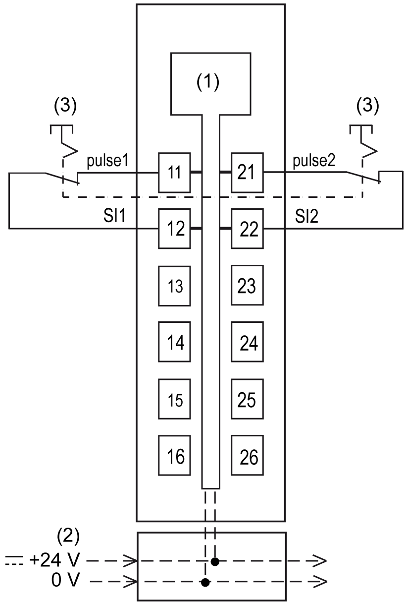

# TM5SDI2DFS Wiring

## Pin Assignments / Connection Example

The following figure presents a connection example for the TM5SDI2DFS:

**1** Internal electronics

**2** 24 Vdc I/O power segment integrated into the bus bases

**3** 2-wire sensor

| WARNING | |
| --- | --- |
|  | UNINTENDED EQUIPMENT OPERATION  Do not connect wires to unused terminals and/or terminals indicated as “No Connection (N.C.)”.  Failure to follow these instructions can result in death, serious injury, or equipment damage. |

| WARNING | |
| --- | --- |
|  | UNINTENDED EQUIPMENT OPERATION  Only use the test (pulse) outputs for the intended purpose of connecting them to the module inputs.  Failure to follow these instructions can result in death, serious injury, or equipment damage. |

EIO0000000861.10