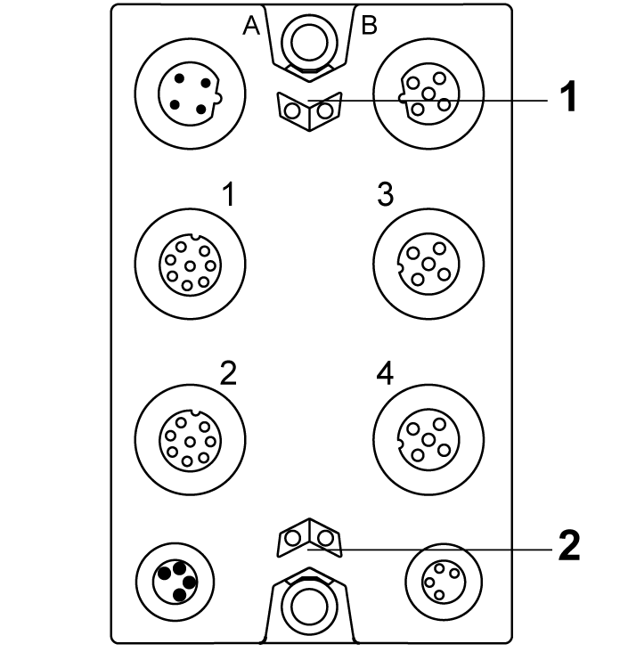

# TM7SDI8DFS Presentation

## Main Features

The following table describes the main features of the Safety Digital Input module TM7SDI8DFS:

| Main features | |
| --- | --- |
| Number of inputs | * 8 safety-related digital inputs * 2 digital inputs without safety functionality |
| Input filter | Configurable input filter, 0...500 ms |
| Input circuit | Sink |
| Number of outputs | * 2 test (pulse) outputs * 2 digital outputs without safety functionality |
| Rated voltage | 24 Vdc |

| DANGER | |
| --- | --- |
|  | POTENTIAL FOR EXPLOSION  * Only use this equipment in non-hazardous locations or in locations that comply with the ATEX Group II, Zone 2 specifications for hazardous locations. * Do not substitute components which would impair compliance to the ATEX Group II, Zone 2 specifications. * Do not connect or disconnect equipment unless power has been removed or the location is known to be non-hazardous.  Failure to follow these instructions will result in death or serious injury. |

## Ordering Information

The following table presents the reference of the module:

| Reference | Description | Color |
| --- | --- | --- |
| TM7SDI8DFS | TM7 Safety Digital Input module | red |

NOTE: For more information, refer to:

* [TM7 Physical Description](D-SE-0060207.html#D-SE-0060207),
* [TM7 Block grounding](../../../../../api/crossBook?lang=en-US&virtualBookName=pacdpig&topicID=D_SE_0007645),
* [TM7 Installation Guidelines](../../../../../api/crossBook?lang=en-US&virtualBookName=tm7diohw&topicID=D_SE_0007647).

## Status LED Indicators

This figure presents the status LED indicators:

**1** Status LED indicators **r** and **e**: left green **r**, right red **e**

**2** Status LED indicators **S** and **E**: left red **S**, right red **E**

The following tables describe the status LED indicators:

| LED indicator | Color | Status | Description |
| --- | --- | --- | --- |
| **r** | off | | Module supply not connected. |
| green | single flash | reset mode |
| double flash | firmware update in progress |
| flashing | pre-operational state |
| on | RUN state |
| **e** | off | | No error detected or module supply not connected. |
| red | flashing | boot loader mode |
| triple flash | firmware update in progress |
| on | Error detected or 24 Vdc I/O power supply not connected. |
| **r**+**e** | steady red/single green flash | | invalid configuration |

| LED indicator | Color | Status | Description |
| --- | --- | --- | --- |
| **1**  **2**  **3**  **4** | - | | status of the corresponding device |
| off | | * Without signal function:  No error detected, all signals from female connector off ("low" state). * 2-channel evaluation:  No error detected, 2-channel evaluation FALSE ("low" state). |
| green | on | * Without signal function:  All inputs on the female connector set ("high" state). * 2-channel evaluation:  2-channel evaluation signal TRUE ("high" state) |
| flashing | * Without signal function:  Only one input on the female connector set ("high" state). * 2-channel evaluation:  - |
| red | on | * Without signal function:  Error detected on all inputs of the female connector. * 2-channel evaluation:  Error detected in 2-channel evaluation. |
| flashing | * Without signal function:  Error detected on only 1 input of the female connector, the signal is NOT set on the second input ("low" state). * 2-channel evaluation:  - |
| red / green | flashing | * Without signal function:  Error detected on only 1 input of the female connector, the signal is set on the second input ("high" state). * 2-channel evaluation:  - |

| LED indicator | Color | Status | Description |
| --- | --- | --- | --- |
| **SE** | off | | RUN state or 24 Vdc supply not present |
| red |  | boot phase or missing TM5 link or non-functioning processor (refer to hazard message below) |
|  | pre-operational state |
|  | communication channel is not OK |
|  | firmware for this module is a non-certified pilot version  NOTE: If you observe this indication, you must immediately replace the module, or update its firmware with a certified version. In all cases, contact your Schneider Electric representative. |
|  | boot phase, inoperable firmware |
| on | Safety-related status is active. |

Whenever the **SE** LED indicator is illuminated continuously, this indicates that the module is inoperative. There is also a diagnostic available in the Safety Logic Controller to indicate this state. Replacement of the module must be made immediately.

| WARNING | |
| --- | --- |
|  | LOSS OF SAFETY FUNCTION  * Immediately replace any and all modules that indicate that they are in an inoperable state. * Ensure that the effect on un-repaired equipment is taken into account in your risk assessment. * Make all necessary repairs to equipment before re-starting, or continuing service of, your machine.  Failure to follow these instructions can result in death, serious injury, or equipment damage. |

EIO0000000861.10