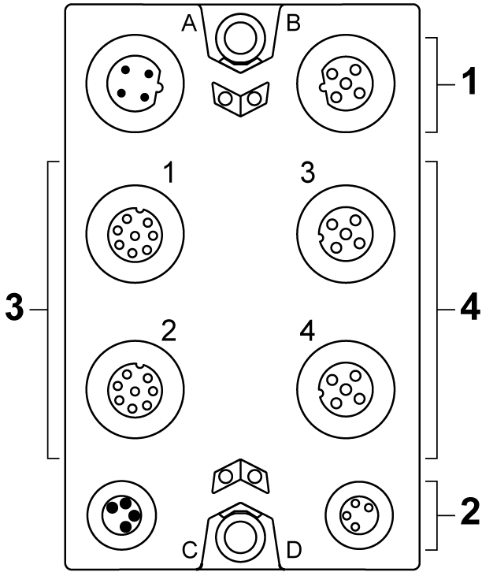
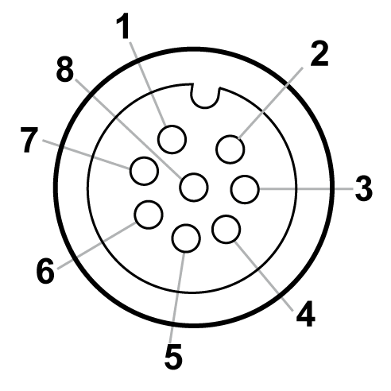
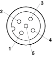

# TM7SDI8DFS Wiring

## Connection Elements

The following figure presents the connection elements for the TM7SDI8DFS:

| Number | Meaning |
| --- | --- |
| 1 | TM5 link:   * 2 x M12 (4-pin) * connector A: input * connector B: output |
| 2 | Module supply 24 Vdc:   * 2 x M8 (4-pin) * connector C: supply feed * connector D: routing |
| 3 | Connectors 1 and 2:   * Digital I/O: 2 x M12 (8-pin) |
| 4 | Connectors 3 and 4:   * Digital I/O: 2 x M12 (5-pin) |

## Pin Assignments

The pin assignments of the power and communication connectors (A, B, C and D) are provided in the [TM7 Physical Description](D-SE-0060207.html#D-SE-0060207__D-SE-0060207.8).

Pin assignment for the 8-pin I/O connectors 1 and 2 of the TM7SDI8DFS module:

**1** +24 Vdc

**2** Test (pulse) output 1

**3** COM

**4** SI x (safety-related inputs)

**5** DI x

**6** Test (pulse) output 2

**7** SI x (safety-related inputs)

**8** DO x (non-safety-related outputs)

| Connector socket | Pin1 | Pin2 | Pin3 | Pin4 | Pin5 | Pin6 | Pin7 | Pin8 |
| --- | --- | --- | --- | --- | --- | --- | --- | --- |
| 1 (IN/OUT) | +24 Vdc | Test (pulse) output 1 | COM | SI 1 | DI 1 | Test (pulse) output 2 | SI 2 | DO 1 |
| 2 (IN/OUT) | +24 Vdc | Test (pulse) output 1 | COM | SI 3 | DI 2 | Test (pulse) output 2 | SI 4 | DO 2 |

NOTE: Test (pulse) output 1 and test (pulse) 2 are shared between the connector sockets 1, 2, 3 and 4.

Pin assignment for the 5-pin I/O connectors 3 and 4 of the TM7SDI8DFS module:

**1** Test (pulse) x

**2** SI x (safety-related inputs)

**3** COM

**4** SI x (safety-related inputs)

**5** Test (pulse) x (inputs)

| Connector socket | Pin1 | Pin2 | Pin3 | Pin4 | Pin5 |
| --- | --- | --- | --- | --- | --- |
| 3 (IN) | Test (pulse) 1 | SI 5 | COM | SI 6 | Test (pulse) 2 |
| 4 (IN) | Test (pulse) 1 | SI 7 | COM | SI 8 | Test (pulse) 2 |

NOTE: Test (pulse) output 1 and test (pulse) 2 are shared between the connector sockets 1, 2, 3 and 4.

| WARNING | |
| --- | --- |
|  | IP67 NON-CONFORMANCE  * Properly fit all connectors with cables or sealing plugs and tighten for IP67 conformance according to the torque values as specified in this document. * Do not connect or disconnect cables or sealing plugs in the presence of water or moisture.  Failure to follow these instructions can result in death, serious injury, or equipment damage. |

EIO0000000861.10