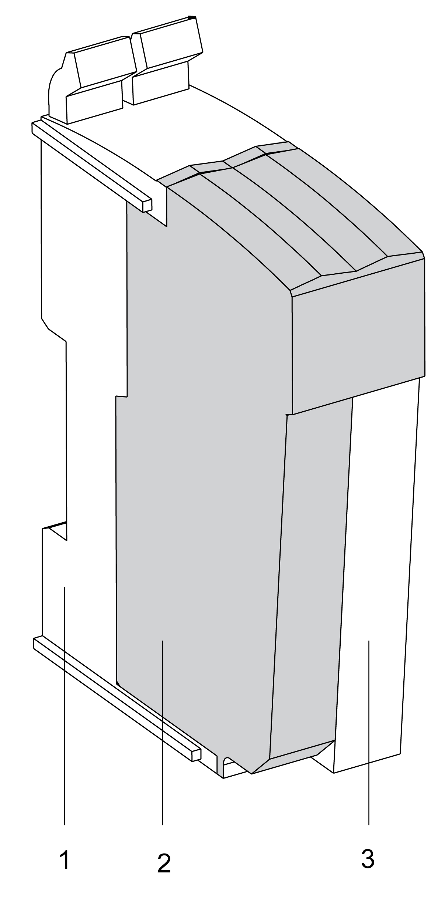
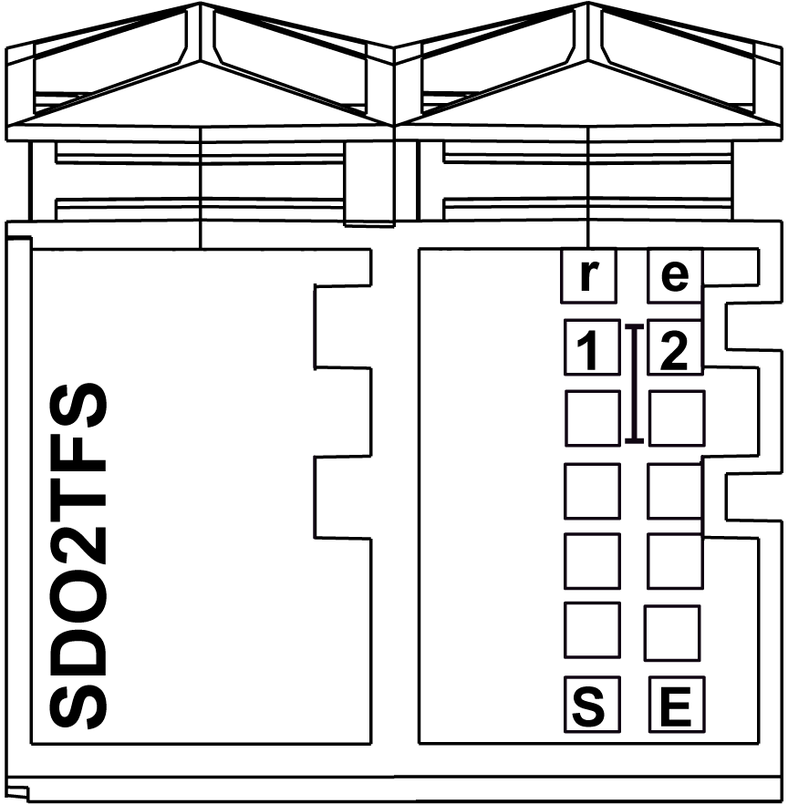

# TM5SDO2TFS Presentation

## Main Features

The following table describes the main features of the Safety Digital Output module TM5SDO2TFS:

| Main Features | |
| --- | --- |
| Number of Outputs | 2 |
| Output Type | safety-related digital FET outputs with current monitoring |
| Protective Features | open-circuit detection |
| integrated over-current protection and inductive load resistance |
| Rated Output Current | 0.5 A |
| Rated Voltage | 24 Vdc |

| DANGER | |
| --- | --- |
|  | POTENTIAL FOR EXPLOSION  * Only use this equipment in non-hazardous locations or in locations that comply with Class I, Division 2, Groups A, B, C and D. * Do not substitute components which would impair compliance to Class I, Division 2. * Do not connect or disconnect equipment unless power has been removed or the location is known to be non-hazardous.  Failure to follow these instructions will result in death or serious injury. |

## Ordering Information

The following figure presents the module in combination with the required components:

The following table presents the reference of the module:

| Number | Model Number | Description | Color |
| --- | --- | --- | --- |
| 2 | TM5SDO2TFS | TM5 Safety Digital Output module | red |

The following table presents the references for the required components:

| Number | Reference | Description | Color |
| --- | --- | --- | --- |
| 1 | TM5ACBM3FS | TM5 Safety bus base, safety coded, internal I/O supply is interconnected | red |
| 3 | TM5ACTB52FS | TM5 Safety terminal block, 12-pin, safety coded | red |
| NOTE: A TM5 Safety bus base and a TM5 Safety terminal block are required for operation of the module, and are sold separately. For more information, refer to [TM5ACBM3FS Safety bus base](D-SE-0010853.html#D-SE-0010853) and [TM5ACTB52FS Safety terminal block](D-SE-0010863.html#D-SE-0010863). | | | |

## Status LED Indicators

This figure presents the TM5SDO2TFS status LED indicators:

The following tables describe the status LED indicators:

| LED indicator | Color | Status | Description |
| --- | --- | --- | --- |
| **r** | off | | Module supply not connected. |
| green | single flash | reset mode |
| double flash | firmware update in progress |
| flashing | pre-operational state |
| on | RUN state |
| **e** | off | | No error detected or module supply not connected. |
| red | flashing | boot loader mode |
| triple flash | firmware update in progress |
| on | Error detected or 24 Vdc I/O power supply not connected. |
| **r**+**e** | steady red/single green flash | | invalid configuration |

| LED indicator | Color | Status | Description |
| --- | --- | --- | --- |
| **1**  **2** | red | on | Indicates either that an error has been detected for the corresponding output or that the safety-related output is being used as a non-safety-related output.  NOTE: During the start-up phase, the channel LED indicators are steady red. |
| orange | on | output set |

| LED indicator | Color | Status | Description |
| --- | --- | --- | --- |
| **SE** | off | | RUN state or 24 Vdc supply not present |
| red |  | boot phase or missing TM5 link or non-functioning processor (refer to hazard message below) |
|  | pre-operational state |
|  | communication channel is not OK |
|  | firmware for this module is a non-certified pilot version  NOTE: If you observe this indication, you must immediately replace the module, or update its firmware with a certified version. In all cases, contact your Schneider Electric representative. |
|  | boot phase, inoperable firmware |
| on | Safety-related status is active. |

Whenever the **SE** LED indicator is illuminated continuously, this indicates that the module is inoperative. There is also a diagnostic available in the Safety Logic Controller to indicate this state. Replacement of the module must be made immediately.

| WARNING | |
| --- | --- |
|  | LOSS OF SAFETY FUNCTION  * Immediately replace any and all modules that indicate that they are in an inoperable state. * Ensure that the effect on un-repaired equipment is taken into account in your risk assessment. * Make all necessary repairs to equipment before re-starting, or continuing service of, your machine.  Failure to follow these instructions can result in death, serious injury, or equipment damage. |

EIO0000000861.10