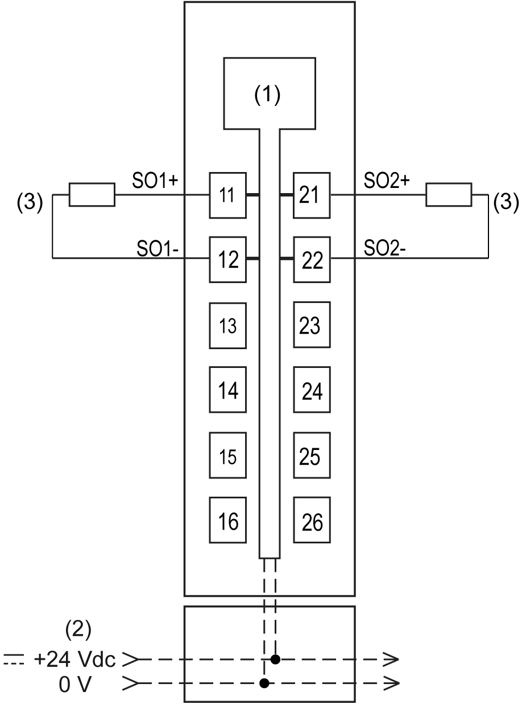

# TM5SDO2TFS Wiring

## Pin Assignments / Connection Example

The following figure presents a connection example for the TM5SDO2TFS:

**1** Internal electronics

**2** 24 Vdc I/O power segment integrated into the bus bases

**3** Actuator 24 Vdc

| WARNING | |
| --- | --- |
|  | UNINTENDED EQUIPMENT OPERATION  Do not connect wires to unused terminals and/or terminals indicated as “No Connection (N.C.)”.  Failure to follow these instructions can result in death, serious injury, or equipment damage. |

## Invalid Connection of an Actuator

NOTE: Observe the information given in [Invalid Connection of an Actuator](D-SE-0015101.html#D-SE-0015101__InvalidConnectionOfAnActuator-198D4A08).

EIO0000000861.10