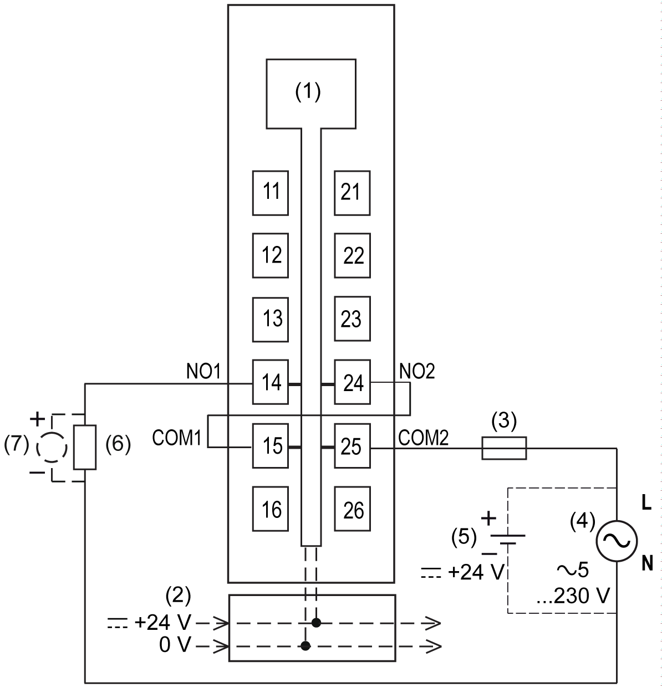

# TM5SDO2DTRFS Wiring

## Pin Assignments / Connection Example

The following figure presents a connection example for the TM5SDO2DTRFS:

**1** Internal electronics

**2** 24 Vdc I/O power segment integrated into the bus bases

**3** External fuse sized to the load and its characteristics, maximum 6 A

**4** External power supply, 5...230 Vac

**5** External power supply, 24 Vdc

**6** Actuator 2-wire load

**7** Inductive load protection

| WARNING | |
| --- | --- |
|  | UNINTENDED EQUIPMENT OPERATION  Do not connect wires to unused terminals and/or terminals indicated as “No Connection (N.C.)”.  Failure to follow these instructions can result in death, serious injury, or equipment damage. |

EIO0000000861.10