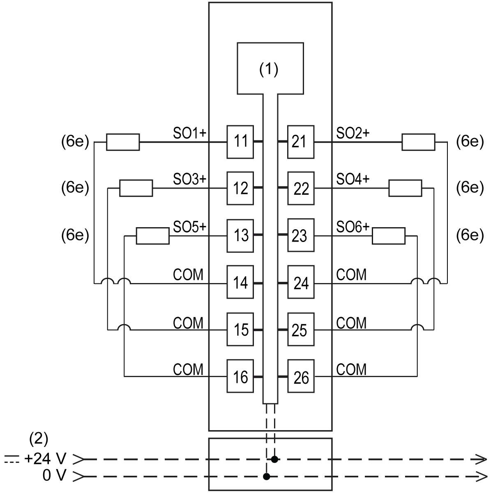

# TM5SDO6TBFS Wiring

## Connection Example

The following figure presents a connection example for the TM5SDO6TBFS:

**1** Internal electronics

**2** 24 Vdc I/O power segment integrated into the bus bases

**6e** Actuator 24 Vdc

| WARNING | |
| --- | --- |
|  | UNINTENDED EQUIPMENT OPERATION  Do not connect wires to unused terminals and/or terminals indicated as “No Connection (N.C.)”.  Failure to follow these instructions can result in death, serious injury, or equipment damage. |

EIO0000000861.10