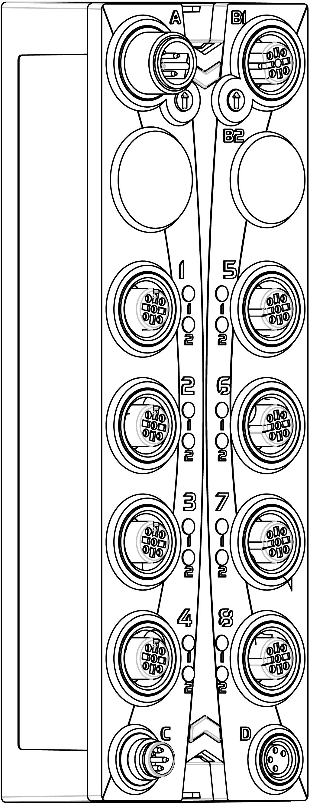
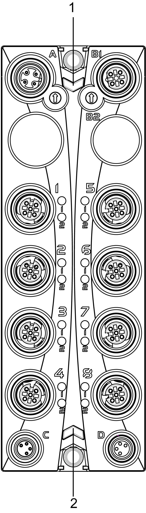

# TM7SDM12DTFS Presentation

## Main Features

The following table describes the main features of the Safety Digital Mixed module TM7SDM12DTFS:

| Main Features | |
| --- | --- |
| Number of Inputs | 8 |
| Input Type | safety-related digital inputs and configurable input filter |
| Input Circuit | sink |
| Number of Outputs | * 8 test (pulse) outputs * 4 safety-related digital FET outputs |
| Rated Voltage | 24 Vdc |

| DANGER | |
| --- | --- |
|  | POTENTIAL FOR EXPLOSION  * Only use this equipment in non-hazardous locations or in locations that comply either with the Class I, Division 2, Groups A, B, C and D, or with the ATEX Group II, Zone 2 specifications for hazardous locations, depending on your local and/or national regulations. * Do not substitute components which would impair compliance to the hazardous location specifications of this equipment. * Do not connect or disconnect equipment unless power has been removed or the location is known to be non-hazardous.  Failure to follow these instructions will result in death or serious injury. |

## Ordering Information

This figure presents the TM7SDM12DTFS module:

The following table presents the reference of the module:

| Model Number | Description | Color |
| --- | --- | --- |
| TM7SDM12DTFS | TM7 Safety Digital Mixed module | red |

NOTE: For more information, refer to:

* [TM7 Physical Description](D-SE-0060207.html#D-SE-0060207),
* [TM7 Block grounding](../../../../../api/crossBook?lang=en-US&virtualBookName=pacdpig&topicID=D_SE_0007645),
* [TM7 Installation Guidelines](../../../../../api/crossBook?lang=en-US&virtualBookName=tm7diohw&topicID=D_SE_0007647).

## Status LED Indicators

This figure presents the status LED indicators:

**1** Status LED indicators **r** and **e**: left green **r**, right red **e**

**2** Status LED indicators **S** and **E**: left red **S**, right red **E**

The following tables describe the status LED indicators:

| LED indicator | Color | Status | Description |
| --- | --- | --- | --- |
| **r** | off | | Module supply not connected. |
| green | single flash | reset mode |
| double flash | firmware update in progress |
| flashing | pre-operational state |
| on | RUN state |
| **e** | off | | No error detected or module supply not connected. |
| red | flashing | boot loader mode |
| triple flash | firmware update in progress |
| on | Error detected or 24 Vdc I/O power supply not connected. |
| **r**+**e** | steady red/single green flash | | invalid configuration |

| LED indicator | Color | Status | Description |
| --- | --- | --- | --- |
| **1**- **1**  **1**- **2**  **2**- **1**  **2**- **2**  **5**- **1**  **5**- **2**  **6**- **1**  **6**- **2** | red | on | Indicates either that an error has been detected for the corresponding input or that the safety-related input is being used as a non-safety-related input.  NOTE: When there is no connection to the Safety Logic Controller, all channels are steady red. |
| flashing | detected error in 2-channel evaluation (synchronous flashing of two affected channels). |
| green | on | input set |

| LED indicator | Color | Status | Description |
| --- | --- | --- | --- |
| **4**- **1**  **4**- **2**  **8**- **1**  **8**- **2** | red | on | Indicates either that an error has been detected for the corresponding output or that the safety-related output is being used as a non-safety-related output.  NOTE: When there is no connection to the Safety Logic Controller, all channels are steady red. |
| orange | on | output set |

| LED indicator | Color | Status | Description |
| --- | --- | --- | --- |
| **SE** | off | | RUN state or 24 Vdc supply not present |
| red |  | boot phase or missing TM5 link or non-functioning processor (refer to hazard message below) |
|  | pre-operational state |
|  | communication channel is not OK |
|  | firmware for this module is a non-certified pilot version  NOTE: If you observe this indication, you must immediately replace the module, or update its firmware with a certified version. In all cases, contact your Schneider Electric representative. |
|  | boot phase, inoperable firmware |
| on | Safety-related status is active. |

Whenever the **SE** LED indicator is illuminated continuously, this indicates that the module is inoperative. There is also a diagnostic available in the Safety Logic Controller to indicate this state. Replacement of the module must be made immediately.

| WARNING | |
| --- | --- |
|  | LOSS OF SAFETY FUNCTION  * Immediately replace any and all modules that indicate that they are in an inoperable state. * Ensure that the effect on un-repaired equipment is taken into account in your risk assessment. * Make all necessary repairs to equipment before re-starting, or continuing service of, your machine.  Failure to follow these instructions can result in death, serious injury, or equipment damage. |

EIO0000000861.10