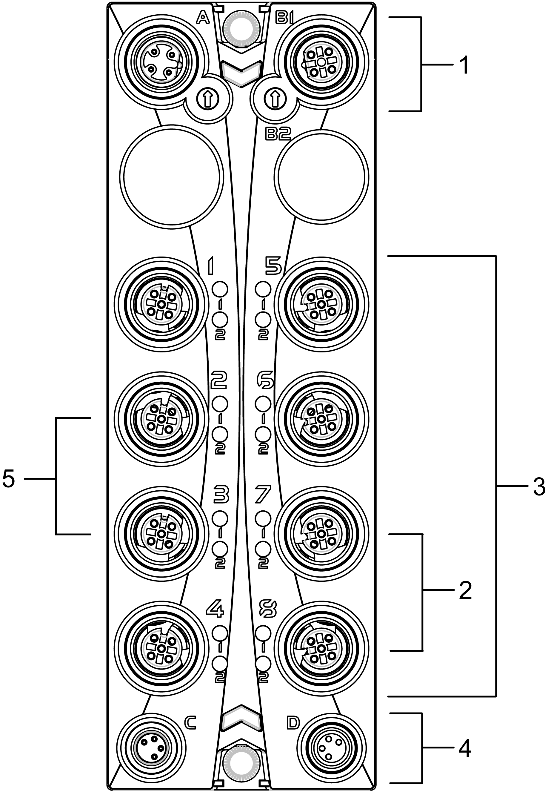
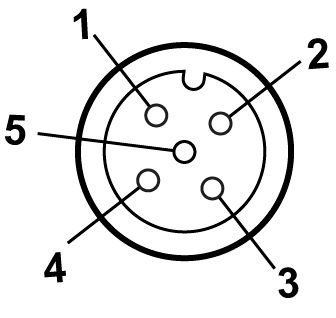

# TM7SDM12DTFS Wiring

## Connection Elements

The following figure presents the connection elements for the TM7SDM12DTFS:

| Number | Meaning |
| --- | --- |
| 1 | TM5 link:   * 2xM12 (4-pin) * connector A: input * connector B1: output |
| 2 | SO4 is available on connectors 7 and 8 (physical connection) |
| 3 | Digital I/O 8 x M12 (5-pin) |
| 4 | Module supply 24 Vdc:   * 2 x M8 (4-pin) * connector C: supply feed * connector D: routing |
| 5 | SI4 is available on connectors 2 and 3 (physical connection) |

## Pin Assignments

The pin assignments of the power and communication connectors (A, B, C and D) are provided in the [TM7 Physical Description](D-SE-0060207.html#D-SE-0060207__D-SE-0060207.8).

The following figure presents the pin assignment for the TM7SDM12DTFS:

**1** Test (pulse) x (inputs) or COM (outputs)

**2** SI x (safety-related inputs) or SO x (safety-related outputs)

**3** COM

**4** SI y (safety-related inputs) or SO y (safety-related outputs)

**5** Test (pulse) y (inputs) or COM (outputs)

The following table describes the pin assignments for the inputs of TM7SDM12DTFS (N.C. = No Connection):

| Connector socket | Pin1 | Pin2 | Pin3 | Pin4 | Pin5 |
| --- | --- | --- | --- | --- | --- |
| 1 (IN) | Test (pulse) 1 | SI 1 | COM | SI 2 | Test (pulse) 2 |
| 2 (IN) | Test (pulse) 3 | SI 3 | COM | SI 4 | Test (pulse) 4 |
| 3 (IN) | N.C. | N.C. | COM | SI 4 | Test (pulse) 4 |
| 5 (IN) | Test (pulse) 5 | SI 5 | COM | SI 6 | Test (pulse) 6 |
| 6 (IN) | Test (pulse) 7 | SI 7 | COM | SI 8 | Test (pulse) 8 |

The following table describes the pin assignments for the outputs of TM7SDM12DTFS (N.C. = No Connection):

| Connector socket | Pin1 | Pin2 | Pin3 | Pin4 | Pin5 |
| --- | --- | --- | --- | --- | --- |
| 4 (OUT) | COM | SO 1 | COM | SO 2 | COM |
| 7 (OUT) | COM | N.C. | COM | SO 4 | COM |
| 8 (OUT) | COM | SO 3 | COM | SO 4 | COM |

| WARNING | |
| --- | --- |
|  | UNINTENDED EQUIPMENT OPERATION  Do not connect wires to unused terminals and/or terminals indicated as “No Connection (N.C.)”.  Failure to follow these instructions can result in death, serious injury, or equipment damage. |

| WARNING | |
| --- | --- |
|  | UNINTENDED EQUIPMENT OPERATION  Only use the test (pulse) outputs for the intended purpose of connecting them to the module inputs.  Failure to follow these instructions can result in death, serious injury, or equipment damage. |

NOTE: Cross-circuits between the two channels of a connector cannot be ruled out according to ISO 13849-1. This is why shared [error handling](D-SE-0015098.html#D-SE-0015098__D-SE-0015098.3) is implemented for both output channels of a connector. This means that both output channels are switched off as soon as an error has been detected on one channel.

Detected errors are acknowledged in a similar way. As soon as a detected channel error has been acknowledged, the error state on the other channel of the same connector is also acknowledged.

However, the restart inhibit is separately active for each channel to help prevent unintentional enabling of a channel.

NOTE: SI 4 is provided on both connectors 2 and 3 for ease of wiring. This enables SI 4 to be used with one-channel sensors as well as two-channel sensors. Two sensors must not be connected to SI 4 in connector 2 and SI 4 in connector 3, as this would cause a parallel connection of two sensors on one input channel.

| WARNING | |
| --- | --- |
|  | PARALLEL CONNECTION ON ONE INPUT CHANNEL  Do not connect independent inputs to SI 4 in connector 2 and SI 4 in connector 3.  Failure to follow these instructions can result in death, serious injury, or equipment damage. |

NOTE: SO 4 is provided both on the connectors 7 and 8 to make wiring easier. This makes it possible to use SO 4 for one-channel actuators as well as for two-channel actuators.

| WARNING | |
| --- | --- |
|  | IP67 NON-CONFORMANCE  * Properly fit all connectors with cables or sealing plugs and tighten for IP67 conformance according to the torque values as specified in this document. * Do not connect or disconnect cables or sealing plugs in the presence of water or moisture.  Failure to follow these instructions can result in death, serious injury, or equipment damage. |

EIO0000000861.10