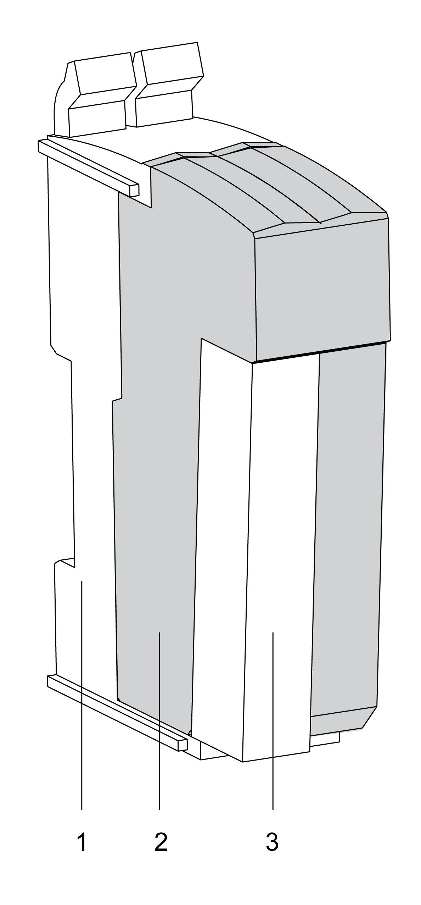
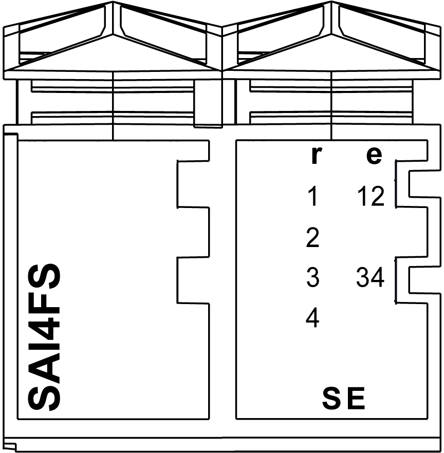

# TM5SAI4AFS Presentation

## Main Features

The following table describes the main features of the Safety Analog Input module TM5SAI4AFS:

| Main Features | |
| --- | --- |
| Number of inputs | 2 redundant safety-related analog inputs |
| Input filter | configurable input filter and switching threshold |
| Input range | * 4...20 mA (valid measurement range) * 0.5...25 mA (input range HW\_LIMIT\_MIN, HW\_LIMIT\_MAX) |
| Digital converter resolution | 24 bits |

This equipment has been designed to operate outside of any hazardous location. Only install this equipment in zones known to be free of a hazardous atmosphere.

| DANGER | |
| --- | --- |
|  | POTENTIAL FOR EXPLOSION  Install and use this equipment in non-hazardous locations only.  Failure to follow these instructions will result in death or serious injury. |

## Ordering Information

The following figure presents the module in combination with the required components:

The following table presents the reference of the module:

| Number | Reference | Description | Color |
| --- | --- | --- | --- |
| 2 | TM5SAI4AFS | TM5 Safety Analog Input module | red |

The following table presents the references for the required components:

| Number | Reference | Description | Color |
| --- | --- | --- | --- |
| 1 | TM5ACBM3FS | TM5 Safety bus base, safety coded, internal I/O supply is interconnected | red |
| 3 | TM5ACTB5FFS | TM5 Safety terminal block, 16-pin, safety coded | red |
| NOTE: A TM5 Safety bus base and a TM5 Safety terminal block are required for operation of the module, and are sold separately. For more information, refer to [TM5ACBM3FS Safety bus base](D-SE-0010853.html#D-SE-0010853) and [TM5ACTB5FFS Safety terminal block](D-SE-0057595.html#D-SE-0057595). | | | |

## Status LED Indicators

This figure presents the TM5SAI4AFS status LED indicators:

The following tables describe the status LED indicators:

| LED indicator | Color | Status | Description |
| --- | --- | --- | --- |
| **r** | off | | Module supply not connected. |
| green | single flash | reset mode |
| double flash | firmware update in progress |
| flashing | pre-operational state |
| on | RUN state |
| **e** | off | | No error detected or module supply not connected. |
| red | flashing | boot loader mode |
| triple flash | firmware update in progress |
| on | Error detected or 24 Vdc I/O power supply not connected. |
| **r**+**e** | steady red/single green flash | | invalid configuration |

| LED indicator | Color | Status | Description |
| --- | --- | --- | --- |
| **1**  **2**  **3**  **4** | off | | channel not used |
| red | on | Indicates either that an error has been detected for the corresponding input or that the safety-related input is being used as a non-safety-related input.  NOTE: When there is no connection to the Safety Logic Controller, all channels are steady red. |
| flashing | open circuit on corresponding channel |
| green | on | channel being used and signal OK |
| flashing | channel outside of the limits configured in EcoStruxure Machine Expert - Safety |
| **12**, **34** | off | | signal on channel pair not OK |
| red | on | Indicates a detected error. |
| green | on | signal on channel pair OK |

| LED indicator | Color | Status | Description |
| --- | --- | --- | --- |
| **SE** | off | | RUN state or 24 Vdc supply not present |
| red |  | boot phase or missing TM5 link or non-functioning processor (refer to hazard message below) |
|  | pre-operational state |
|  | communication channel is not OK |
|  | firmware for this module is a non-certified pilot version  NOTE: If you observe this indication, you must immediately replace the module, or update its firmware with a certified version. In all cases, contact your Schneider Electric representative. |
|  | boot phase, inoperable firmware |
| on | Safety-related status is active. |

Whenever the **SE** LED indicator is illuminated continuously, this indicates that the module is inoperative. There is also a diagnostic available in the Safety Logic Controller to indicate this state. Replacement of the module must be made immediately.

| WARNING | |
| --- | --- |
|  | LOSS OF SAFETY FUNCTION  * Immediately replace any and all modules that indicate that they are in an inoperable state. * Ensure that the effect on un-repaired equipment is taken into account in your risk assessment. * Make all necessary repairs to equipment before re-starting, or continuing service of, your machine.  Failure to follow these instructions can result in death, serious injury, or equipment damage. |

EIO0000000861.10