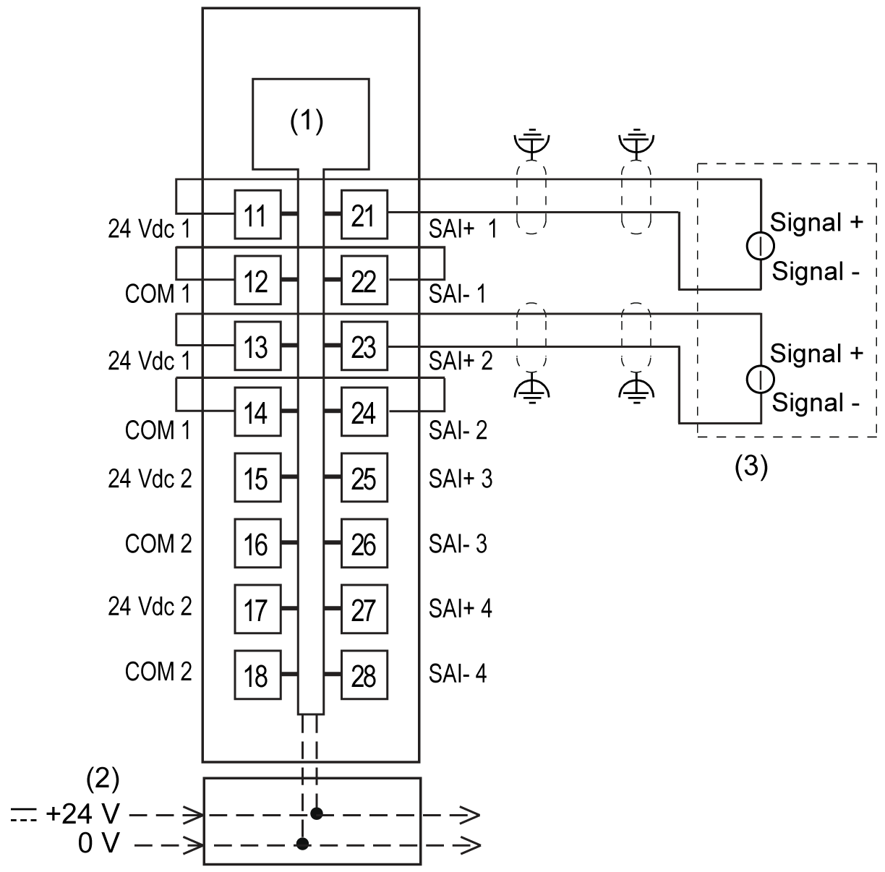
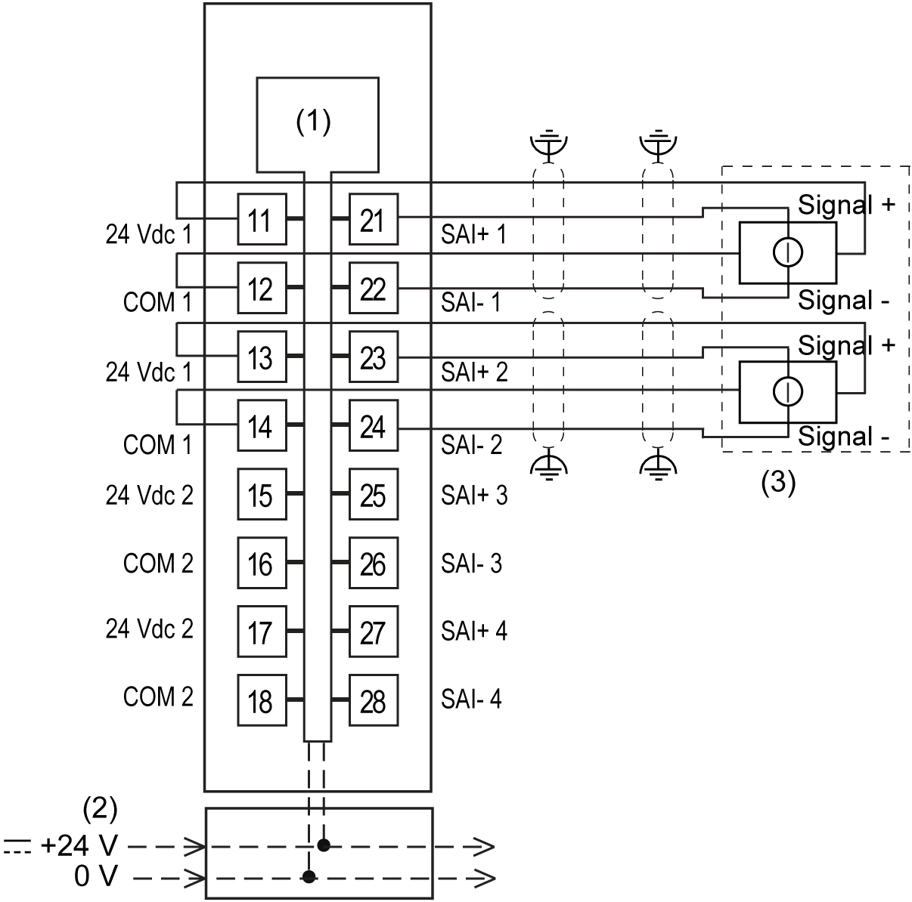
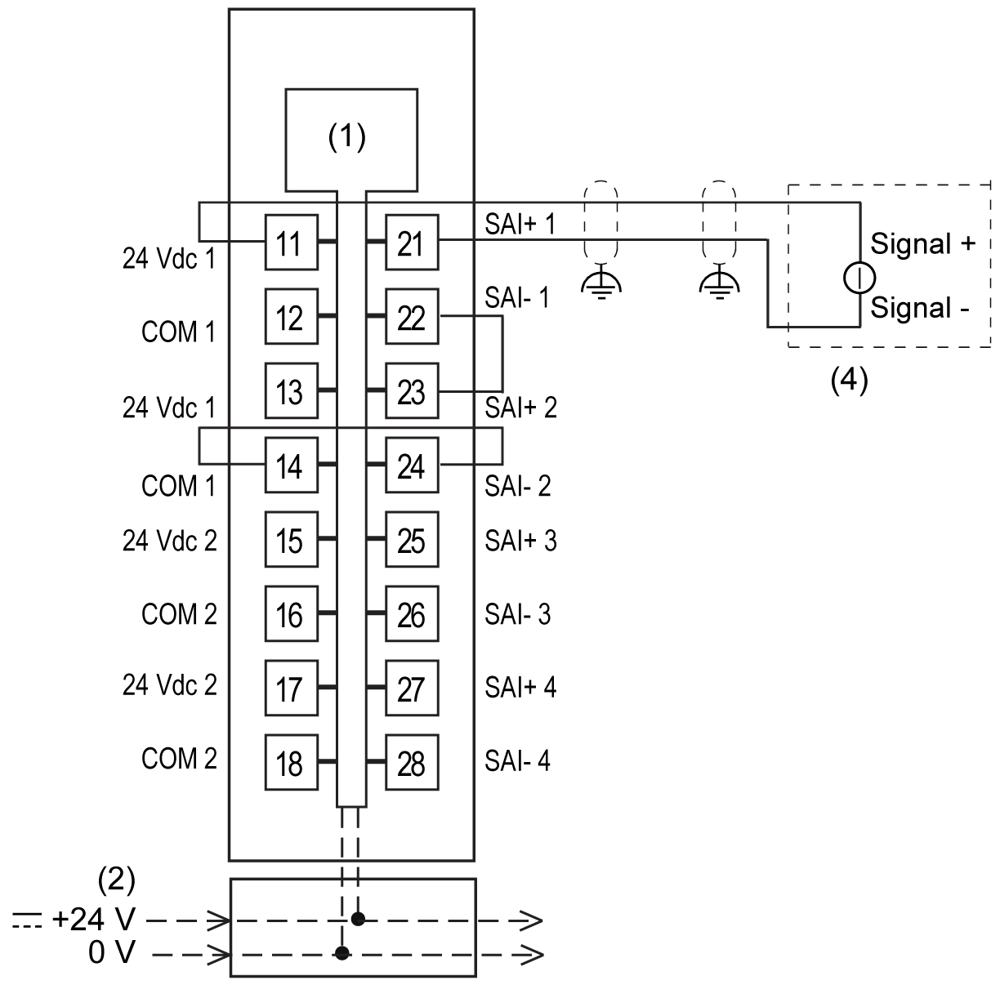
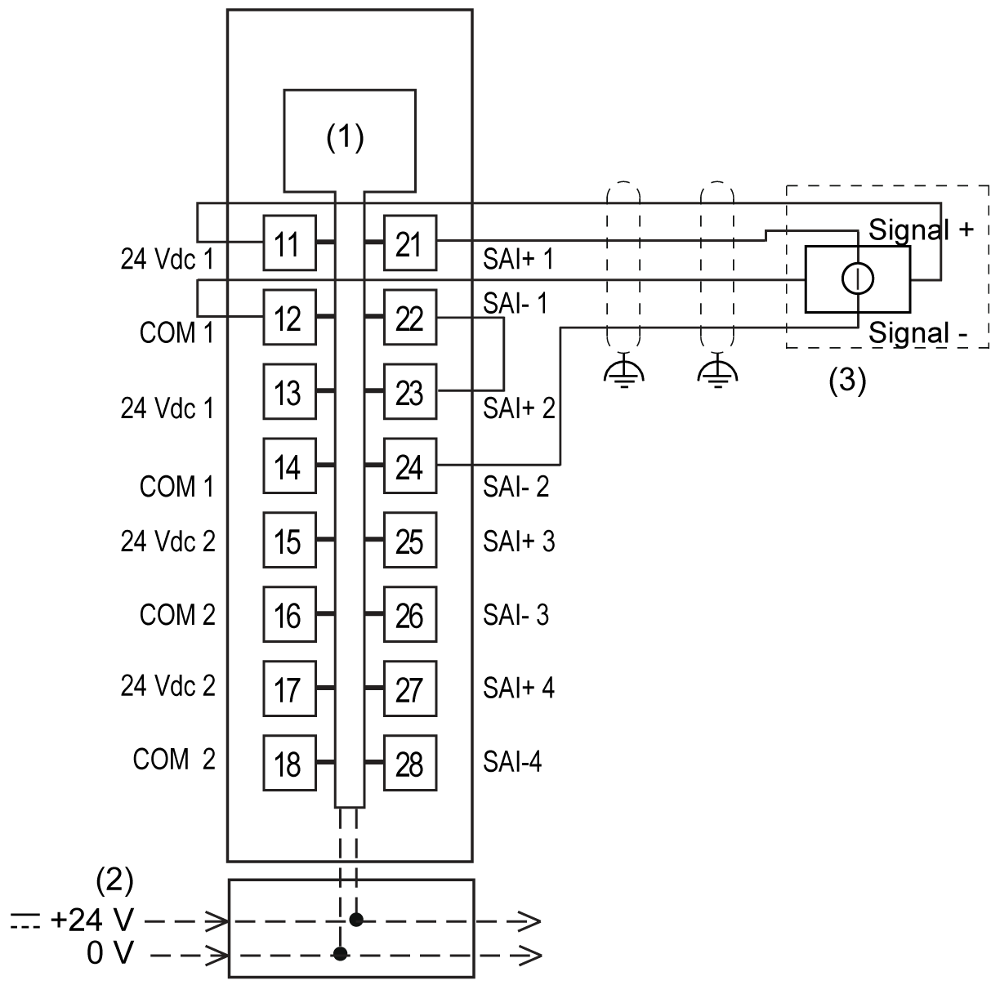

# TM5SAI4AFS Wiring

## Pin Assignments / Connection Example

The following channel pair application is sufficient to achieve maximum PL e (EN ISO 13849-1:2008), maximum SIL 3 (EN IEC 62061:2010), maximum SIL 3 (EN IEC 61508:2010), and maximum SIL 3 (EN IEC 61511:2004).

TM5SAI4AFS 2-wire connection, 2x SIL 2

**1** Internal electronics

**2** 24 Vdc I/O power segment integrated into the bus bases

**3** 2-channel sensor, module sensor power supplied

TM5SAI4AFS 4-wire connection, 2x SIL 2

**1** Internal electronics

**2** 24 Vdc I/O power segment integrated into the bus bases

**3** 2-channel sensor, module sensor power supplied

TM5SAI4AFS 2-wire connection, 1x SIL 2

**1** Internal electronics

**2** 24 Vdc I/O power segment integrated into the bus bases

**3** 2-channel sensor, module sensor power supplied

TM5SAI4AFS 4-wire connection, 1x SIL 2

**1** Internal electronics

**2** 24 Vdc I/O power segment integrated into the bus bases

**3** 2-channel sensor, module sensor power supplied

Use shielded, properly grounded cables for all analog and high-speed inputs or outputs and communication connections. If you do not use shielded cable for these connections, electromagnetic interference can cause signal degradation. Degraded signals can cause the controller or attached modules and equipment to perform in an unintended manner.

| WARNING | |
| --- | --- |
|  | UNINTENDED EQUIPMENT OPERATION  * Use shielded cables for all fast I/O, analog I/O, and communication signals. * Ground cable shields for all fast I/O, analog I/O, and communication signals at a single point1. * Route communications and I/O cables separately from power cables.  Failure to follow these instructions can result in death, serious injury, or equipment damage. |

1Multipoint grounding is permissible (and in some cases inevitable) if connections are made to an equipotential ground plane dimensioned to help avoid cable shield damage in the event of power system short-circuit currents.

| WARNING | |
| --- | --- |
|  | UNINTENDED EQUIPMENT OPERATION  Do not connect wires to unused terminals and/or terminals indicated as “No Connection (N.C.)”.  Failure to follow these instructions can result in death, serious injury, or equipment damage. |

| WARNING | |
| --- | --- |
|  | UNINTENDED EQUIPMENT OPERATION  Use the sensor and actuator power supply only for supplying power to sensors or actuators connected to the module.  Failure to follow these instructions can result in death, serious injury, or equipment damage. |

EIO0000000861.10